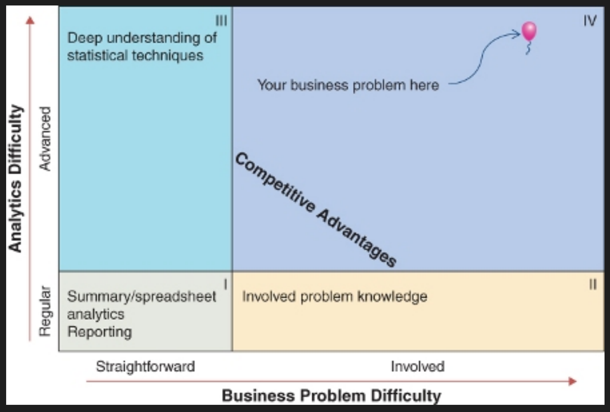

## Contents:<!-- omit in toc -->

- [Introduction to Applied Statistics](#introduction-to-applied-statistics)
- [Key Features of Applied Statistics](#key-features-of-applied-statistics)
  - [1. Data Collection](#1-data-collection)
  - [2. Data Analysis](#2-data-analysis)
  - [3. Probability](#3-probability)
  - [4. Regression Analysis](#4-regression-analysis)
  - [5. ANOVA (Analysis of Variance)](#5-anova-analysis-of-variance)
  - [6. Non-Parametric Methods](#6-non-parametric-methods)
  - [7. Time Series Analysis](#7-time-series-analysis)
  - [8. Multivariate Analysis](#8-multivariate-analysis)
  - [9. Statistical Software and Tools](#9-statistical-software-and-tools)
- [Applied Statistics: Thinking, Not a Toolbox](#applied-statistics-thinking-not-a-toolbox)
- [Applications of Applied Statistics](#applications-of-applied-statistics)
  - [Business and Economics](#business-and-economics)
  - [Healthcare](#healthcare)
  - [Engineering](#engineering)
  - [Social Sciences](#social-sciences)
  - [Environmental Science](#environmental-science)
  - [Sports Analytics](#sports-analytics)
  - [Marketing](#marketing)
  - [Telecommunications](#telecommunications)
  - [Agriculture](#agriculture)
  - [Education](#education)
- [Videos: Statistics Fundamentals](#videos-statistics-fundamentals)
- [Conclusion](#conclusion)
- [Related Content](#related-content)
- [References](#references)



## Introduction to Applied Statistics

Applied statistics is the use of statistical techniques to solve real-world problems across various fields such as business, engineering, medicine, and social sciences. This involves collecting, analyzing, and interpreting data to make informed decisions and predictions. By leveraging statistical methods, organizations can optimize operations, improve quality, and gain insights that drive strategic decisions.

> [!NOTE]  
> Reference and Details: [Applied Statistics Project](https://github.com/amitkumar-aimlp/projects/tree/content/applied-statistics)

## Key Features of Applied Statistics

<iframe src="https://drive.google.com/file/d/1MrLlySgxqpZ8aYMZlKLF3MEw19tw9XMO/preview" frameborder="0" style="position: absolute; top: 0; left: 0; width: 100%; height: 100%;" allowfullscreen></iframe>

### 1. Data Collection

The foundation of applied statistics is the systematic collection of data. This phase is crucial as the quality of data directly impacts the reliability of statistical analysis.

- **Types of Data**: Data can be qualitative (descriptive and categorical) or quantitative (numerical).
- **Data Sources**: Primary data is collected firsthand through surveys, experiments, and observations. Secondary data is obtained from existing sources such as databases, publications, and reports.
- **Sampling Methods**: Proper sampling techniques ensure that the collected data accurately represents the population.
  - **Random Sampling**: Every individual has an equal chance of being selected.
  - **Stratified Sampling**: The population is divided into strata, and samples are drawn from each stratum.
  - **Cluster Sampling**: The population is divided into clusters, and entire clusters are randomly selected.
  - **Systematic Sampling**: Every nth individual is selected from a list.

### 2. Data Analysis

Data analysis involves summarizing and interpreting the data to extract meaningful insights.

- **Descriptive Statistics**: Summarizing and describing the main features of a dataset.
  - **Measures of Central Tendency**: Mean, median, and mode provide information about the central value of the data.
  - **Measures of Dispersion**: Range, variance, and standard deviation describe the spread of the data.
  - **Graphical Representations**: Histograms, pie charts, and box plots visually represent data distributions.
- **Inferential Statistics**: Making predictions or inferences about a population from a sample.
  - **Hypothesis Testing**: Formulating and testing hypotheses about population parameters.
  - **Confidence Intervals**: Estimating the range within which a population parameter lies.
  - **P-values and Significance Levels**: Determining the statistical significance of test results.
  - **Types of Errors**: Type I (false positive) and Type II (false negative) errors.

### 3. Probability

Probability theory underpins many statistical methods, providing a framework for making inferences about populations based on sample data.

- **Probability Distributions**: Understanding different types of distributions is essential for analyzing data.
  - **Normal Distribution**: A symmetric, bell-shaped distribution.
  - **Binomial Distribution**: Models the number of successes in a fixed number of trials.
  - **Poisson Distribution**: Models the number of events occurring in a fixed interval of time or space.
- **Theorems and Laws**: Fundamental principles of probability.
  - **Law of Large Numbers**: As sample size increases, the sample mean approaches the population mean.
  - **Central Limit Theorem**: The distribution of the sample mean approaches a normal distribution as the sample size grows.
  - **Bayes' Theorem**: Provides a way to update the probability of a hypothesis based on new evidence.

### 4. Regression Analysis

Regression analysis is a powerful tool for examining the relationships between variables.

- **Simple Linear Regression**: Analyzes the relationship between two variables by fitting a linear equation to the data.
  - **Line of Best Fit**: The line that minimizes the sum of squared residuals.
  - **Coefficient of Determination (R²)**: Measures the proportion of variability in the dependent variable explained by the independent variable.
  - **Residual Analysis**: Evaluates the goodness-of-fit of the regression model.
- **Multiple Regression**: Examines the relationship between multiple independent variables and one dependent variable.
  - **Model Building**: Selecting the best combination of variables to include in the model.
  - **Multicollinearity**: Assessing the correlation among independent variables.
  - **Interaction Terms**: Exploring the combined effects of multiple variables.

### 5. ANOVA (Analysis of Variance)

ANOVA techniques are used to compare means among different groups.

- **One-Way ANOVA**: Compares means across a single factor with multiple levels to determine if there are significant differences.
- **Two-Way ANOVA**: Examines the interaction between two factors and their individual effects on the dependent variable.
- **Post Hoc Tests**: Conducted after ANOVA to identify specific group differences.

### 6. Non-Parametric Methods

Non-parametric methods are useful when data doesn't meet the assumptions of parametric tests.

- **Chi-Square Tests**: Tests the relationship between categorical variables.
- **Mann-Whitney U Test**: Compares differences between two independent groups.
- **Kruskal-Wallis Test**: Non-parametric version of ANOVA for comparing more than two groups.

### 7. Time Series Analysis

Time series analysis involves studying data points collected or recorded at specific time intervals.

- **Components of Time Series**: Trend, seasonality, cyclicity, and irregularity.
- **Smoothing Techniques**: Moving averages and exponential smoothing to reduce noise and highlight trends.
- **Forecasting Models**: ARIMA (AutoRegressive Integrated Moving Average) and Exponential Smoothing State Space Model (ETS).

### 8. Multivariate Analysis

Multivariate analysis techniques handle multiple variables simultaneously to understand complex relationships.

- **Principal Component Analysis (PCA)**: Reduces the dimensionality of data while retaining most of the variance.
- **Factor Analysis**: Identifies underlying variables (factors) that explain the data.
- **Cluster Analysis**: Groups similar observations based on selected variables.
- **Discriminant Analysis**: Classifies observations into predefined categories.

### 9. Statistical Software and Tools

Various software and tools are available to perform statistical analysis efficiently.

- **Popular Software**: R, Python, SAS, SPSS, Minitab.
- **Data Visualization Tools**: Tableau, Power BI, ggplot2 in R, Matplotlib and Seaborn in Python.

## Applied Statistics: Thinking, Not a Toolbox

Image
Applied statistics is more about **thinking critically** and **approaching problems** with a statistical mindset rather than just using a set of tools. The key points include:

1. **Mindset Over Tools:**
   Applied statistics involves a way of thinking and problem-solving that integrates statistical methods with the context of the problem. It’s about understanding the **underlying principles** and making informed decisions based on statistical reasoning.
2. **Problem Understanding:**
   Effective application of statistics requires a deep understanding of the problem at hand, including the domain context. It’s crucial to define the problem clearly, choose appropriate methods, and interpret results correctly.
3. **Modeling and Assumptions:**
   Building statistical models involves making assumptions about data and processes. The importance of understanding these assumptions and their implications for the validity of the results is emphasized.
4. **Data Exploration:**
   Exploratory data analysis (EDA) is essential for understanding the data before applying statistical techniques. This step helps in identifying patterns, anomalies, and insights that guide the analysis.
5. **Communication:**
   Communicating statistical findings effectively is as important as the analysis itself. Results should be presented in a way that is understandable to stakeholders, highlighting key insights and their implications.
6. **Continuous Learning:**
   Applied statisticians must stay updated with evolving methods and best practices. The field of statistics is dynamic, and ongoing learning is necessary to apply the latest techniques effectively.
   **Statistical Thinking**—understanding the principles, context, and implications of analysis—is fundamental to applied statistics, rather than just relying on statistical tools and software.

**Here is a mix of common statistics tools and the overlapping genealogy:**

| Grouping (Genus)                       | Tools (Species)                                                                                                                                                                                                                                                                                                                                                                                                                                                                                                             |
| -------------------------------------- | --------------------------------------------------------------------------------------------------------------------------------------------------------------------------------------------------------------------------------------------------------------------------------------------------------------------------------------------------------------------------------------------------------------------------------------------------------------------------------------------------------------------------- |
| Exploratory Data Analysis (EDA)        | Packaging of tools for quick insights; emphasis on graphics: e.g., Box-Plots, Bubble Graphs, CART, Clustering, Density Plots, Histograms, k-NN, Outlier Detection, Scatterplots, Smoothing, Time-series plots, et al.                                                                                                                                                                                                                                                                                                       |
| Statistical DM (Data Mining)           | Rebranding of EDA; more discussion of some topics and less of others.                                                                                                                                                                                                                                                                                                                                                                                                                                                       |
| Statistical ML (Machine Learning)      | The data-analysis part of the ML packaging of statistics and data management tools with a machine learning engine, e.g., Topic Modeling, Support Vector Machines, Random Forests, Tree-Based and Rule-Based Regression and Classification, Genetic Algorithms, Gradient Boosting, Neural Networks, et al.                                                                                                                                                                                                                   |
| Statistical Learning                   | Evolving definition, at least partly a repackaging/rebranding of Statistical ML, e.g. linear and polynomial regression, logistic regression and Discriminant Analysis; Cross-Validation/Bootstrapping, model selection and regularization methods (ridge and lasso); nonlinear models, splines and generalized additive models; tree-based methods, random forests and boosting; support-vector machines. Some unsupervised learning methods are discussed: principal components and clustering (k-means and hierarchical). |
| Statistical DS (Data Science)          | Evolving definition, rebranding of applied statistics; more discussion of some topics and less of others; this definition will continue to evolve.                                                                                                                                                                                                                                                                                                                                                                          |
| Bayesian                               | Techniques that assume a prior distribution for the parameters–it is a long story, e.g., Naive Bayes, Hierarchical Bayes, et al.                                                                                                                                                                                                                                                                                                                                                                                            |
| Predictive Analytics                   | Rebranding of Predictive Modeling                                                                                                                                                                                                                                                                                                                                                                                                                                                                                           |
| Multivariate Statistics                | Clustering?, Factor Analysis, Principal Component Analysis, Structure Equation Modeling?, et al.                                                                                                                                                                                                                                                                                                                                                                                                                            |
| Spatial Statistics                     | Packaging of tools for modeling spatial variability, e.g., Thin-plate splines, inverse distance weighting, geographically weighted regression.                                                                                                                                                                                                                                                                                                                                                                              |
| Parametric Statistics                  | All tools making parametric assumptions; e.g., Regression                                                                                                                                                                                                                                                                                                                                                                                                                                                                   |
| Nonparametric Statistics               | All tools not making parametric assumptions; they still makes assumptions: e.g., Association Analysis, Neural Networks, Order Statistics, Rank Statistics, Quantile Regression, et al.                                                                                                                                                                                                                                                                                                                                      |
| Semi-parametric                        | Family of models containing both parametric and non-parametric components (e.g. Cox-proportional hazard model)                                                                                                                                                                                                                                                                                                                                                                                                              |
| Categorical Data Analysis              | Tools with a categorical response, e.g., Contingency Tables, Cochran-Mantel-Haenszel Methods, General Linear Models, Loglinear Models, Logit Models, Logistic Regression, et al.                                                                                                                                                                                                                                                                                                                                            |
| Time Series/Forecasting                | Tools modeling a time (or location) dependent response; e.g., ARIMA, Box-Jenkins, Correlograms, Spectral Decomposition [Census Bureau]                                                                                                                                                                                                                                                                                                                                                                                      |
| Survival Analysis                      | Tools to perform time-to-event analysis (also called duration analysis) e.g., Cox Proportional Hazard, Kaplan-Meier, Life Tables, et al.                                                                                                                                                                                                                                                                                                                                                                                    |
| Game Theory                            | Tools for modeling contests.                                                                                                                                                                                                                                                                                                                                                                                                                                                                                                |
| Text Analytics                         | Tools for extracting information from text.                                                                                                                                                                                                                                                                                                                                                                                                                                                                                 |
| Cross Validation/Data Splitting        | e.g., K-fold Cross-Validation, Sequential Validation                                                                                                                                                                                                                                                                                                                                                                                                                                                                        |
| Resampling Techniques With Replacement | e.g., Permutation Tests, Jackknife, Bootstrapping, et al.                                                                                                                                                                                                                                                                                                                                                                                                                                                                   |
| Six Sigma                              | Repacking of statistics common to manufacturing with clever organizational ideas.                                                                                                                                                                                                                                                                                                                                                                                                                                           |
| Quality/Process Control                | X-Bar Charts, R Charts, [Manufacturing]                                                                                                                                                                                                                                                                                                                                                                                                                                                                                     |
| DoS (Design of Samples)                | Simple Random, Systematic, Stratification, Clustering, Probabilities Proportional to Size, Multi-stage Designs, Small Area Estimation, Discrete Choice, Conjoint Analytics [Census Bureau; Marketing]                                                                                                                                                                                                                                                                                                                       |
| DoE (Design of Experiments)            | Completely Randomize, Randomized Blocks, Factorial Designs, Repeated Measures, Split-Plot, Response Surface Models, Crossover Designs, Nested Designs, Clinical Modifications [Agriculture; Pharmaceuticals]                                                                                                                                                                                                                                                                                                                |
| DSim (Design of Simulation)            | Artificial generation of random processes to model uncertainty; Monte Carlo, Markov Chains,                                                                                                                                                                                                                                                                                                                                                                                                                                 |
| Stochastic Processes                   | Models for processes (with uncertainty), e.g., Birth-Death Processes, Markov Chains, Markov Processes, Poison Processes, Renewal Processes, et al.                                                                                                                                                                                                                                                                                                                                                                          |
| Areas awaiting a name                  | E.g., high dimensional problems (p>>n); et al.                                                                                                                                                                                                                                                                                                                                                                                                                                                                              |

## Applications of Applied Statistics

### Business and Economics

- **Market Research**: Analyzing consumer behavior, preferences, and trends.
- **Quality Control**: Monitoring and improving production processes.
- **Financial Forecasting**: Predicting stock prices, economic indicators, and market trends.
- **Risk Management**: Assessing and mitigating financial risks.

### Healthcare

- **Clinical Trials**: Designing and analyzing trials to test new treatments and drugs.
- **Epidemiology**: Studying the distribution and determinants of health-related states and events.
- **Medical Imaging**: Enhancing and analyzing medical images to aid diagnosis.
- **Public Health**: Monitoring and evaluating health programs and policies.

### Engineering

- **Reliability Testing**: Assessing the dependability of products and systems.
- **Process Optimization**: Improving manufacturing and operational processes.
- **Quality Assurance**: Ensuring products meet specified standards and requirements.
- **Safety Analysis**: Evaluating and improving safety measures in engineering projects.

### Social Sciences

- **Survey Analysis**: Designing and analyzing surveys to understand social phenomena.
- **Behavioral Studies**: Investigating human behavior and social interactions.
- **Policy Evaluation**: Assessing the effectiveness of public policies and programs.
- **Educational Research**: Analyzing educational practices and outcomes.

### Environmental Science

- **Environmental Monitoring**: Tracking changes in environmental conditions.
- **Climate Modeling**: Predicting climate change and its impacts.
- **Pollution Control**: Assessing and managing pollution levels.
- **Natural Resource Management**: Optimizing the use and conservation of natural resources.

### Sports Analytics

- **Performance Analysis**: Evaluating athletes' performance and strategies.
- **Injury Prevention**: Identifying risk factors and preventing injuries.
- **Talent Identification**: Analyzing potential in athletes for recruitment.
- **Game Strategy**: Developing data-driven strategies for teams.

### Marketing

- **Customer Segmentation**: Dividing a customer base into distinct groups.
- **Campaign Analysis**: Evaluating the effectiveness of marketing campaigns.
- **Sales Forecasting**: Predicting future sales based on historical data.
- **Product Development**: Using customer feedback and data to guide product innovation.

### Telecommunications

- **Network Optimization**: Improving the performance of communication networks.
- **Customer Churn Analysis**: Predicting and reducing customer turnover.
- **Usage Patterns**: Analyzing how customers use services to inform product offerings.
- **Fraud Detection**: Identifying and preventing fraudulent activities.

### Agriculture

- **Crop Yield Prediction**: Forecasting crop production based on various factors.
- **Soil Analysis**: Understanding soil properties for better crop management.
- **Pest and Disease Management**: Monitoring and controlling agricultural pests and diseases.
- **Resource Allocation**: Optimizing the use of water, fertilizers, and other resources.

### Education

- **Student Performance Analysis**: Evaluating and improving student outcomes.
- **Curriculum Development**: Using data to design effective educational programs.
- **Teacher Effectiveness**: Assessing and enhancing teaching methods.
- **Educational Policy**: Informing policy decisions with data-driven insights.

## Videos: Statistics Fundamentals

Statistics Fundamentals: These videos give you a general overview of statistics and a solid reference for statistical concepts.

<iframe src=" https://www.youtube.com/embed/qBigTkBLU6g?si=MqWCoi2ZkUgM96Bf" frameborder="0" style="position: absolute; top: 0; left: 0; width: 100%; height: 100%;" allowfullscreen></iframe>

## Conclusion

Applied statistics is a crucial tool in various fields, providing the methods and techniques necessary to make sense of data and derive actionable insights. Understanding its key features and applications allows professionals to make data-driven decisions and solve complex problems effectively. By leveraging the power of statistical analysis, organizations and individuals can optimize operations, improve quality, and drive innovation across diverse domains.

## Related Content

- [Python Programming Language Syntax and Examples](https://amitkumar-aimlp.github.io/projects/python-programming-language-syntax-and-examples/)
- [NumPy for Data Science: A Comprehensive Guide](https://amitkumar-aimlp.github.io/projects/numpy-for-data-science-a-comprehensive-guide/)
- [Pandas for Data Science: A Comprehensive Guide](https://amitkumar-aimlp.github.io/projects/pandas-for-data-science-a-comprehensive-guide/)
- [Pandas Vs. SQL: A Comprehensive Comparison](https://amitkumar-aimlp.github.io/projects/pandas-vs-sql-a-comprehensive-comparison/)
- [PySpark Using Databricks: A Comprehensive Guide](https://amitkumar-aimlp.github.io/projects/pyspark-using-databricks-a-comprehensive-guide/)
- [Pandas Vs. PySpark: A Comprehensive Comparison](https://amitkumar-aimlp.github.io/projects/pandas-vs-pyspark-a-comprehensive-comparison/)
- [Matplotlib for Data Visualization](https://amitkumar-aimlp.github.io/projects/matplotlib-for-data-visualization/)
- [Supervised Learning – A Simple Guide](https://amitkumar-aimlp.github.io/projects/supervised-learning-a-simple-guide/)
- [Unsupervised Learning – A Simple Guide](https://amitkumar-aimlp.github.io/projects/unsupervised-learning-a-simple-guide/)
- [Ensemble Learning –  Methods](https://amitkumar-aimlp.github.io/projects/ensemble-learning-methods/)
- [Feature Engineering - An Overview](https://amitkumar-aimlp.github.io/projects/feature-engineering-an-overview/)
- [Hyperparameter Optimization](https://amitkumar-aimlp.github.io/projects/hyperparameter-optimization/)
- [Recommender Systems](https://amitkumar-aimlp.github.io/projects/recommender-systems/)
- [Deep Learning Fundamentals](https://amitkumar-aimlp.github.io/projects/deep-learning-fundamentals/)
- [Semi-supervised Learning](https://amitkumar-aimlp.github.io/projects/semi-supervised-learning/)
- [Natural Language Processing](https://amitkumar-aimlp.github.io/projects/natural-language-processing/)
- [Computer Vision Fundamentals](https://amitkumar-aimlp.github.io/projects/computer-vision-fundamentals/)
- [Time Series Analysis](https://amitkumar-aimlp.github.io/projects/time-series-analysis/)

## References

1. Montgomery, D. C., & Runger, G. C. (2014). _Applied Statistics and Probability for Engineers_. Wiley.
2. Agresti, A., & Finlay, B. (2018). _Statistical Methods for the Social Sciences_. Pearson.
3. Chatfield, C. (2003). _The Analysis of Time Series: An Introduction_. Chapman and Hall/CRC.
4. Field, A. (2013). _Discovering Statistics Using IBM SPSS Statistics_. SAGE Publications.
5. James, G., Witten, D., Hastie, T., & Tibshirani, R. (2013). _An Introduction to Statistical Learning: With Applications in R_. Springer.
6. Hastie, T., Tibshirani, R., & Friedman, J. (2009). _The Elements of Statistical Learning: Data Mining, Inference, and Prediction_. Springer.
7. Box, G. E. P., Jenkins, G. M., Reinsel, G. C., & Ljung, G. M. (2015). _Time Series Analysis: Forecasting and Control_. Wiley.
8. Moore, D. S., McCabe, G. P., & Craig, B. A. (2016). _Introduction to the Practice of Statistics_. W. H. Freeman.
9. Everitt, B. S., & Hothorn, T. (2011). _An Introduction to Applied Multivariate Analysis with R_. Springer.
10. Kirk, R. E. (2013). _Experimental Design: Procedures for the Behavioral Sciences_. SAGE Publications.
11. [Applied Statistics Is A Way Of Thinking, Not Just A Toolbox](https://www.kdnuggets.com/2015/05/applied-statistics-thinking-not-toolbox.html)
12. Bartlett, R. (2013). _A Practitioner’s Guide To Business Analytics_. McGraw-Hill
13. [Afshine Amidi](https://www.mit.edu/~amidi/)

> ### Fear less, hope more, eat less, chew more, whine less, breathe more, talk less, say more, hate less, love more, and good things will be yours.
>
> -Swedish Proverb

---

_Published: 2020-01-10; Updated: 2024-05-01_

---

[TOP](#contents)
