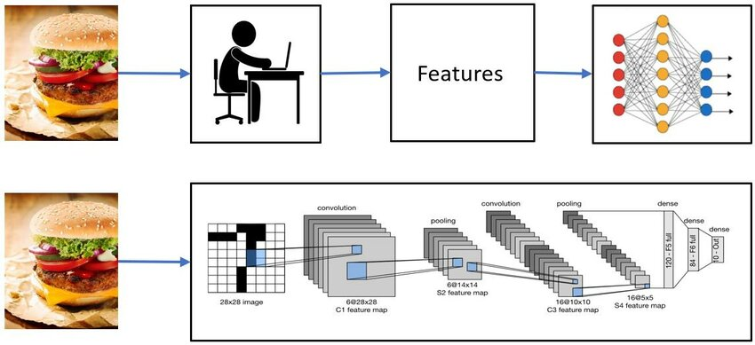
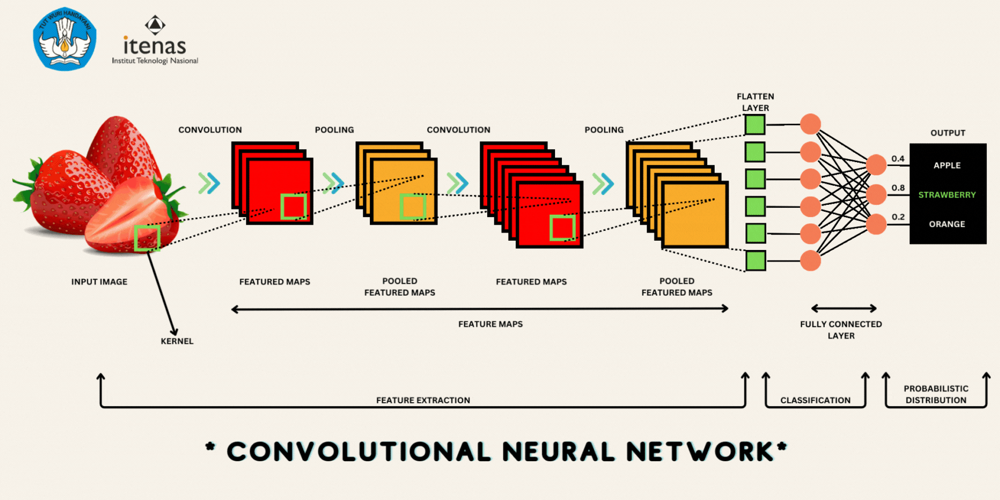

## Contents:<!-- omit in toc -->

- [1. Introduction to Computer Vision](#1-introduction-to-computer-vision)
  - [Definition and Scope](#definition-and-scope)
  - [Importance and Applications](#importance-and-applications)
  - [Historical Background and Evolution](#historical-background-and-evolution)
- [2. Fundamentals of Computer Vision](#2-fundamentals-of-computer-vision)
  - [Image Processing Basics](#image-processing-basics)
  - [Feature Extraction](#feature-extraction)
- [3. Computer Vision Algorithms](#3-computer-vision-algorithms)
  - [Classical Algorithms](#classical-algorithms)
  - [Machine Learning Approaches](#machine-learning-approaches)
- [4. Deep Learning in Computer Vision](#4-deep-learning-in-computer-vision)
  - [Convolutional Neural Networks (CNNs)](#convolutional-neural-networks-cnns)
  - [Transfer Learning](#transfer-learning)
- [5. Key Applications of Computer Vision](#5-key-applications-of-computer-vision)
  - [Image Classification](#image-classification)
  - [Object Detection](#object-detection)
  - [Image Segmentation](#image-segmentation)
  - [Facial Recognition](#facial-recognition)
  - [Medical Imaging](#medical-imaging)
- [6. Challenges in Computer Vision](#6-challenges-in-computer-vision)
  - [Data Quality and Quantity](#data-quality-and-quantity)
  - [Computational Resources](#computational-resources)
  - [Ethical and Privacy Concerns](#ethical-and-privacy-concerns)
- [7. Future Trends in Computer Vision](#7-future-trends-in-computer-vision)
  - [Emerging Technologies](#emerging-technologies)
  - [Advancements in Algorithms](#advancements-in-algorithms)
- [8. Videos: Computer Vision Fundamentals](#8-videos-computer-vision-fundamentals)
- [9. Conclusion](#9-conclusion)
- [10. Related Content](#10-related-content)
- [11. References](#11-references)



## 1. Introduction to Computer Vision

<iframe src="https://drive.google.com/file/d/1hvLtt68CZ9azj3b7tof2ELKQ_2a6jTQ8/preview" frameborder="0" style="position: absolute; top: 0; left: 0; width: 100%; height: 100%;" allowfullscreen></iframe>

Computer Vision is an interdisciplinary field that enables computers to interpret and make decisions based on visual data, replicating human visual perception through the use of algorithms and models.

> [!NOTE]  
> Reference and Details: [CV Project-1](https://github.com/amitkumar-aimlp/projects/tree/content/cv-project-1)
>
> Reference and Details: [CV Project-2](https://github.com/amitkumar-aimlp/projects/tree/content/cv-project-2)
>
> Reference and Details: [CV Project-3](https://github.com/amitkumar-aimlp/projects/tree/content/cv-project-3)

### Definition and Scope

Computer Vision involves the extraction of meaningful information from visual inputs such as images or videos. It encompasses a range of tasks including image recognition, object detection, image segmentation, and video analysis. The field draws from multiple areas including mathematics, computer science, and cognitive science.

### Importance and Applications

The significance of computer vision is reflected in its wide array of applications:

- **Healthcare**: Assisting in diagnostic imaging and disease detection.
- **Automotive**: Enhancing the development of autonomous vehicles.
- **Retail**: Powering checkout systems and customer analytics.
- **Security**: Enabling surveillance and facial recognition systems.
- **Agriculture**: Monitoring crop health and automating farming processes.

### Historical Background and Evolution

Computer Vision has evolved from basic image processing techniques to sophisticated AI-driven solutions. Early work focused on simple pattern recognition, but the field gained momentum with the advent of machine learning and deep learning. Milestones include the development of the first edge detection algorithms in the 1980s and the significant breakthroughs achieved by convolutional neural networks (CNNs) in the 2010s.

## 2. Fundamentals of Computer Vision

To grasp how computer vision systems operate, it is essential to understand their foundational elements.

### Image Processing Basics

- **Pixels and Color Models**: Images are composed of a grid of pixels, each with color values defined in models such as RGB or HSV. Understanding color models helps in tasks like color correction and segmentation.
- **Image Filtering and Enhancement**: Techniques such as Gaussian blurring reduce noise, while sharpening filters enhance edges. Contrast stretching improves image visibility, making features more discernible for analysis.

### Feature Extraction

- **Edge Detection**: Algorithms like the Canny edge detector and Sobel filter are used to identify transitions between different regions of an image. This is crucial for detecting boundaries and shapes.
- **Keypoint Detection**: Methods such as SIFT and SURF extract distinctive points in an image, which are invariant to scaling and rotation. These keypoints are essential for tasks like image matching and object recognition.
- **Feature Descriptors**: Descriptors like the Histogram of Oriented Gradients (HOG) and Scale-Invariant Feature Transform (SIFT) provide robust representations of detected keypoints, enabling efficient matching across images.

## 3. Computer Vision Algorithms

Various algorithms are employed to analyze visual data, each with its strengths and applications.

### Classical Algorithms

- **Template Matching**: This technique involves sliding a template across an image to find matches. It is useful for object detection when the object’s appearance is known and relatively invariant.
- **Histogram of Oriented Gradients (HOG)**: HOG descriptors capture the gradient structure of objects and are widely used for detecting pedestrians and vehicles. The method is effective due to its robustness to variations in lighting and occlusion.

### Machine Learning Approaches

- **Support Vector Machines (SVM)**: SVMs classify data by finding the hyperplane that best separates different classes. They are particularly effective in high-dimensional spaces and for small-to-medium-sized datasets.
- **K-Nearest Neighbors (KNN)**: KNN classifies data based on the majority vote of its nearest neighbors in the feature space. It is simple to implement and effective for problems where data distribution is relatively uniform.

## 4. Deep Learning in Computer Vision

Deep learning has transformed computer vision, enabling the development of models that achieve state-of-the-art performance on a variety of tasks.

### Convolutional Neural Networks (CNNs)

- **Architecture and Layers**: CNNs consist of convolutional layers that detect features, pooling layers that reduce dimensionality, and fully connected layers that perform classification. This architecture allows CNNs to capture spatial hierarchies in images.
- **Popular CNN Models**:
  - **AlexNet**: Pioneered the use of deep learning for image classification, achieving a significant performance improvement in the ImageNet competition. It introduced the use of Rectified Linear Units (ReLUs) for activation.
  - **VGG**: Known for its uniform architecture of 3x3 convolutional filters and deep network depth, VGG models are used as feature extractors in many applications.
  - **ResNet**: Introduced residual connections that help train very deep networks by mitigating the vanishing gradient problem, enabling the creation of extremely deep and powerful models.

### Transfer Learning

- **Pre-trained Models**: Transfer learning involves using models trained on large datasets (like ImageNet) as a starting point for new tasks. This approach saves time and resources by leveraging existing knowledge.
- **Fine-Tuning and Adaptation**: Fine-tuning involves adjusting the weights of a pre-trained model on a new dataset. This process improves the model's performance on specific tasks by adapting it to the new data’s characteristics.

## 5. Key Applications of Computer Vision

Computer Vision technology has diverse applications across various domains, each leveraging different aspects of visual analysis.

### Image Classification

- **Object Recognition**: This involves categorizing objects within an image, such as identifying specific animal species or recognizing products in retail settings. Deep learning models like CNNs have significantly improved accuracy in this area.
- **Scene Understanding**: This includes analyzing the broader context of an image, such as determining whether an image depicts a beach or a cityscape. Scene understanding can enhance applications in autonomous navigation and content analysis.

### Object Detection

- **Bounding Box Detection**: This technique involves identifying and locating objects in an image with bounding boxes. It is critical for applications like facial recognition and autonomous driving.
- **Real-Time Detection**: Algorithms such as YOLO (You Only Look Once) and SSD (Single Shot MultiBox Detector) enable real-time object detection, allowing systems to process and respond to visual data quickly and accurately.

### Image Segmentation

- **Semantic Segmentation**: This process involves classifying each pixel in an image into a predefined category, such as segmenting road lanes for autonomous vehicles. Techniques like U-Net are commonly used for medical image segmentation.
- **Instance Segmentation**: Extending semantic segmentation, instance segmentation distinguishes between different objects of the same class, such as identifying individual people in a crowded scene.

### Facial Recognition

- **Face Detection**: Algorithms detect the presence and location of faces in images, often using methods like Haar cascades or deep learning-based detectors. Face detection is the first step in many facial recognition systems.
- **Facial Landmark Detection**: This involves identifying key facial features such as eyes, nose, and mouth. Landmark detection is used for applications like emotion recognition and facial alignment.

### Medical Imaging

- **Disease Diagnosis**: Computer vision models analyze medical images to assist in diagnosing conditions such as tumors, fractures, or retinal diseases. Techniques like deep learning have enhanced the accuracy and speed of medical diagnostics.
- **Image Enhancement**: Methods such as noise reduction and contrast adjustment improve the quality of medical images, facilitating better visualization and diagnosis.

## 6. Challenges in Computer Vision

Despite its advancements, computer vision faces several challenges that affect its deployment and effectiveness.

### Data Quality and Quantity

- **Annotation and Labeling**: Creating high-quality labeled datasets is time-consuming and expensive. Accurate annotation is crucial for training effective models, but it often involves manual labor and expert knowledge.
- **Handling Diverse Datasets**: Models must be robust to variations in data, including changes in lighting, viewpoint, and object appearance. This requires diverse training datasets and techniques for data augmentation.

### Computational Resources

- **Processing Power**: Training complex models, particularly deep neural networks, requires significant computational power. Access to GPUs or TPUs is often necessary for efficient training.
- **Memory Requirements**: High-resolution images and large models demand substantial memory, which can be a limiting factor in resource-constrained environments. Efficient model architectures and compression techniques can help address this issue.

### Ethical and Privacy Concerns

- **Data Security**: Ensuring the security of visual data is critical, particularly in sensitive applications like facial recognition or medical imaging. Measures must be taken to protect data from unauthorized access and misuse.
- **Bias and Fairness**: Computer vision systems must be designed to avoid bias and ensure fairness. This involves addressing issues such as biased training data and ensuring that models perform equitably across different demographic groups.

## 7. Future Trends in Computer Vision

The future of computer vision is shaped by ongoing research and emerging technologies that promise to push the boundaries of what is possible.

### Emerging Technologies

- **Augmented Reality (AR) and Virtual Reality (VR)**: Computer vision enhances AR and VR experiences by enabling real-time interaction with virtual objects and environments. Applications include immersive gaming, virtual training, and interactive design.
- **Autonomous Vehicles**: Advances in computer vision are driving the development of self-driving cars, which rely on visual perception to navigate, detect obstacles, and make decisions. This includes integrating object detection, lane tracking, and sensor fusion.

### Advancements in Algorithms

- **Self-Supervised Learning**: This approach allows models to learn from unlabeled data by creating supervisory signals from the data itself. Self-supervised learning can reduce the reliance on large labeled datasets and improve model performance.
- **Improved Model Efficiency**: Researchers are developing more efficient models that require fewer computational resources and can run on mobile and edge devices. Techniques such as model pruning, quantization, and neural architecture search contribute to this progress.

## 8. Videos: Computer Vision Fundamentals

Discover how computers interpret and understand visual information through cutting-edge algorithms and technologies. From basic concepts to advanced applications like object detection and image segmentation, this video provides a comprehensive overview of how Computer Vision is transforming industries such as healthcare, automotive, and security. Perfect for enthusiasts and professionals alike, join us for an insightful exploration of this exciting field!

<iframe src="https://www.youtube.com/embed/vT1JzLTH4G4?si=9_eHf_tA70_9FUUv" frameborder="0" style="position: absolute; top: 0; left: 0; width: 100%; height: 100%;" allowfullscreen></iframe>

## 9. Conclusion

Computer Vision is a transformative field that continues to evolve and expand its influence across various sectors. Its ability to analyze and understand visual data has far-reaching implications, from enhancing daily applications to advancing cutting-edge technology. As research progresses and new innovations emerge, computer vision will likely continue to play a pivotal role in shaping the future of technology and society.

## 10. Related Content

- [Python Programming Language Syntax and Examples](https://amitkumar-aimlp.github.io/projects/python-programming-language-syntax-and-examples/)
- [NumPy for Data Science: A Comprehensive Guide](https://amitkumar-aimlp.github.io/projects/numpy-for-data-science-a-comprehensive-guide/)
- [Pandas for Data Science: A Comprehensive Guide](https://amitkumar-aimlp.github.io/projects/pandas-for-data-science-a-comprehensive-guide/)
- [Pandas Vs. SQL: A Comprehensive Comparison](https://amitkumar-aimlp.github.io/projects/pandas-vs-sql-a-comprehensive-comparison/)
- [PySpark Using Databricks: A Comprehensive Guide](https://amitkumar-aimlp.github.io/projects/pyspark-using-databricks-a-comprehensive-guide/)
- [Pandas Vs. PySpark: A Comprehensive Comparison](https://amitkumar-aimlp.github.io/projects/pandas-vs-pyspark-a-comprehensive-comparison/)
- [Matplotlib for Data Visualization](https://amitkumar-aimlp.github.io/projects/matplotlib-for-data-visualization/)
- [Applied Statistics: An Overview](https://amitkumar-aimlp.github.io/projects/applied-statistics-an-overview/)
- [Supervised Learning – A Simple Guide](https://amitkumar-aimlp.github.io/projects/supervised-learning-a-simple-guide/)
- [Unsupervised Learning – A Simple Guide](https://amitkumar-aimlp.github.io/projects/unsupervised-learning-a-simple-guide/)
- [Ensemble Learning –  Methods](https://amitkumar-aimlp.github.io/projects/ensemble-learning-methods/)
- [Feature Engineering - An Overview](https://amitkumar-aimlp.github.io/projects/feature-engineering-an-overview/)
- [Hyperparameter Optimization](https://amitkumar-aimlp.github.io/projects/hyperparameter-optimization/)
- [Recommender Systems](https://amitkumar-aimlp.github.io/projects/recommender-systems/)
- [Deep Learning Fundamentals](https://amitkumar-aimlp.github.io/projects/deep-learning-fundamentals/)
- [Semi-supervised Learning](https://amitkumar-aimlp.github.io/projects/semi-supervised-learning/)
- [Natural Language Processing](https://amitkumar-aimlp.github.io/projects/natural-language-processing/)
- [Time Series Analysis](https://amitkumar-aimlp.github.io/projects/time-series-analysis/)

## 11. References

1. **Szeliski, R.** (2011). _Computer Vision: Algorithms and Applications_. Springer.  
   Provides a comprehensive overview of computer vision techniques, algorithms, and applications.
2. **Goodfellow, I., Bengio, Y., & Courville, A.** (2016). _Deep Learning_. MIT Press.  
   An authoritative text on deep learning, including the use of Convolutional Neural Networks (CNNs) in computer vision.
3. **Russell, S., & Norvig, P.** (2020). _Artificial Intelligence: A Modern Approach_. Pearson.  
   Covers a wide range of AI topics, including computer vision and machine learning techniques.
4. **Krizhevsky, A., Sutskever, I., & Hinton, G. E.** (2012). ImageNet Classification with Deep Convolutional Neural Networks. _Advances in Neural Information Processing Systems (NeurIPS)_.  
   The landmark paper on AlexNet, which significantly advanced the field of computer vision.
5. **Simonyan, K., & Zisserman, A.** (2014). Very Deep Convolutional Networks for Large-Scale Image Recognition. _International Conference on Learning Representations (ICLR)_.  
   Introduces the VGG architecture and its application to image classification.
6. **He, K., Zhang, X., Ren, S., & Sun, J.** (2015). Deep Residual Learning for Image Recognition. _IEEE Conference on Computer Vision and Pattern Recognition (CVPR)_.  
   Discusses the ResNet architecture, which addresses the vanishing gradient problem in very deep networks.
7. **Redmon, J., Divvala, S., Girshick, R., & Farhadi, A.** (2016). You Only Look Once: Unified, Real-Time Object Detection. _IEEE Conference on Computer Vision and Pattern Recognition (CVPR)_.  
   Details the YOLO algorithm, known for its real-time object detection capabilities.
8. **Ren, S., He, K., Girshick, R., & Sun, J.** (2015). Faster R-CNN: Towards Real-Time Object Detection with Region Proposal Networks. _Advances in Neural Information Processing Systems (NeurIPS)_.  
   Introduces the Faster R-CNN method, improving object detection speed and accuracy.
9. **Long, J., Shelhamer, E., & Darrell, T.** (2015). Fully Convolutional Networks for Semantic Segmentation. _IEEE Conference on Computer Vision and Pattern Recognition (CVPR)_.  
   Presents the Fully Convolutional Networks (FCNs) for semantic segmentation tasks.
10. **Girshick, R.** (2015). Fast R-CNN. _IEEE International Conference on Computer Vision (ICCV)_.  
    Describes the Fast R-CNN method, which improves the efficiency of object detection models.
11. **Bishop, C. M.** (2006). _Pattern Recognition and Machine Learning_. Springer.  
    Offers foundational knowledge in machine learning techniques relevant to computer vision.
12. **Maturana, D., & Scherer, S.** (2015). 3D Object Detection and Tracking for Autonomous Vehicles. _IEEE Conference on Computer Vision and Pattern Recognition (CVPR)_.  
    Discusses object detection and tracking methods used in autonomous driving systems.
13. **Pintér, S., & Fehér, Z.** (2022). Transfer Learning and Domain Adaptation: An Overview. _Journal of Machine Learning Research (JMLR)_.  
    Provides insights into transfer learning and its applications in computer vision.
14. **Zhou, B., Khosla, A., Lapedriza, A., Oliva, A., & Torralba, A.** (2016). Learning Deep Features for Discriminative Localization. _IEEE Conference on Computer Vision and Pattern Recognition (CVPR)_.  
    Covers the development of methods for object localization using deep features.
15. **Chollet, F.** (2018). _Deep Learning with Python_. Manning Publications.  
    Introduces deep learning concepts and practical implementations with Python, including computer vision applications.
16. [Computer Vision](https://en.wikipedia.org/wiki/Computer_vision)
17. [Convolutional Neural Networks cheatsheet](https://stanford.edu/~shervine/teaching/cs-230/cheatsheet-convolutional-neural-networks)
18. [Spada Indonesia](https://spada.kemdikbud.go.id)

> ### I do not think there is any other quality so essential to success of any kind as the quality of perseverance. It overcomes almost everything, even nature.
>
> -John D. Rockefeller

---

_Published: 2020-01-20; Updated: 2024-05-01_

---

[TOP](#contents)
