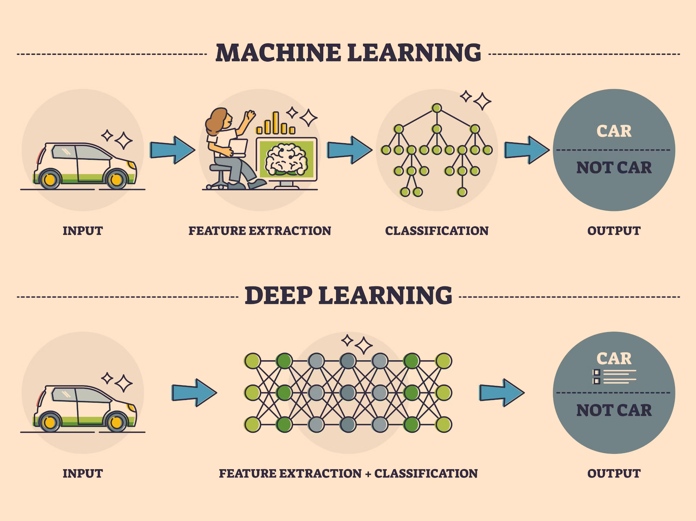
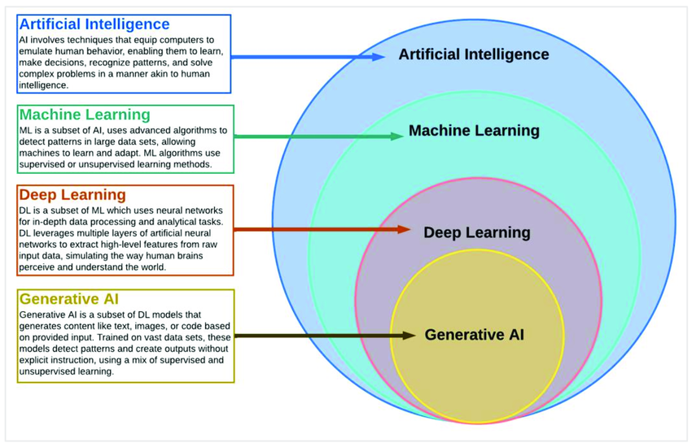

## Contents:<!-- omit in toc -->

- [1. Introduction to Deep Learning](#1-introduction-to-deep-learning)
- [1.1 What is Deep Learning?](#11-what-is-deep-learning)
  - [Definition](#definition)
  - [Relation to Machine Learning](#relation-to-machine-learning)
  - [Historical Context](#historical-context)
- [1.2 Importance and Applications](#12-importance-and-applications)
  - [Image Recognition](#image-recognition)
  - [Natural Language Processing (NLP)](#natural-language-processing-nlp)
  - [Speech Recognition](#speech-recognition)
  - [Autonomous Systems](#autonomous-systems)
  - [Healthcare](#healthcare)
  - [Finance](#finance)
- [2. Core Concepts](#2-core-concepts)
- [2.1 Neural Networks](#21-neural-networks)
  - [Overview of Neural Networks](#overview-of-neural-networks)
  - [Structure: Neurons, Layers, and Weights](#structure-neurons-layers-and-weights)
  - [Activation Functions](#activation-functions)
- [2.2 Architecture of Deep Neural Networks](#22-architecture-of-deep-neural-networks)
  - [Feedforward Neural Networks (FNN)](#feedforward-neural-networks-fnn)
  - [Convolutional Neural Networks (CNN)](#convolutional-neural-networks-cnn)
  - [Recurrent Neural Networks (RNN) and Long Short-Term Memory (LSTM)](#recurrent-neural-networks-rnn-and-long-short-term-memory-lstm)
  - [Generative Adversarial Networks (GANs)](#generative-adversarial-networks-gans)
  - [Transformer Networks](#transformer-networks)
  - [Attention Mechanisms](#attention-mechanisms)
- [2.3 Training Deep Learning Models](#23-training-deep-learning-models)
  - [Forward Propagation](#forward-propagation)
  - [Backpropagation and Gradient Descent](#backpropagation-and-gradient-descent)
  - [Loss Functions](#loss-functions)
  - [Optimization Algorithms](#optimization-algorithms)
  - [Learning Rate Schedulers](#learning-rate-schedulers)
  - [Batch Normalization](#batch-normalization)
- [2.4 Evaluation Metrics](#24-evaluation-metrics)
  - [Classification Metrics](#classification-metrics)
  - [Regression Metrics](#regression-metrics)
- [3. Tools and Frameworks](#3-tools-and-frameworks)
- [3.1 Popular Deep Learning Frameworks](#31-popular-deep-learning-frameworks)
  - [TensorFlow](#tensorflow)
  - [Keras](#keras)
  - [PyTorch](#pytorch)
  - [MXNet](#mxnet)
  - [Caffe](#caffe)
- [3.2 Software Libraries and Platforms](#32-software-libraries-and-platforms)
  - [GPU and TPU Acceleration](#gpu-and-tpu-acceleration)
  - [Cloud-Based Platforms](#cloud-based-platforms)
- [3.3 Development Environments](#33-development-environments)
  - [Jupyter Notebooks](#jupyter-notebooks)
  - [Colab](#colab)
  - [Integrated Development Environments (IDEs) for Python](#integrated-development-environments-ides-for-python)
- [4. Advanced Topics](#4-advanced-topics)
- [4.1 Transfer Learning](#41-transfer-learning)
  - [Concept and Benefits](#concept-and-benefits)
  - [Pretrained Models](#pretrained-models)
  - [Fine-Tuning Techniques](#fine-tuning-techniques)
- [4.2 Hyperparameter Tuning](#42-hyperparameter-tuning)
  - [Learning Rate](#learning-rate)
  - [Batch Size](#batch-size)
  - [Number of Epochs](#number-of-epochs)
  - [Regularization Techniques](#regularization-techniques)
  - [Grid Search vs. Random Search vs. Bayesian Optimization](#grid-search-vs-random-search-vs-bayesian-optimization)
- [4.3 Interpretability and Explainability](#43-interpretability-and-explainability)
  - [Model Visualization](#model-visualization)
  - [Techniques for Explainable AI](#techniques-for-explainable-ai)
  - [Model Debugging](#model-debugging)
- [4.4 Model Deployment](#44-model-deployment)
  - [Deployment Strategies](#deployment-strategies)
  - [Serving Models](#serving-models)
  - [Monitoring and Maintenance](#monitoring-and-maintenance)
- [5. Challenges and Considerations](#5-challenges-and-considerations)
- [5.1 Overfitting and Underfitting](#51-overfitting-and-underfitting)
  - [Definitions](#definitions)
  - [Techniques to Combat Overfitting](#techniques-to-combat-overfitting)
  - [Regularization Techniques](#regularization-techniques-1)
- [5.2 Data Requirements](#52-data-requirements)
  - [Large Datasets](#large-datasets)
  - [Data Augmentation Techniques](#data-augmentation-techniques)
  - [Synthetic Data Generation](#synthetic-data-generation)
- [5.3 Ethical and Societal Implications](#53-ethical-and-societal-implications)
  - [Bias and Fairness](#bias-and-fairness)
  - [Privacy Concerns](#privacy-concerns)
  - [Responsible AI Practices](#responsible-ai-practices)
- [5.4 Computational Resources](#54-computational-resources)
  - [Hardware Requirements](#hardware-requirements)
  - [Cost Considerations](#cost-considerations)
- [6. Future Trends](#6-future-trends)
- [6.1 Emerging Technologies](#61-emerging-technologies)
  - [Quantum Computing in AI](#quantum-computing-in-ai)
  - [AI for Drug Discovery](#ai-for-drug-discovery)
  - [Self-Supervised Learning](#self-supervised-learning)
  - [Neuromorphic Computing](#neuromorphic-computing)
- [6.2 Integration with Other Fields](#62-integration-with-other-fields)
  - [AI in Robotics](#ai-in-robotics)
  - [AI in IoT](#ai-in-iot)
  - [AI in Education](#ai-in-education)
- [6.3 AI in Business](#63-ai-in-business)
  - [Automation](#automation)
  - [Personalization](#personalization)
  - [Customer Service](#customer-service)
- [Videos: Master the Deep Learning](#videos-master-the-deep-learning)
- [7. Conclusion](#7-conclusion)
- [7.1 Summary of Key Points](#71-summary-of-key-points)
- [7.2 Future Directions](#72-future-directions)
- [7.3 Further Reading and Resources](#73-further-reading-and-resources)
- [Related Content](#related-content)
- [References](#references)



## 1. Introduction to Deep Learning

## 1.1 What is Deep Learning?

Deep Learning is an advanced machine learning technique that models complex patterns in data using neural networks with multiple layers. Unlike traditional machine learning methods, which require manual feature extraction, Deep Learning automates this process through multiple hierarchical layers.

> [!NOTE]  
> Reference and Details: [Deep Learning Project](https://github.com/amitkumar-aimlp/projects/tree/content/deep-learning-project)

### Definition

Deep Learning involves neural networks with many layers (hence "deep") to analyze and transform data into meaningful outputs. These networks consist of interconnected nodes (neurons) that process data through various transformations. By stacking multiple layers, Deep Learning models can learn increasingly abstract features, making them particularly effective for tasks like image and speech recognition.

### Relation to Machine Learning

While Machine Learning involves training algorithms to learn from data and make predictions, Deep Learning extends this concept by using deep neural networks. Traditional machine learning models often rely on feature engineering, where domain experts manually extract features from data. In contrast, Deep Learning models automatically discover and learn these features from raw data, reducing the need for manual intervention.

### Historical Context

The theoretical foundations of neural networks date back to the 1950s with early models like the Perceptron. However, Deep Learning as we know it began to gain traction in the early 2010s due to breakthroughs in computational power (especially GPUs), the availability of large datasets, and advancements in algorithms. The success of models like AlexNet in the 2012 ImageNet competition marked a significant turning point, showcasing the potential of deep neural networks.

## 1.2 Importance and Applications

Deep Learning has transformed various industries by enabling new applications and improving existing ones.

### Image Recognition

Deep Learning, particularly through Convolutional Neural Networks (CNNs), has achieved remarkable accuracy in image recognition tasks. These models are used for facial recognition in security systems, object detection in autonomous vehicles, and medical imaging for diagnosing diseases such as cancer and diabetic retinopathy.

### Natural Language Processing (NLP)

NLP tasks have been revolutionized by Deep Learning models like Recurrent Neural Networks (RNNs) and Transformers. Applications include sentiment analysis, which helps businesses understand customer opinions, and machine translation, which enables real-time language translation in applications like Google Translate.

### Speech Recognition

Deep Learning has significantly improved speech recognition systems. Models like Deep Neural Networks (DNNs) and Long Short-Term Memory (LSTM) networks are used in virtual assistants such as Siri and Alexa, making voice commands and dictation more accurate and responsive.

### Autonomous Systems

Autonomous vehicles rely on Deep Learning for interpreting sensor data, making real-time driving decisions, and navigating complex environments. Similarly, robotics uses Deep Learning for tasks such as object manipulation and autonomous navigation.

### Healthcare

Deep Learning is transforming healthcare by enabling predictive analytics and personalized medicine. Models analyze medical records to predict patient outcomes, analyze genetic data to identify potential health risks, and assist in drug discovery by predicting molecular interactions.

### Finance

In finance, Deep Learning is used for algorithmic trading, fraud detection, and risk assessment. Models analyze market trends to make investment decisions, detect unusual transactions to prevent fraud, and evaluate credit risks to approve loans.

## 2. Core Concepts

## 2.1 Neural Networks

Neural Networks are the backbone of Deep Learning, comprising interconnected neurons organized into layers.

### Overview of Neural Networks

Neural Networks are computational models inspired by the human brain. They consist of layers of neurons where each neuron is connected to others in the subsequent layer. Data is passed through these layers, with each neuron applying a transformation to the data and passing the result to the next layer.

### Structure: Neurons, Layers, and Weights

- **Neurons**: The basic units of neural networks that receive input, apply a transformation (using an activation function), and send output to the next layer.
- **Layers**: Neural networks are composed of:
  - **Input Layer**: Receives the raw input data.
  - **Hidden Layers**: Intermediate layers where computations are performed. These layers extract features from the data.
  - **Output Layer**: Produces the final prediction or classification result.
- **Weights**: Parameters that are adjusted during training to minimize the error between predicted and actual outputs. Each connection between neurons has an associated weight that influences the data flow through the network.

### Activation Functions

Activation functions introduce non-linearity into the network, enabling it to model complex patterns:

- **ReLU (Rectified Linear Unit)**: Computes the positive part of its input (max(0, x)). It is efficient and helps mitigate the vanishing gradient problem.
- **Sigmoid**: Maps outputs to a range between 0 and 1. It is often used in binary classification tasks but can suffer from vanishing gradients.
- **Tanh (Hyperbolic Tangent)**: Maps outputs to a range between -1 and 1. It is centered around zero, which can make optimization easier compared to the sigmoid function.

## 2.2 Architecture of Deep Neural Networks

### Feedforward Neural Networks (FNN)

Feedforward Neural Networks are the simplest type of neural network where connections between nodes do not form cycles. Data flows from the input layer to the output layer through hidden layers, with each layer performing a transformation on the data.

### Convolutional Neural Networks (CNN)

CNNs are specialized neural networks designed for processing grid-like data such as images. They use convolutional layers to automatically and adaptively learn spatial hierarchies of features. Key components include:

- **Convolutional Layers**: Apply filters to input data to produce feature maps.
- **Pooling Layers**: Reduce the dimensionality of feature maps while retaining important features (e.g., max pooling).
- **Fully Connected Layers**: Connect every neuron from the previous layer to every neuron in the current layer, used to combine features learned by convolutional layers.

### Recurrent Neural Networks (RNN) and Long Short-Term Memory (LSTM)

- **RNN**: Designed for sequential data where the output depends on previous computations. Useful for tasks such as time-series forecasting and language modeling.
- **LSTM**: A type of RNN that can capture long-term dependencies and avoid vanishing gradients. It uses gates to control the flow of information, making it effective for tasks with long sequences, such as text generation and speech recognition.

### Generative Adversarial Networks (GANs)

GANs consist of two networks: a generator and a discriminator. The generator creates synthetic data, while the discriminator evaluates its authenticity. The two networks are trained simultaneously, with the generator improving its ability to produce realistic data and the discriminator becoming better at distinguishing real from fake data.

### Transformer Networks

Transformers use self-attention mechanisms to process sequences of data more effectively than RNNs. They have revolutionized NLP tasks by enabling models to consider the relationships between all words in a sentence, leading to significant improvements in machine translation, text generation, and question answering.

### Attention Mechanisms

Attention mechanisms allow models to focus on different parts of the input data when making predictions. For example, in machine translation, attention helps the model focus on relevant words in the source language when generating words in the target language.

## 2.3 Training Deep Learning Models

### Forward Propagation

Forward Propagation involves passing input data through the network layers to obtain an output. Each layer performs computations and transformations on the data, culminating in the final prediction or classification.

### Backpropagation and Gradient Descent

- **Backpropagation**: Computes gradients of the loss function with respect to each weight in the network by applying the chain rule. These gradients indicate how to adjust the weights to reduce the loss.
- **Gradient Descent**: An optimization algorithm that updates weights iteratively to minimize the loss function. Variants include:
  - **Batch Gradient Descent**: Uses the entire training dataset to compute gradients.
  - **Stochastic Gradient Descent (SGD)**: Uses individual training examples, which introduces noise but can lead to faster convergence.
  - **Mini-Batch Gradient Descent**: Combines the benefits of both by using small batches of data for gradient computation.

### Loss Functions

- **Cross-Entropy**: Measures the difference between the true class probabilities and the predicted probabilities. Commonly used in classification tasks.
- **Mean Squared Error (MSE)**: Measures the average squared difference between predicted and actual values. Used in regression tasks to evaluate model performance.

### Optimization Algorithms

- **SGD (Stochastic Gradient Descent)**: Updates weights based on each training example, introducing noise but allowing for faster convergence.
- **Adam**: An adaptive learning rate algorithm that combines the advantages of momentum and adaptive gradient methods. It adjusts learning rates based on the first and second moments of gradients.
- **RMSprop**: Normalizes the learning rate based on a moving average of squared gradients, which helps stabilize training.

### Learning Rate Schedulers

Learning rate schedulers adjust the learning rate during training to improve convergence. Common techniques include:

- **Step Decay**: Reduces the learning rate by a factor at predefined epochs.
- **Exponential Decay**: Decreases the learning rate exponentially over time.
- **Cosine Annealing**: Modulates the learning rate following a cosine function, which helps escape local minima and improve training.

### Batch Normalization

Batch Normalization normalizes the inputs to a layer by adjusting and scaling activations. It reduces internal covariate shift, leading to faster training and improved model performance.

## 2.4 Evaluation Metrics

### Classification Metrics

- **Accuracy**: The proportion of correct predictions out of the total number of predictions. Useful for balanced datasets.
- **Precision**: The proportion of true positives among all predicted positives. Important for tasks where false positives are costly.
- **Recall**: The proportion of true positives among all actual positives. Crucial for tasks where false negatives are costly.
- **F1 Score**: The harmonic mean of precision and recall, providing a single metric that balances both.

### Regression Metrics

- **Mean Absolute Error (MAE)**: The average of the absolute differences between predicted and actual values. Provides a straightforward measure of prediction accuracy.
- **R^2 Score**: Indicates how well the model explains the variance in the target variable. An R^2 score close to 1 indicates a good fit.

## 3. Tools and Frameworks

## 3.1 Popular Deep Learning Frameworks

### TensorFlow

TensorFlow is an open-source framework developed by Google for building and deploying machine learning models. It supports a wide range of applications from training deep neural networks to deploying models on various platforms.

### Keras

Keras is a high-level API for TensorFlow that simplifies model creation and training. It provides a user-friendly interface for building neural networks with minimal code, making it accessible to both beginners and experts.

### PyTorch

PyTorch is an open-source deep learning framework developed by Facebook. It is known for its dynamic computation graph, which allows for more flexible and intuitive model development. PyTorch is widely used in research and has gained popularity for its ease of use and performance.

### MXNet

MXNet is an open-source deep learning framework designed for efficiency and scalability. It supports both symbolic and imperative programming, making it suitable for a range of applications from research to production.

### Caffe

Caffe is a deep learning framework developed by the Berkeley Vision and Learning Center. It is known for its speed and modularity, making it suitable for large-scale image classification tasks.

## 3.2 Software Libraries and Platforms

### GPU and TPU Acceleration

Graphics Processing Units (GPUs) and Tensor Processing Units (TPUs) are specialized hardware designed to accelerate deep learning computations. GPUs parallelize matrix operations, speeding up training and inference. TPUs, developed by Google, are custom accelerators optimized for tensor processing, further enhancing performance.

### Cloud-Based Platforms

- **Google Cloud AI**: Provides a suite of tools and services for building and deploying AI models, including pre-trained models, custom model training, and scalable infrastructure.
- **AWS SageMaker**: Offers a comprehensive set of tools for developing, training, and deploying machine learning models. Features include built-in algorithms, automated model tuning, and integration with other AWS services.
- **Azure ML**: Microsoft’s platform for machine learning that provides tools for building, training, and managing models. It includes features for automated machine learning, model interpretability, and deployment.

## 3.3 Development Environments

### Jupyter Notebooks

Jupyter Notebooks provide an interactive environment for writing and executing code, visualizing data, and documenting the analysis process. They support multiple languages, including Python, and are widely used in data science and machine learning.

### Colab

Google Colab is a cloud-based environment that allows users to run Jupyter notebooks with free access to GPUs. It is particularly useful for prototyping and experimenting with deep learning models without the need for local hardware.

### Integrated Development Environments (IDEs) for Python

IDEs like PyCharm and Visual Studio Code offer advanced features for coding, debugging, and managing projects. They provide integrated tools for version control, testing, and code analysis, enhancing productivity in deep learning development.

## 4. Advanced Topics

## 4.1 Transfer Learning

### Concept and Benefits

Transfer Learning involves leveraging a pre-trained model on a related task to improve performance on a new task. It allows for faster training and better results with limited data by transferring knowledge learned from large datasets to smaller, domain-specific datasets.

### Pretrained Models

- **VGG**: A CNN architecture known for its simplicity and depth, widely used for image classification tasks.
- **ResNet**: Uses residual blocks to facilitate the training of very deep networks. ResNet models have achieved state-of-the-art performance in image classification and object detection.
- **BERT**: A transformer-based model for NLP tasks, including text classification and question answering. BERT’s bidirectional approach allows it to capture context from both directions, improving performance on various NLP benchmarks.

### Fine-Tuning Techniques

Fine-tuning involves adjusting a pre-trained model’s parameters on a new dataset. Techniques include:

- **Feature Extraction**: Using the pre-trained model as a fixed feature extractor and training a new classifier on top of it.
- **Full Model Fine-Tuning**: Updating all layers of the pre-trained model with a lower learning rate to adapt it to the new task.

## 4.2 Hyperparameter Tuning

### Learning Rate

The learning rate controls the size of weight updates during training. Choosing an appropriate learning rate is crucial for convergence and stability. Too high a learning rate may cause the model to converge prematurely, while too low a rate may result in slow convergence.

### Batch Size

Batch size refers to the number of training examples used in one iteration. Larger batch sizes can improve training stability and parallelism but may require more memory. Smaller batch sizes introduce noise into the training process, which can help escape local minima.

### Number of Epochs

Epochs refer to the number of times the entire training dataset is passed through the model. The number of epochs affects model performance and training time. Using techniques like early stopping can help determine the optimal number of epochs.

### Regularization Techniques

- **Dropout**: Randomly omits neurons during training to prevent overfitting. It helps the model generalize better by reducing reliance on specific neurons.
- **L2 Regularization**: Adds a penalty proportional to the square of the weights to the loss function. It discourages large weights and helps prevent overfitting.

### Grid Search vs. Random Search vs. Bayesian Optimization

- **Grid Search**: Exhaustively searches over a predefined set of hyperparameters, which can be computationally expensive but thorough.
- **Random Search**: Randomly samples hyperparameters from a defined space. It is less exhaustive but can be more efficient and often finds good solutions faster.
- **Bayesian Optimization**: Uses probabilistic models to explore the hyperparameter space more efficiently, balancing exploration and exploitation to find optimal settings.

## 4.3 Interpretability and Explainability

### Model Visualization

- **Saliency Maps**: Highlight regions of an image that have the most influence on the model's predictions. Useful for understanding what the model focuses on when making decisions.
- **Activation Maps**: Show how different layers of the network respond to inputs, providing insights into the hierarchical features learned by the model.

### Techniques for Explainable AI

- **SHAP (SHapley Additive exPlanations)**: Provides consistent and interpretable explanations for model predictions by calculating the contribution of each feature to the final prediction.
- **LIME (Local Interpretable Model-agnostic Explanations)**: Approximates the model locally with simpler, interpretable models to explain individual predictions.

### Model Debugging

Debugging deep learning models involves:

- **Analyzing Error Patterns**: Identifying patterns in the model's errors to understand potential issues in data or model architecture.
- **Inspecting Intermediate Layers**: Examining the activations and weights of intermediate layers to diagnose problems with feature learning or representation.

## 4.4 Model Deployment

### Deployment Strategies

- **On-Premise**: Deploying models on local servers or infrastructure provides control over data security and customization but may require significant hardware investment.
- **Cloud**: Using cloud services for model deployment offers scalability, flexibility, and cost efficiency. Cloud providers handle infrastructure management and provide additional services for monitoring and scaling.

### Serving Models

- **TensorFlow Serving**: An open-source system designed for serving TensorFlow models in production environments. It supports versioning, batching, and asynchronous requests.
- **ONNX Runtime**: A cross-platform inference engine for models in the Open Neural Network Exchange (ONNX) format, enabling interoperability between different deep learning frameworks.

### Monitoring and Maintenance

Model deployment involves ongoing monitoring to ensure performance and reliability. Techniques include:

- **Performance Tracking**: Monitoring metrics like accuracy and latency to detect changes in model performance.
- **Model Updates**: Retraining or updating models to adapt to new data or changing conditions.

## 5. Challenges and Considerations

## 5.1 Overfitting and Underfitting

### Definitions

- **Overfitting**: Occurs when a model learns the training data too well, capturing noise and details that do not generalize to unseen data. This results in high accuracy on training data but poor performance on validation or test data.
- **Underfitting**: Happens when a model is too simple to capture the underlying patterns in the data, leading to poor performance on both training and validation data.

### Techniques to Combat Overfitting

- **Early Stopping**: Monitors performance on a validation set and stops training when performance starts to degrade. This prevents the model from learning noise in the training data.
- **Cross-Validation**: Splits the data into multiple subsets to validate the model’s performance on different partitions, providing a more robust estimate of generalization.

### Regularization Techniques

- **Dropout**: Introduces randomness during training by dropping a fraction of neurons, which helps prevent the model from becoming too reliant on specific neurons.
- **L2 Regularization**: Adds a penalty to the loss function for large weights, encouraging the model to learn simpler representations.

## 5.2 Data Requirements

### Large Datasets

Deep Learning models often require large datasets to achieve high performance. Sufficient data helps the model learn diverse patterns and avoid overfitting.

### Data Augmentation Techniques

Data augmentation artificially increases the size of the training dataset by applying transformations such as:

- **Rotation**: Rotating images by various angles.
- **Flipping**: Horizontally or vertically flipping images.
- **Cropping**: Randomly cropping parts of images to create new training samples.

### Synthetic Data Generation

Creating synthetic data can supplement real data, especially when real data is limited or expensive to obtain. Techniques include:

- **Simulation**: Generating data through simulations or virtual environments.
- **Data Augmentation**: Using transformations to create variations of existing data.
- **Generative Models**: Using models like GANs to generate new, realistic data samples.

## 5.3 Ethical and Societal Implications

### Bias and Fairness

Addressing bias and fairness involves ensuring that models do not perpetuate or amplify existing biases in the data. Techniques include:

- **Bias Audits**: Evaluating models for bias and taking corrective actions.
- **Fairness Metrics**: Measuring and ensuring equitable outcomes across different demographic groups.

### Privacy Concerns

Protecting user data and ensuring compliance with regulations like GDPR involves:

- **Data Anonymization**: Removing or obfuscating personally identifiable information (PII).
- **Secure Data Storage**: Implementing measures to protect data from unauthorized access.

### Responsible AI Practices

Developing and deploying AI responsibly includes considerations for:

- **Transparency**: Providing clear explanations of how models make decisions.
- **Accountability**: Ensuring responsible use and monitoring of AI systems.
- **Ethical Considerations**: Addressing potential societal impacts and ensuring the ethical use of AI technologies.

## 5.4 Computational Resources

### Hardware Requirements

- **CPUs**: General-purpose processors used for training and inference. They are versatile but may be slower compared to GPUs and TPUs for deep learning tasks.
- **GPUs**: Accelerate computations by performing parallel processing of large data matrices. They are widely used for training deep neural networks due to their efficiency.
- **TPUs**: Custom accelerators developed by Google for deep learning tasks, providing high performance and efficiency for large-scale models.

### Cost Considerations

Balancing computational costs involves:

- **Budgeting**: Estimating and managing expenses related to hardware and cloud services.
- **Efficiency**: Optimizing resource usage to achieve the best performance at the lowest cost.

## 6. Future Trends

## 6.1 Emerging Technologies

### Quantum Computing in AI

Quantum Computing holds the potential to revolutionize Deep Learning by performing complex computations more efficiently. Quantum algorithms could accelerate training and enhance model capabilities.

### AI for Drug Discovery

AI is transforming drug discovery by predicting molecular properties, identifying potential drug candidates, and optimizing drug design processes. This accelerates the development of new treatments and reduces costs.

### Self-Supervised Learning

Self-Supervised Learning reduces the need for labeled data by training models to predict parts of the input from other parts. This approach can leverage large amounts of unlabeled data and improve model performance.

### Neuromorphic Computing

Neuromorphic Computing designs hardware that mimics the brain's neural structure. It aims to improve the efficiency and capability of AI systems by using brain-like computation methods.

## 6.2 Integration with Other Fields

### AI in Robotics

AI enhances robotic capabilities by improving perception, decision-making, and interaction with the environment. Applications include autonomous robots for manufacturing, healthcare, and service industries.

### AI in IoT

AI applied to Internet of Things (IoT) devices enables smarter and more autonomous operations. Examples include predictive maintenance for machinery, intelligent home automation systems, and enhanced data analysis for IoT sensors.

### AI in Education

AI is personalizing learning experiences by providing adaptive learning platforms, automating administrative tasks, and offering intelligent tutoring systems. This helps tailor education to individual needs and improves learning outcomes.

## 6.3 AI in Business

### Automation

AI-driven automation streamlines business processes by reducing manual tasks and increasing efficiency. Examples include automated customer service, supply chain optimization, and financial operations.

### Personalization

AI leverages data to tailor products, services, and experiences to individual customer preferences. This enhances user satisfaction and engagement, leading to improved business performance.

### Customer Service

AI-powered chatbots and virtual assistants improve customer support by providing instant responses, handling routine inquiries, and offering personalized assistance. This enhances customer experience and operational efficiency.

## Videos: Master the Deep Learning

Dive into the world of Deep Learning with this comprehensive video! Learn about the fundamental concepts of neural networks, including their structure, core components, and various architectures like CNNs, RNNs, and GANs. Discover key training techniques, optimization algorithms, and evaluation metrics that drive modern AI. Perfect for both beginners and seasoned practitioners, this video will enhance your understanding of Deep Learning's impact and applications in various fields.

<iframe src="https://www.youtube.com/embed/ErnWZxJovaM?si=FcbZQmDoy6C99HlL" frameborder="0" style="position: absolute; top: 0; left: 0; width: 100%; height: 100%;" allowfullscreen></iframe>

## 7. Conclusion

## 7.1 Summary of Key Points

Deep Learning is a powerful technology with the potential to transform various domains, from image and speech recognition to healthcare and finance. Understanding its core concepts, tools, and challenges is essential for leveraging its full potential.

## 7.2 Future Directions

The future of Deep Learning includes advancements in emerging technologies, integration with other fields, and addressing ethical considerations. Continuous research and development will drive further innovations and applications.

## 7.3 Further Reading and Resources

- **Books**:
  - “Deep Learning” by Ian Goodfellow, Yoshua Bengio, and Aaron Courville: A comprehensive textbook covering deep learning theory, algorithms, and applications.
- **Online Courses**:
  - Coursera’s Deep Learning Specialization: A series of courses covering various aspects of deep learning, including neural networks, CNNs, and sequence models.
  - Udacity’s Deep Learning Nanodegree: An intensive program focusing on practical deep learning skills and project-based learning.
- **Research Papers**:
  - “Attention is All You Need” by Vaswani et al.: Introduces the Transformer model and self-attention mechanism, revolutionizing NLP tasks.
  - “Generative Adversarial Nets” by Goodfellow et al.: Proposes the GAN framework for generating realistic data samples.

## Related Content

- [Python Programming Language Syntax and Examples](https://amitkumar-aimlp.github.io/projects/python-programming-language-syntax-and-examples/)
- [NumPy for Data Science: A Comprehensive Guide](https://amitkumar-aimlp.github.io/projects/numpy-for-data-science-a-comprehensive-guide/)
- [Pandas for Data Science: A Comprehensive Guide](https://amitkumar-aimlp.github.io/projects/pandas-for-data-science-a-comprehensive-guide/)
- [Pandas Vs. SQL: A Comprehensive Comparison](https://amitkumar-aimlp.github.io/projects/pandas-vs-sql-a-comprehensive-comparison/)
- [PySpark Using Databricks: A Comprehensive Guide](https://amitkumar-aimlp.github.io/projects/pyspark-using-databricks-a-comprehensive-guide/)
- [Pandas Vs. PySpark: A Comprehensive Comparison](https://amitkumar-aimlp.github.io/projects/pandas-vs-pyspark-a-comprehensive-comparison/)
- [Matplotlib for Data Visualization](https://amitkumar-aimlp.github.io/projects/matplotlib-for-data-visualization/)
- [Applied Statistics: An Overview](https://amitkumar-aimlp.github.io/projects/applied-statistics-an-overview/)
- [Supervised Learning – A Simple Guide](https://amitkumar-aimlp.github.io/projects/supervised-learning-a-simple-guide/)
- [Unsupervised Learning – A Simple Guide](https://amitkumar-aimlp.github.io/projects/unsupervised-learning-a-simple-guide/)
- [Ensemble Learning –  Methods](https://amitkumar-aimlp.github.io/projects/ensemble-learning-methods/)
- [Feature Engineering - An Overview](https://amitkumar-aimlp.github.io/projects/feature-engineering-an-overview/)
- [Hyperparameter Optimization](https://amitkumar-aimlp.github.io/projects/hyperparameter-optimization/)
- [Recommender Systems](https://amitkumar-aimlp.github.io/projects/recommender-systems/)
- [Semi-supervised Learning](https://amitkumar-aimlp.github.io/projects/semi-supervised-learning/)
- [Natural Language Processing](https://amitkumar-aimlp.github.io/projects/natural-language-processing/)
- [Computer Vision Fundamentals](https://amitkumar-aimlp.github.io/projects/computer-vision-fundamentals/)
- [Time Series Analysis](https://amitkumar-aimlp.github.io/projects/time-series-analysis/)

## References

1. **Books**
   - Goodfellow, I., Bengio, Y., & Courville, A. (2016). _Deep Learning_. MIT Press. ISBN: 978-0262035613.
     - A comprehensive textbook that covers the fundamental concepts, algorithms, and applications of deep learning.
2. **Online Courses**
   - Coursera. (n.d.). _Deep Learning Specialization_. Retrieved from [Coursera](https://www.coursera.org/specializations/deep-learning)
     - A series of courses covering neural networks, CNNs, and sequence models, designed by Andrew Ng and the Deeplearning.ai team.
   - Udacity. (n.d.). _Deep Learning Nanodegree_. Retrieved from [Udacity](https://www.udacity.com/course/deep-learning-nanodegree--nd101)
     - An intensive program focusing on practical deep learning skills, including hands-on projects and real-world applications.
3. **Research Papers**
   - Vaswani, A., Shazeer, N., Parmar, N., Uszkoreit, J., Jones, L., Gomez, A. N., Kaiser, Ł., & Polosukhin, I. (2017). _Attention is All You Need_. In Advances in Neural Information Processing Systems (NeurIPS).
     - Introduces the Transformer model and the self-attention mechanism, revolutionizing natural language processing tasks.
   - Goodfellow, I., Pouget-Abadie, J., Mirza, M., Xu, B., Warde-Farley, D., Ozair, S., Courville, A., & Bengio, Y. (2014). _Generative Adversarial Nets_. In Advances in Neural Information Processing Systems (NeurIPS).
     - Proposes the Generative Adversarial Networks (GANs) framework for generating realistic data samples, with applications in image synthesis and data augmentation.
4. **Framework Documentation**
   - TensorFlow. (n.d.). _TensorFlow Documentation_. Retrieved from [TensorFlow](https://www.tensorflow.org/)
     - Official documentation for TensorFlow, an open-source framework developed by Google for building and deploying machine learning models.
   - PyTorch. (n.d.). _PyTorch Documentation_. Retrieved from [PyTorch](https://pytorch.org/)
     - Official documentation for PyTorch, an open-source deep learning framework developed by Facebook, known for its dynamic computation graph and ease of use.
5. **Blog Articles**
   - Chollet, F. (2015). _Keras Documentation_. Retrieved from [Keras](https://keras.io/)
     - Official documentation for Keras, a high-level API for TensorFlow that simplifies model creation and training.
   - Amazon Web Services. (n.d.). _AWS SageMaker Documentation_. Retrieved from [AWS](https://aws.amazon.com/sagemaker/)
     - Official documentation for AWS SageMaker, a comprehensive set of tools for developing, training, and deploying machine learning models on the Amazon Web Services platform.
6. [Deep Learning](https://en.wikipedia.org/wiki/Deep_learning)
7. [Deep Learning vs Machine Learning](https://www.turing.com/kb/ultimate-battle-between-deep-learning-and-machine-learning)
8. [The Application of AutoML Techniques in Diabetes Diagnosis: Current Approaches, Performance, and Future Directions](https://www.researchgate.net/publication/373797588_The_Application_of_AutoML_Techniques_in_Diabetes_Diagnosis_Current_Approaches_Performance_and_Future_Directions)

> ### Everybody wants to be somebody; nobody wants to grow.
>
> -Johann Wolfgang von Goethe

---

_Published: 2020-01-17; Updated: 2024-05-01_

---

[TOP](#contents)
