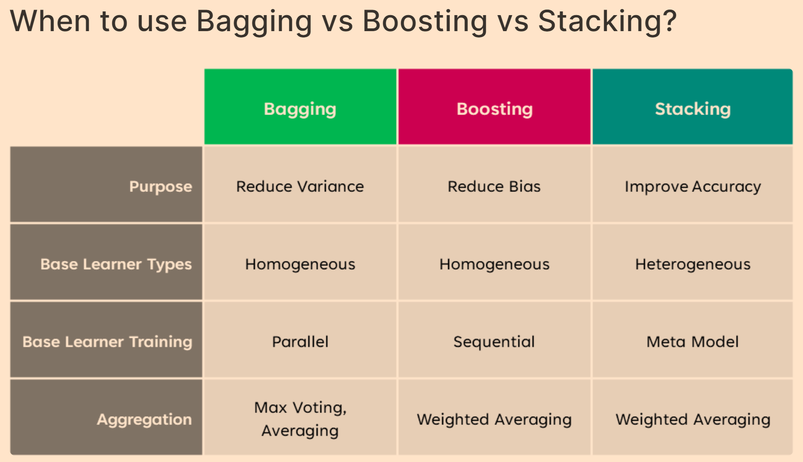

## Contents:<!-- omit in toc -->

- [Introduction](#introduction)
- [Types of Ensemble Methods](#types-of-ensemble-methods)
  - [Bagging (Bootstrap Aggregating)](#bagging-bootstrap-aggregating)
  - [Boosting](#boosting)
  - [Stacking (Stacked Generalization)](#stacking-stacked-generalization)
  - [Voting](#voting)
- [Ensemble Learning Techniques](#ensemble-learning-techniques)
  - [Model Averaging](#model-averaging)
  - [Bagging and Boosting Variants](#bagging-and-boosting-variants)
- [Benefits of Ensemble Learning](#benefits-of-ensemble-learning)
- [Challenges of Ensemble Learning](#challenges-of-ensemble-learning)
- [Applications](#applications)
- [Case Studies and Examples](#case-studies-and-examples)
- [Future Directions](#future-directions)
- [Videos: Bootstrapping](#videos-bootstrapping)
- [Conclusion](#conclusion)
- [Related Content](#related-content)
- [References](#references)



## Introduction

<iframe src="https://drive.google.com/file/d/1mvjXGPMcz6J-9ng-aeZMEo24GhXknGF7/preview" frameborder="0" style="position: absolute; top: 0; left: 0; width: 100%; height: 100%;" allowfullscreen></iframe>

Ensemble learning is a machine learning technique where multiple models are combined to enhance overall predictive performance. The idea is that aggregating the predictions from various models can lead to better accuracy, robustness, and generalization compared to any single model. Ensemble methods are particularly useful when individual models exhibit different strengths and weaknesses, allowing for a more balanced and accurate final prediction.

> [!NOTE]  
> Reference and Details: [Ensemble Techniques Project](https://github.com/amitkumar-aimlp/projects/tree/content/ensemble-techniques-project)

## Types of Ensemble Methods

### Bagging (Bootstrap Aggregating)

**Concept**: Bagging involves training multiple versions of the same model on different subsets of the training data, which are generated through bootstrap sampling. The subsets are created by randomly sampling with replacement, meaning each subset can contain repeated instances of some data points and omit others.

**Key Features**:

- **Bootstrap Sampling**: Each model is trained on a different sample of the data, which helps in reducing variance. This process generates diverse models by using slightly different versions of the data.
- **Aggregation**: The predictions from all models are combined to make the final prediction. For classification tasks, a majority vote is used, while for regression tasks, the average of predictions is computed.
  **Popular Algorithms**:
- **Random Forest**: An ensemble method based on decision trees, where each tree is trained on a different bootstrap sample and a random subset of features. Random Forests mitigate overfitting and improve accuracy by averaging the predictions of multiple trees.
- **Bagged Decision Trees**: Uses the bagging approach with decision trees as the base models. By training on different subsets of data, it improves the stability and accuracy of the final predictions.
  **Advantages**:
- **Reduces Variance**: By aggregating predictions from multiple models, bagging decreases the overall variance, making the model less sensitive to fluctuations in the training data.
- **Improves Stability**: Individual models might overfit the data, but combining their outputs helps in creating a more stable model that performs well on unseen data.
  **Limitations**:
- **Limited Improvement**: If the base models are highly similar, bagging may not offer substantial improvements in performance. Diversity among base models is crucial for maximizing the benefits of bagging.
- **Computational Complexity**: Training multiple models requires more computational resources and time compared to a single model.

### Boosting

**Concept**: Boosting builds a sequence of models where each subsequent model aims to correct the errors made by the previous models. The focus is on training models that can handle the mistakes of the previous ones, with the goal of creating a strong, accurate ensemble.

**Key Features**:

- **Adaptive Weighting**: Boosting algorithms adjust the weights of misclassified samples so that the next model in the sequence pays more attention to difficult cases. This adaptive nature helps in focusing on harder-to-classify instances.
- **Sequential Learning**: Models are added sequentially, and each new model is trained to correct the errors of the previous models. This process continues until a predetermined number of models is reached or no further improvement is observed.
  **Popular Algorithms**:
- **AdaBoost (Adaptive Boosting)**: AdaBoost adjusts the weights of misclassified instances and combines multiple weak learners into a single strong model. It is known for its simplicity and effectiveness in improving model performance.
- **Gradient Boosting Machines (GBM)**: GBM uses gradient descent to minimize the loss function by adding models that improve the residual errors of previous models. It provides flexibility through various loss functions and regularization techniques.
- **XGBoost (Extreme Gradient Boosting)**: An optimized variant of gradient boosting that incorporates additional features like regularization, tree pruning, and parallel processing. XGBoost is renowned for its speed and accuracy.
  **Advantages**:
- **High Accuracy**: Boosting can significantly enhance the accuracy of the model by focusing on the errors made by previous models, effectively converting weak learners into strong learners.
- **Flexibility**: Applicable to various types of problems, including both classification and regression tasks. It can also handle different types of data distributions and noise levels.
  **Limitations**:
- **Computationally Intensive**: Training a sequence of models and fine-tuning parameters can be computationally demanding and time-consuming.
- **Sensitive to Noise**: Boosting can be prone to overfitting, especially if the data contains noise or outliers. Regularization and careful parameter tuning are required to mitigate this issue.

### Stacking (Stacked Generalization)

**Concept**: Stacking involves training multiple base models and then using their predictions as input to a meta-model, which learns to combine these predictions optimally. The meta-model is trained on the predictions of the base models rather than the original input data.

**Key Features**:

- **Base Models**: Diverse models are trained on the same dataset, each providing different insights and predictions. This diversity helps in capturing various aspects of the data.
- **Meta-Model**: The meta-model is trained to learn the best way to combine the predictions from the base models. It can be any machine learning model, such as logistic regression or a neural network.
  **Popular Algorithms**:
- **Stacked Generalization with Various Base Learners**: The choice of base models can vary, including models like decision trees, support vector machines, or neural networks. The meta-model learns how to weight and combine these predictions to produce the final output.
  **Advantages**:
- **Superior Performance**: Stacking often results in improved performance compared to individual models by leveraging their collective strengths. The meta-model optimizes the combination of base model predictions to achieve better accuracy.
- **Versatility**: Allows the use of a variety of base models, making it possible to capture different patterns and relationships in the data.
  **Limitations**:
- **Overfitting Risk**: The complexity of stacking can lead to overfitting if the meta-model is not properly validated. It is crucial to use techniques such as cross-validation to ensure generalization.
- **Complexity**: Implementing and tuning a stacking ensemble requires careful selection of base models and meta-model, which can be more complex compared to other ensemble methods.

### Voting

**Concept**: Voting is a simple ensemble method that combines the predictions of multiple models by aggregating their outputs. There are two main types of voting: hard voting and soft voting.

**Key Features**:

- **Majority Voting**: In classification tasks, the class that receives the most votes from the base models is chosen as the final prediction. This method is straightforward and easy to implement.
- **Weighted Voting**: Predictions are weighted based on the performance or reliability of each base model. The final prediction is determined by the weighted average of the base models' outputs.
  **Popular Algorithms**:
- **Hard Voting**: Each base model casts a vote for a class, and the class with the majority of votes is selected. This method is simple and effective for many classification problems.
- **Soft Voting**: Each base model provides probability estimates for each class, and the class with the highest average probability is chosen. This method can provide more nuanced predictions and is often used in probabilistic classification.
  **Advantages**:
- **Simplicity**: Voting methods are easy to implement and understand. They provide a straightforward way to combine multiple models' predictions.
- **Diverse Models**: By aggregating predictions from diverse models, voting can improve accuracy and robustness, especially when the base models have complementary strengths.
  **Limitations**:
- **Dependence on Base Models**: The effectiveness of voting depends on the quality and diversity of the base models. If the models are similar, voting may not provide significant improvements.
- **Limited Improvement**: Voting may not offer substantial performance gains if the base models are not sufficiently diverse or accurate.

## Ensemble Learning Techniques

### Model Averaging

**Concept**: Model averaging involves combining the predictions from multiple models to create a more accurate and stable final prediction. This technique helps in reducing the variance and improving the overall performance of the ensemble.

**Types**:

- **Simple Averaging**: Takes the average of predictions from multiple models for regression tasks or uses majority voting for classification. It is the most basic form of model averaging and provides a straightforward way to combine model outputs.
- **Weighted Averaging**: Assigns different weights to each model's predictions based on their performance. The final prediction is computed as a weighted average, where models with better performance have more influence.

### Bagging and Boosting Variants

**Random Forest**: An advanced bagging technique that utilizes decision trees as base models. It introduces randomness by selecting random subsets of features at each split, which helps in reducing correlation among trees and improving performance. Random Forests are widely used due to their robustness and ease of use.
**Gradient Boosting**: Enhances model performance by adding models that correct the residual errors of previous models. It uses gradient descent to minimize the loss function iteratively, making it effective for handling complex datasets and improving accuracy.
**AdaBoost**: Focuses on improving the performance of weak learners by adjusting the weights of misclassified samples. AdaBoost is known for its simplicity and effectiveness in combining weak models into a strong ensemble.

## Benefits of Ensemble Learning

- **Improved Accuracy**: Ensemble methods often achieve higher accuracy by combining predictions from multiple models. This collective decision-making process helps in capturing different aspects of the data and reducing errors.
- **Robustness**: By aggregating models, ensembles are less sensitive to fluctuations and noise in the data. This robustness makes ensemble methods suitable for real-world applications where data can be noisy or incomplete.
- **Reduced Overfitting**: Combining multiple models helps in generalizing better on unseen data, reducing the risk of overfitting. Ensembles are less likely to memorize the training data and more likely to learn general patterns.
- **Versatility**: Ensemble methods can be applied to various types of problems, including classification, regression, and anomaly detection. Their adaptability makes them valuable tools in a wide range of applications.

## Challenges of Ensemble Learning

- **Increased Complexity**: Combining multiple models adds complexity to the machine learning pipeline. Managing and tuning multiple models requires additional computational resources and time.
- **Interpretability**: The combined model may be harder to interpret compared to individual base models. Understanding the contribution of each base model to the final prediction can be challenging.
- **Overhead**: Ensemble methods require careful tuning and validation to ensure optimal performance. The additional overhead in terms of model management and validation needs to be considered.
- **Computational Cost**: Training and maintaining multiple models can be resource-intensive, especially for large datasets. Efficient algorithms and hardware are required to handle the computational demands.

## Applications

- **Classification Tasks**: Ensemble methods are widely used in tasks such as email spam detection, image recognition, and medical diagnosis. By combining predictions from multiple models, ensembles can improve classification accuracy and reliability.
- **Regression Tasks**: Effective for predicting continuous values, such as house prices or stock market trends. Ensemble methods can capture complex relationships in the data and provide more accurate predictions.
- **Anomaly Detection**: Useful for identifying unusual patterns in data, such as fraud detection or network intrusion. Ensembles can enhance the detection of rare or anomalous events by combining insights from different models.
- **Natural Language Processing (NLP)**: Applied to tasks like sentiment analysis and language translation. Ensemble methods can improve the performance of NLP models by combining predictions from different algorithms and approaches.

## Case Studies and Examples

- **Case Study 1: Random Forests in Medical Diagnosis**: Random Forests have been successfully used to improve diagnostic accuracy in medical imaging by combining multiple decision trees trained on different subsets of patient data. This approach helps in achieving more reliable and accurate diagnoses.
- **Case Study 2: Gradient Boosting for Customer Churn Prediction**: Gradient Boosting techniques have been employed to predict customer churn in telecommunications. By focusing on correcting errors and improving predictions, Gradient Boosting provides valuable insights for retention strategies.
- **Case Study 3: Stacking Models for Financial Market Prediction**: Stacked models have been used to predict stock prices and market trends by combining predictions from various machine learning algorithms. The ensemble approach enhances forecasting accuracy and provides better investment insights.

## Future Directions

- **Algorithmic Advancements**: Continued development of more efficient and scalable ensemble methods to handle large-scale and complex datasets. Innovations in algorithm design and optimization techniques will drive the future of ensemble learning.
- **Integration with Deep Learning**: Exploring the combination of ensemble techniques with deep learning models to leverage the strengths of both approaches. Hybrid models that integrate ensemble methods with neural networks can enhance performance and scalability.
- **Real-World Applications**: Expanding the use of ensemble methods in emerging fields such as autonomous systems, personalized medicine, and climate modeling. Ensemble learning will continue to play a crucial role in addressing complex real-world challenges and advancing technology.

## Videos: Bootstrapping

Discover the fundamentals of Ensemble Learning in this insightful video! Learn about key techniques like Bagging, Boosting, and Stacking, and understand how these methods enhance model performance. Perfect for anyone looking to deepen their knowledge of machine learning and improve predictive accuracy.

<iframe src=" https://www.youtube.com/embed/Xz0x-8-cgaQ?si=kpglEIULW89aWNlT" frameborder="0" style="position: absolute; top: 0; left: 0; width: 100%; height: 100%;" allowfullscreen></iframe>

## Conclusion

Ensemble learning is a powerful technique that combines the strengths of multiple models to achieve better performance, accuracy, and robustness. By utilizing various ensemble methods such as bagging, boosting, stacking, and voting, practitioners can enhance predictive capabilities and tackle complex problems more effectively. Despite its challenges, ensemble learning remains a valuable tool in the machine learning toolkit, with ongoing advancements promising even greater improvements in the future. As technology evolves, ensemble methods will continue to drive innovation and solve increasingly complex problems in various domains.

## Related Content

- [Python Programming Language Syntax and Examples](https://amitkumar-aimlp.github.io/projects/python-programming-language-syntax-and-examples/)
- [NumPy for Data Science: A Comprehensive Guide](https://amitkumar-aimlp.github.io/projects/numpy-for-data-science-a-comprehensive-guide/)
- [Pandas for Data Science: A Comprehensive Guide](https://amitkumar-aimlp.github.io/projects/pandas-for-data-science-a-comprehensive-guide/)
- [Pandas Vs. SQL: A Comprehensive Comparison](https://amitkumar-aimlp.github.io/projects/pandas-vs-sql-a-comprehensive-comparison/)
- [PySpark Using Databricks: A Comprehensive Guide](https://amitkumar-aimlp.github.io/projects/pyspark-using-databricks-a-comprehensive-guide/)
- [Pandas Vs. PySpark: A Comprehensive Comparison](https://amitkumar-aimlp.github.io/projects/pandas-vs-pyspark-a-comprehensive-comparison/)
- [Matplotlib for Data Visualization](https://amitkumar-aimlp.github.io/projects/matplotlib-for-data-visualization/)
- [Applied Statistics: An Overview](https://amitkumar-aimlp.github.io/projects/applied-statistics-an-overview/)
- [Supervised Learning – A Simple Guide](https://amitkumar-aimlp.github.io/projects/supervised-learning-a-simple-guide/)
- [Unsupervised Learning – A Simple Guide](https://amitkumar-aimlp.github.io/projects/unsupervised-learning-a-simple-guide/)
- [Feature Engineering - An Overview](https://amitkumar-aimlp.github.io/projects/feature-engineering-an-overview/)
- [Hyperparameter Optimization](https://amitkumar-aimlp.github.io/projects/hyperparameter-optimization/)
- [Recommender Systems](https://amitkumar-aimlp.github.io/projects/recommender-systems/)
- [Deep Learning Fundamentals](https://amitkumar-aimlp.github.io/projects/deep-learning-fundamentals/)
- [Semi-supervised Learning](https://amitkumar-aimlp.github.io/projects/semi-supervised-learning/)
- [Natural Language Processing](https://amitkumar-aimlp.github.io/projects/natural-language-processing/)
- [Computer Vision Fundamentals](https://amitkumar-aimlp.github.io/projects/computer-vision-fundamentals/)
- [Time Series Analysis](https://amitkumar-aimlp.github.io/projects/time-series-analysis/)

## References

1. **Breiman, L.** (1996). _Bagging Predictors_. Machine Learning, 24(2), 123-140.  
   [Bagging Predictors](https://link.springer.com/article/10.1007/BF00058655)
2. **Breiman, L.** (2001). _Random Forests_. Machine Learning, 45(1), 5-32.  
   [Random Forests](https://link.springer.com/article/10.1023/A:1010933404324)
3. **Friedman, J. H.** (2001). _Greedy Function Approximation: A Gradient Boosting Machine_. Annals of Statistics, 29(5), 1189-1232.  
   [Greedy Function Approximation](https://projecteuclid.org/euclid.aos/1183143727)
4. **Chen, T., & Guestrin, C.** (2016). _XGBoost: A Scalable Tree Boosting System_. In Proceedings of the 22nd ACM SIGKDD International Conference on Knowledge Discovery and Data Mining (pp. 785-794).  
   [XGBoost: A Scalable Tree Boosting System](https://dl.acm.org/doi/10.1145/2939672.2939785)
5. **Freund, Y., & Schapire, R. E.** (1997). _A Decision-Theoretic Generalization of On-Line Learning and an Application to Boosting_. In European Conference on Computational Learning Theory (pp. 23-37).  
   [A Decision-Theoretic Generalization of On-Line Learning](https://link.springer.com/chapter/10.1007/3-540-63107-0_5)
6. **Hastie, T., Tibshirani, R., & Friedman, J.** (2009). _The Elements of Statistical Learning: Data Mining, Inference, and Prediction_ (2nd ed.). Springer.  
   [The Elements of Statistical Learning](https://web.stanford.edu/~hastie/ElemStatLearn/)
7. **Wolpert, D. H.** (1992). _Stacked Generalization_. Neural Networks, 5(2), 241-259.  
   [Stacked Generalization](https://www.sciencedirect.com/science/article/pii/S0893608005800865)
8. **Rokach, L., & Maimon, O.** (2008). _Ensemble Methods for Classification and Regression_. In Data Mining and Knowledge Discovery Handbook (pp. 1009-1033). Springer.  
   [Ensemble Methods for Classification and Regression](https://link.springer.com/chapter/10.1007/978-0-387-09823-4_60)
9. **Xia, Y., & Liu, H.** (2017). _A Comprehensive Review of Ensemble Deep Learning: Opportunities and Challenges_. IEEE Access, 5, 828-844.  
   [A Comprehensive Review of Ensemble Deep Learning](https://ieeexplore.ieee.org/document/7888645)
10. **Kuhn, M., & Johnson, K.** (2013). _Applied Predictive Modeling_. Springer.  
    [Applied Predictive Modeling](https://www.springer.com/gp/book/9781461468486)
11. **Zhou, Z.-H.** (2012). _Ensemble Methods: Foundations and Algorithms_. CRC Press.  
    [Ensemble Methods: Foundations and Algorithms](https://www.crcpress.com/Ensemble-Methods-Foundations-and-Algorithms/Zhou/p/book/9781439816265)
12. **Mitchell, T. M.** (1997). _Machine Learning_. McGraw-Hill.  
    [Machine Learning](https://www.amazon.com/Machine-Learning-Tom-Mitchell/dp/0070428077)
13. [Bias–Variance Tradeoff](https://en.wikipedia.org/wiki/Bias%E2%80%93variance_tradeoff)
14. [Bias-Variance Tradeoff](https://www.cs.cornell.edu/courses/cs4780/2018fa/lectures/lecturenote12.html)
15. [Ensemble Learning](https://en.wikipedia.org/wiki/Ensemble_learning)
16. [Ensemble methods: bagging, boosting and stacking](https://towardsdatascience.com/ensemble-methods-bagging-boosting-and-stacking-c9214a10a205)
17. [Ensemble Learning: Stacking, Blending & Voting](https://towardsdatascience.com/ensemble-learning-stacking-blending-voting-b37737c4f483)
18. [How Do You Implement AdaBoost with Python](https://towardsdatascience.com/how-do-you-implement-adaboost-with-python-a76427b0fa7a)
19. [Ensemble Learning in Machine Learning: Stacking, Bagging and Boosting](https://www.analyticsvidhya.com/blog/2023/01/ensemble-learning-methods-bagging-boosting-and-stacking/)

> ### It is often in the darkest skies that we see the brightest stars.
>
> -Richard Evans

---

_Published: 2020-01-13; Updated: 2024-05-01_

---

[TOP](#contents)
