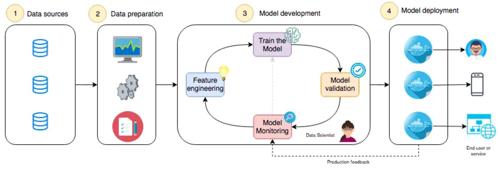
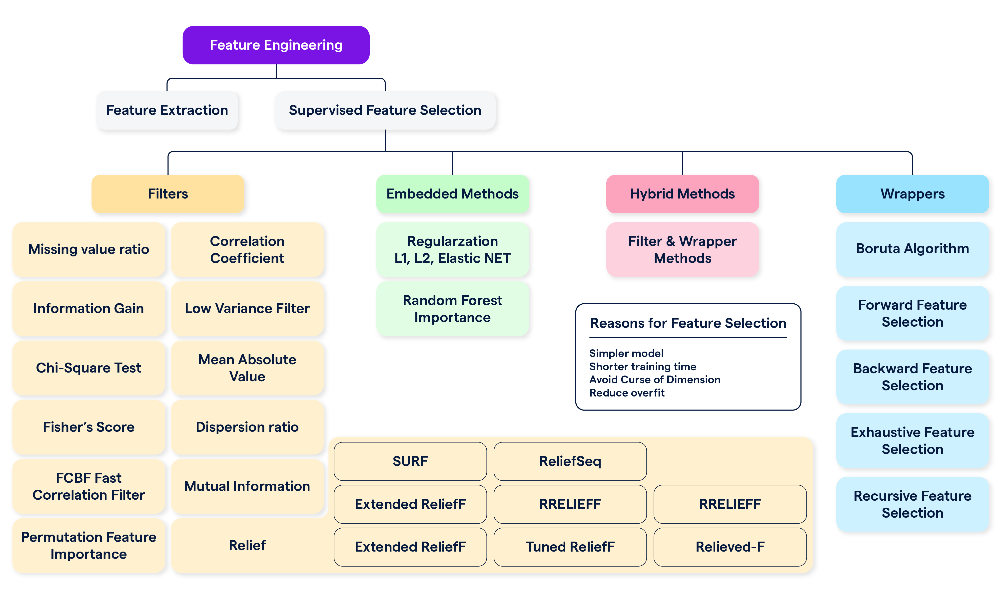

## Contents:<!-- omit in toc -->

- [Introduction](#introduction)
- [Key Components of Feature Engineering](#key-components-of-feature-engineering)
  - [1. Understanding the Data](#1-understanding-the-data)
  - [2. Data Cleaning](#2-data-cleaning)
  - [3. Feature Creation](#3-feature-creation)
  - [4. Feature Selection](#4-feature-selection)
  - [5. Feature Scaling](#5-feature-scaling)
  - [6. Feature Encoding](#6-feature-encoding)
  - [7. Feature Interaction](#7-feature-interaction)
  - [8. Dimensionality Reduction](#8-dimensionality-reduction)
  - [9. Automated Feature Engineering](#9-automated-feature-engineering)
  - [10. Challenges and Considerations](#10-challenges-and-considerations)
- [Best Practices](#best-practices)
- [Videos: Feature Engineering - Key Concepts](#videos-feature-engineering---key-concepts)
- [Conclusion](#conclusion)
- [Related Content](#related-content)
- [References](#references)



## Introduction

Feature engineering is a crucial step in the machine learning pipeline, involving the process of creating, modifying, and selecting features to improve model performance. Effective feature engineering can transform raw data into a format that enhances the predictive power of machine learning models, thereby directly impacting their success and accuracy. This guide delves into the essential components and best practices of feature engineering.

> [!NOTE]  
> Reference and Details: [Feature Engineering Project](https://github.com/amitkumar-aimlp/projects/tree/content/feature-engineering-and-model-tuning-project)

## Key Components of Feature Engineering

### 1. Understanding the Data

Understanding your data is the foundational step in feature engineering, setting the stage for effective feature creation and selection.

- **Exploratory Data Analysis (EDA):** EDA is crucial for uncovering the underlying patterns and relationships in the data. Key EDA tasks include:
  - **Summary Statistics:** Compute mean, median, standard deviation, and quantiles to understand the central tendencies and dispersion.
  - **Data Distribution and Visualization:** Use histograms, density plots, and scatter plots to visualize distributions and relationships. Techniques like box plots and violin plots can help detect outliers.
  - **Correlation Analysis:** Examine pairwise correlations between features using heatmaps and correlation matrices to identify potential multicollinearity.
- **Data Types and Structures:** Recognize and categorize different types of data:
  - **Numeric Data:** Continuous (e.g., age, salary) and discrete (e.g., number of items).
  - **Categorical Data:** Nominal (e.g., color, product type) and ordinal (e.g., customer satisfaction ratings).
  - **Temporal Data:** Time-based data requiring features like timestamps, day of the week, and seasonal indicators.
  - **Spatial Data:** Geographical features such as coordinates or locations.

### 2. Data Cleaning

Data cleaning is a critical step to ensure that the dataset is accurate, complete, and usable for modeling.

- **Handling Missing Values:**
  - **Imputation Techniques:** Mean imputation is suitable for numerical data with normally distributed missingness. Median imputation can be used for skewed distributions, while mode imputation is useful for categorical data. More sophisticated methods include K-nearest neighbors (KNN) imputation and multivariate imputation by chained equations (MICE).
  - **Deletion of Missing Values:** Removing records with missing values is sometimes necessary, especially when the proportion of missing data is small.
  - **Predictive Modeling:** Use algorithms to predict missing values based on other features in the dataset.
- **Outlier Detection and Treatment:**
  - **Statistical Methods:** Z-score and IQR (Interquartile Range) methods help identify outliers by comparing data points to a statistical threshold.
  - **Visualization Methods:** Box plots and scatter plots can visually highlight outliers, facilitating their identification and treatment.
- **Data Transformation:**
  - **Normalization:** Min-Max scaling transforms features to a specific range, typically [0, 1], which is important for algorithms sensitive to feature scaling.
  - **Standardization:** Standardizing features to zero mean and unit variance helps algorithms that assume normally distributed data.
  - **Data Discretization:** Converting continuous data into discrete bins or categories can be useful for certain models and makes it easier to interpret results.
- **Data Integration:**
  - **Merging Data:** Combine datasets from different sources using operations such as joins (inner, outer, left, right) to integrate relevant information.
  - **Resolving Discrepancies:** Address inconsistencies in data formats, units, and definitions to ensure a coherent dataset.

### 3. Feature Creation

Feature creation involves developing new features from existing data or external sources to enhance model performance.

- **Domain Knowledge Integration:** Incorporating domain-specific knowledge can lead to the creation of features that capture essential aspects of the problem. For example, in finance, features such as moving averages, volatility indices, or financial ratios can be created based on domain expertise.
- **Feature Extraction:**
  - **Principal Component Analysis (PCA):** PCA reduces dimensionality by transforming features into a set of orthogonal components that capture the maximum variance.
  - **Linear Discriminant Analysis (LDA):** LDA is used for dimensionality reduction in classification problems by finding linear combinations of features that maximize class separability.
- **Feature Engineering Techniques:**
  - **Polynomial Features:** Generate new features by raising existing features to a power or combining them, allowing the model to capture non-linear relationships.
  - **Interaction Features:** Create features that represent the interaction between two or more features, such as products or ratios, to capture complex relationships.
  - **Aggregation Features:** Aggregate data at different levels, such as mean, sum, or count, for grouping features. This is particularly useful in time series and relational datasets.
- **Temporal Features:**
  - **Date and Time Components:** Extract components such as year, month, day of the week, and hour to capture seasonal and temporal patterns.
  - **Time-Based Aggregation:** Calculate rolling statistics, moving averages, or exponential smoothing to capture trends and seasonality in time series data.

### 4. Feature Selection

Feature selection involves identifying and retaining the most relevant features for improving model performance and reducing complexity.

- **Filter Methods:**
  - **Statistical Tests:** Use tests such as chi-square (for categorical features), ANOVA (for comparing means), and correlation coefficients to evaluate feature relevance.
  - **Correlation Coefficients:** Assess the strength and direction of relationships between features and the target variable to identify useful features.
- **Wrapper Methods:**
  - **Recursive Feature Elimination (RFE):** Iteratively train a model and remove the least important features based on model performance.
  - **Forward/Backward Selection:** Start with no features and iteratively add (forward) or remove (backward) features to find the optimal subset.
- **Embedded Methods:**
  - **LASSO (Least Absolute Shrinkage and Selection Operator):** Regularizes linear models by penalizing the absolute magnitude of coefficients, leading to feature selection.
  - **Decision Trees and Random Forests:** Provide feature importance scores based on how much each feature contributes to reducing model impurity.
- **Feature Importance:**
  - **SHAP (SHapley Additive exPlanations) Values:** Explain model predictions by attributing the impact of each feature to the final prediction, providing insights into feature importance.

### 5. Feature Scaling

Feature scaling ensures that features are on a similar scale, which is crucial for many machine learning algorithms.

- **Normalization:**
  - **Min-Max Scaling:** Scales features to a range [0, 1] or [-1, 1], which is useful for algorithms like neural networks that are sensitive to feature magnitudes.
  - **Robust Scaling:** Uses the median and interquartile range to scale features, making it less sensitive to outliers compared to Min-Max scaling.
- **Standardization:**
  - **Z-Score Normalization:** Transforms features to have zero mean and unit variance, which is important for algorithms like linear regression and support vector machines (SVMs).
- **Log Transformation:**
  - **Handling Skewed Data:** Apply log transformation to reduce skewness and stabilize variance, making data distributions more symmetric and suitable for modeling.

### 6. Feature Encoding

Feature encoding converts categorical data into numerical formats that can be used by machine learning algorithms.

- **Categorical Encoding:**
  - **One-Hot Encoding:** Creates binary columns for each category, suitable for algorithms that require numerical input. However, it can lead to high-dimensional data for features with many categories.
  - **Label Encoding:** Assigns integer values to categories, which is efficient for algorithms that can handle ordinal relationships but may introduce unintended ordinal relationships in non-ordinal features.
  - **Target Encoding:** Replaces categorical values with the mean of the target variable for each category, capturing information about the target variable’s distribution.
- **Handling High Cardinality:**
  - **Feature Hashing:** Uses a hash function to map categories to a fixed number of features, managing high cardinality efficiently while reducing dimensionality.
  - **Embeddings:** Represents categories as dense vectors in a lower-dimensional space, useful for high-cardinality categorical features and text data.
- **Handling Imbalanced Classes:**
  - **Synthetic Data Generation (SMOTE):** Generates synthetic samples for minority classes to balance the dataset and improve model performance.
  - **Class Weighting:** Adjusts the weights of classes during model training to account for class imbalance and ensure that the model does not become biased towards the majority class.

### 7. Feature Interaction

Feature interaction involves creating new features that capture relationships between existing features, enhancing model complexity and performance.

- **Creating Interaction Terms:**
  - **Multiplying or Combining Features:** Create new features by combining existing ones through arithmetic operations, such as multiplying or dividing, to capture interactions between features.
  - **Polynomial Interactions:** Generate polynomial features that represent non-linear interactions between features, allowing the model to capture more complex relationships.
- **Feature Engineering for Time Series:**
  - **Lag Features:** Create features based on previous time steps to capture temporal dependencies in time series data.
  - **Rolling Statistics:** Calculate rolling means, sums, or standard deviations to capture trends and variations over time.
  - **Seasonal Decomposition:** Decompose time series into trend, seasonal, and residual components to capture underlying patterns and seasonal effects.

### 8. Dimensionality Reduction

Dimensionality reduction techniques help simplify models by reducing the number of features, which can improve performance and interpretability.

- **Techniques:**
  - **Principal Component Analysis (PCA):** Reduces dimensionality by transforming features into orthogonal components that capture the maximum variance in the data. Useful for visualizing high-dimensional data and reducing overfitting.
  - **t-SNE (t-Distributed Stochastic Neighbor Embedding):** A non-linear dimensionality reduction technique that is effective for visualizing complex data structures in lower dimensions.
- **Applications:**
  - **Visualization:** Use dimensionality reduction to create 2D or 3D visualizations of high-dimensional data, helping to identify patterns and clusters.
  - **Reducing Overfitting:** By reducing the number of features, dimensionality reduction can help mitigate overfitting and improve model generalization.

### 9. Automated Feature Engineering

Automated tools and algorithms can streamline the feature engineering process, saving time and improving efficiency.

- **Feature Engineering Tools:**
  - **Featuretools:** An open-source library that automates feature engineering by creating new features from existing ones using predefined operations.
  - **AutoML Frameworks:** Platforms such as Google AutoML and H2O.ai provide automated feature engineering and model building capabilities, making it easier to build and deploy machine learning models.
- **Algorithmic Approaches:**
  - **Automated Feature Selection Algorithms:** Algorithms like genetic algorithms and simulated annealing can automate the process of selecting the most relevant features.
  - **Automated Feature Generation:** Techniques such as deep feature synthesis can automatically generate new features by combining existing ones in a structured manner.

### 10. Challenges and Considerations

Feature engineering comes with various challenges and considerations that must be addressed to ensure effective model performance.

- **Overfitting vs. Underfitting:**
  - **Balancing Complexity and Simplicity:** Strive to create features that capture meaningful patterns without introducing too much noise. Overfitting occurs when a model learns noise as if it were a signal, while underfitting happens when the model is too simplistic to capture the underlying patterns.
- **Computational Constraints:**
  - **Managing Feature Engineering at Scale:** Large datasets with many features require efficient algorithms and computational resources. Techniques such as feature selection and dimensionality reduction can help manage computational constraints.
- **Model Interpretability:**
  - **Ensuring Interpretability:** Ensure that the features created contribute to the interpretability of the model. This is important for stakeholders who need to understand and trust the model’s predictions.

## Best Practices

To optimize feature engineering efforts, consider the following best practices:

- **Iterative Process:** Feature engineering should be an iterative process, with continuous refinement based on model performance and feedback. Regularly revisit and adjust features as needed.
- **Cross-Validation:** Use cross-validation techniques to assess how feature engineering decisions impact model generalization and performance. This helps ensure that features contribute to robust and reliable models.
- **Documentation:** Maintain detailed records of feature engineering decisions, transformations, and their impacts on model performance. This documentation aids in reproducibility and transparency.
- **Collaboration:** Engage with domain experts for feature creation and stakeholders for validation. Collaboration ensures that features are meaningful, relevant, and aligned with business goals.

## Videos: Feature Engineering - Key Concepts

In this video, we dive into the essentials of feature engineering, covering key concepts, techniques, and best practices. Learn how to transform raw data into valuable features that enhance the performance of machine learning models. Perfect for beginners and data enthusiasts looking to refine their skills!

<iframe src=" https://www.youtube.com/embed/6WDFfaYtN6s?si=dG6DEduZ55j5iZCQ" frameborder="0" style="position: absolute; top: 0; left: 0; width: 100%; height: 100%;" allowfullscreen></iframe>

## Conclusion

Feature engineering is a critical aspect of machine learning that significantly influences model performance. By understanding the data, creating meaningful features, and selecting the most relevant ones, you can enhance both the accuracy and interpretability of your models. Effective feature engineering requires a blend of domain knowledge, statistical techniques, and best practices to achieve optimal results. As you refine your feature engineering process, remember that continuous iteration and collaboration are key to developing successful machine learning models.

## Related Content

- [Python Programming Language Syntax and Examples](https://amitkumar-aimlp.github.io/projects/python-programming-language-syntax-and-examples)
- [NumPy for Data Science: A Comprehensive Guide](https://amitkumar-aimlp.github.io/projects/numpy-for-data-science-a-comprehensive-guide)
- [Pandas for Data Science: A Comprehensive Guide](https://amitkumar-aimlp.github.io/projects/pandas-for-data-science-a-comprehensive-guide)
- [Pandas Vs. SQL: A Comprehensive Comparison](https://amitkumar-aimlp.github.io/projects/pandas-vs-sql-a-comprehensive-comparison)
- [PySpark Using Databricks: A Comprehensive Guide](https://amitkumar-aimlp.github.io/projects/pyspark-using-databricks-a-comprehensive-guide)
- [Pandas Vs. PySpark: A Comprehensive Comparison](https://amitkumar-aimlp.github.io/projects/pandas-vs-pyspark-a-comprehensive-comparison)
- [Matplotlib for Data Visualization](https://amitkumar-aimlp.github.io/projects/matplotlib-for-data-visualization)
- [Applied Statistics: An Overview](https://amitkumar-aimlp.github.io/projects/applied-statistics-an-overview)
- [Supervised Learning – A Simple Guide](https://amitkumar-aimlp.github.io/projects/supervised-learning-a-simple-guide)
- [Unsupervised Learning – A Simple Guide](https://amitkumar-aimlp.github.io/projects/unsupervised-learning-a-simple-guide)
- [Ensemble Learning – Methods](https://amitkumar-aimlp.github.io/projects/ensemble-learning-methods)

## References

1. **Kuhn, M., & Johnson, K.** (2013). _Applied Predictive Modeling_. Springer.
   - A comprehensive guide to predictive modeling techniques, including feature engineering.
2. **Chandrashekar, G., & Sahin, F.** (2014). A survey on feature selection methods. _Computers & Electrical Engineering_, 40(1), 16-28.
   - Overview of various feature selection methods and their applications.
3. **Jolliffe, I. T.** (2011). _Principal Component Analysis_ (2nd ed.). Springer.
   - An in-depth resource on PCA, a key technique in feature extraction and dimensionality reduction.
4. **Pedregosa, F., Varoquaux, G., Gramfort, A., Michel, V., Thirion, B., Grisel, O., & Duchesnay, É.** (2011). Scikit-learn: Machine Learning in Python. _Journal of Machine Learning Research_, 12, 2825-2830.
   - Documentation for Scikit-learn, a popular library with tools for feature engineering.
5. **Harris, C. R., Millman, K. J., Van Der Walt, S., Gommers, R., Virtanen, P., Cournapeau, D., ... & Oliphant, T. E.** (2020). Array programming with NumPy. _Nature_, 585(7825), 357-362.
   - Reference for NumPy, a fundamental library for numerical operations and data transformation.
6. **Zhao, S., & Zhang, J.** (2019). Feature engineering for machine learning and data analytics: The art of feature engineering. _Machine Learning Journal_.
   - Discussion on practical techniques and strategies for feature engineering.
7. **Liaw, A., & Wiener, M.** (2002). Classification and regression by randomForest. _R News_, 2(3), 18-22.
   - Insights into Random Forests and feature importance evaluation.
8. **Chen, J., & Guestrin, C.** (2016). XGBoost: A scalable tree boosting system. _Proceedings of the 22nd ACM SIGKDD International Conference on Knowledge Discovery and Data Mining_, 785-794.
   - Details on XGBoost, a widely used machine learning algorithm with built-in feature importance.
9. **Lundberg, S. M., & Lee, S. I.** (2017). A unified approach to interpreting model predictions. _Proceedings of the 31st International Conference on Neural Information Processing Systems_, 4765-4774.
   - Introduction to SHAP values for model interpretability and feature importance.
10. **Agerri, R., & Garcia, S.** (2018). Automated Feature Engineering for Predictive Modeling. _Proceedings of the 2018 ACM Conference on Knowledge Discovery and Data Mining (KDD)_.
    - Insights into automated feature engineering tools and techniques.
11. **Tukey, J. W.** (1977). _Exploratory Data Analysis_. Addison-Wesley.
    - Classic reference on exploratory data analysis, crucial for understanding data before feature engineering.
12. **Pohlmann, N., & Seifert, C.** (2019). A comprehensive survey on feature engineering and its impact on machine learning. _Journal of Data Science and Analytics_, 12(4), 457-472.
    - Comprehensive survey on feature engineering methodologies and their impact on machine learning models.
13. **Maimon, O., & Rokach, L.** (2010). _Data Mining and Knowledge Discovery Handbook_. Springer.
    - Broad coverage of data mining techniques, including feature engineering.
14. **Featuretools Documentation**. (n.d.). Retrieved from [Featuretools Documentation](https://docs.featuretools.com/)
    - Official documentation for Featuretools, a library for automated feature engineering.
15. **Google AutoML Documentation**. (n.d.). Retrieved from [Google AutoML](https://cloud.google.com/automl)
    - Documentation for Google’s AutoML services, which include automated feature engineering.
16. **H2O.ai Documentation**. (n.d.). Retrieved from [H2O.ai](https://docs.h2o.ai/)
    - Documentation for H2O.ai’s AutoML platform and its feature engineering capabilities.
17. [Feature Engineering](https://en.wikipedia.org/wiki/Feature_engineering)
18. [The Feature Engineering Guide](https://www.featureform.com/post/feature-engineering-guide)
19. [Feature Engineering — Automation and Evaluation](https://medium.com/ki-labs-engineering/feature-engineering-automation-and-evaluation-part-1-a34fb42e0bd4)

> ### Always be yourself, express yourself, have faith in yourself, do not go out and look for a successful personality and duplicate it.
>
> -Bruce Lee

---

_Published: 2020-01-14; Updated: 2024-05-01_

---

[TOP](#contents)
