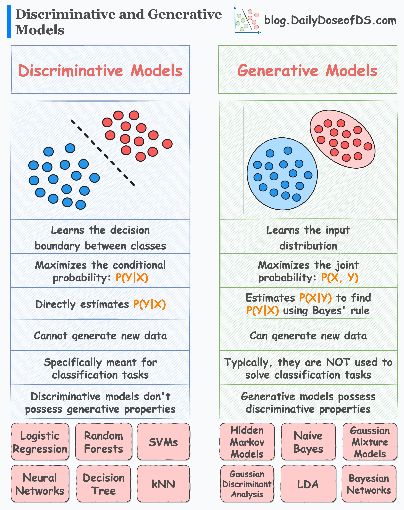
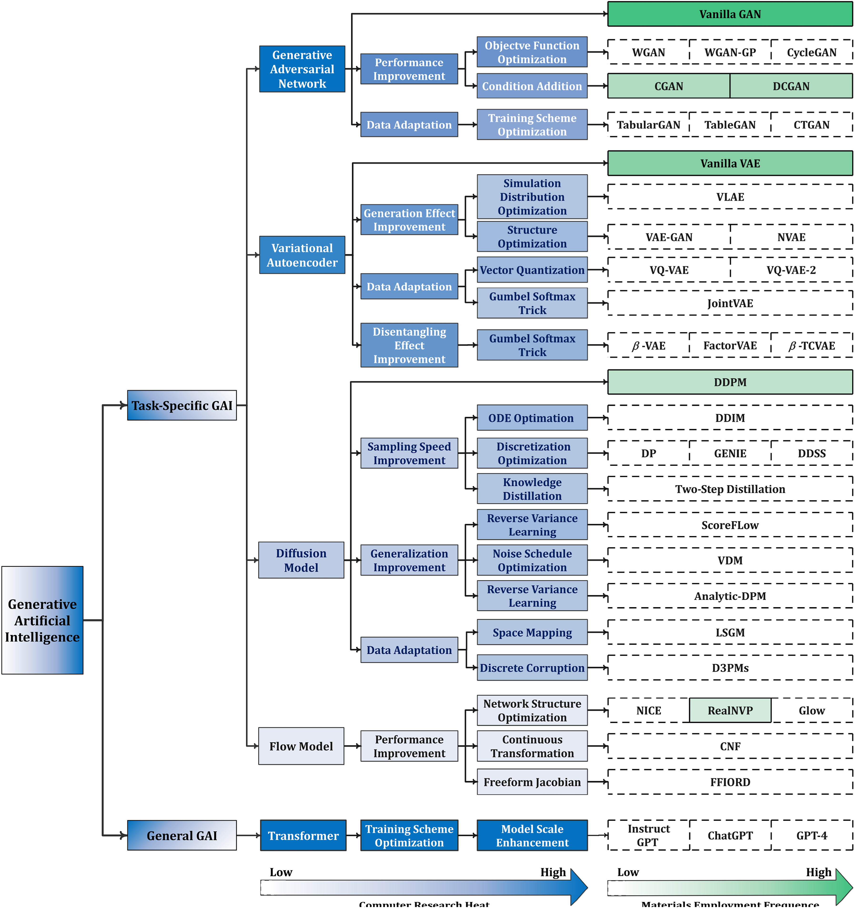

## Contents:<!-- omit in toc -->

- [1. Introduction to Generative Artificial Intelligence](#1-introduction-to-generative-artificial-intelligence)
  - [1.1 Historical Context](#11-historical-context)
  - [1.2 Significance in Modern Technology](#12-significance-in-modern-technology)
- [2. Core Concepts of Generative AI](#2-core-concepts-of-generative-ai)
  - [2.1 Generative vs. Discriminative Models](#21-generative-vs-discriminative-models)
  - [2.2 Key Algorithms and Models](#22-key-algorithms-and-models)
    - [Generative Adversarial Networks (GANs)](#generative-adversarial-networks-gans)
    - [Variational Autoencoders (VAEs)](#variational-autoencoders-vaes)
    - [Autoregressive Models](#autoregressive-models)
    - [Transformers and Attention Mechanisms](#transformers-and-attention-mechanisms)
- [3. Applications of Generative AI](#3-applications-of-generative-ai)
  - [3.1 Content Creation](#31-content-creation)
  - [3.2 Data Augmentation and Enhancement](#32-data-augmentation-and-enhancement)
  - [3.3 Medical and Scientific Applications](#33-medical-and-scientific-applications)
  - [3.4 Virtual Environments and Simulations](#34-virtual-environments-and-simulations)
  - [3.5 Gaming and Entertainment](#35-gaming-and-entertainment)
- [4. Challenges and Ethical Considerations](#4-challenges-and-ethical-considerations)
  - [4.1 Technical Challenges](#41-technical-challenges)
  - [4.2 Ethical and Social Implications](#42-ethical-and-social-implications)
  - [4.3 Regulatory and Policy Challenges](#43-regulatory-and-policy-challenges)
- [5. Future Directions in Generative AI](#5-future-directions-in-generative-ai)
  - [5.1 Advancements in Model Architectures](#51-advancements-in-model-architectures)
  - [5.2 Integration with Other Technologies](#52-integration-with-other-technologies)
  - [5.3 Regulation and Governance](#53-regulation-and-governance)
  - [5.4 Interdisciplinary Research and Collaboration](#54-interdisciplinary-research-and-collaboration)
  - [5.5 Scalability and Real-World Deployment](#55-scalability-and-real-world-deployment)
- [6. Videos: Generative AI Fundamentals](#6-videos-generative-ai-fundamentals)
- [7. Conclusion](#7-conclusion)
- [8. Related Content](#8-related-content)
- [9. References](#9-references)



## 1. Introduction to Generative Artificial Intelligence

Generative Artificial Intelligence (GAI) is a cutting-edge field within artificial intelligence that focuses on creating new, synthetic data that closely resembles a given set of input data. Unlike traditional AI, which primarily revolves around data analysis, pattern recognition, and predictive tasks, GAI aims to generate new content that can be used in a variety of applications. This capability opens up new horizons for creativity, innovation, and efficiency across diverse sectors.

<iframe src="https://drive.google.com/file/d/13xWW1Gc49rVkW1N8ep7-0fngoIXfb5yf/preview" frameborder="0" style="position: absolute; top: 0; left: 0; width: 100%; height: 100%;" allowfullscreen></iframe>

### 1.1 Historical Context

The roots of generative AI can be traced back to the early developments in neural networks and artificial intelligence. Initially, AI systems were rule-based, relying on explicitly programmed instructions to perform tasks. However, with the advent of machine learning, these systems evolved to learn patterns from data without being explicitly programmed.
The emergence of deep learning in the early 2010s marked a significant milestone in the evolution of generative models. Deep learning, characterized by neural networks with many layers, enabled the development of sophisticated models capable of generating high-quality synthetic data. This period saw the introduction of key architectures such as Generative Adversarial Networks (GANs) and Variational Autoencoders (VAEs), which revolutionized the field of generative AI. These advancements allowed for the creation of more complex and realistic data, paving the way for numerous practical applications.

### 1.2 Significance in Modern Technology

Generative AI has immense significance in modern technology, offering innovative solutions across various industries. It has the potential to revolutionize content creation, design, entertainment, healthcare, and more. By automating the generation of new data, generative AI can enhance productivity, creativity, and efficiency, paving the way for novel applications and services. The ability to generate realistic and high-quality synthetic data is particularly valuable in scenarios where acquiring real data is difficult, expensive, or time-consuming.

## 2. Core Concepts of Generative AI

### 2.1 Generative vs. Discriminative Models

In the realm of machine learning, models can be broadly categorized into generative and discriminative models.

- **Generative Models:** These models aim to learn the underlying distribution of a dataset in order to generate new samples that resemble the original data. Examples include GANs, VAEs, and autoregressive models. Generative models are used for tasks such as image synthesis, text generation, and data augmentation. They can capture complex patterns in data and produce new, unseen instances that maintain the statistical properties of the original dataset.
- **Discriminative Models:** These models focus on distinguishing between different classes of data. They are used for tasks such as classification, regression, and clustering. Traditional classifiers like Support Vector Machines (SVMs) and neural networks fall under this category. Discriminative models are primarily concerned with making accurate predictions and decisions based on input data, without necessarily understanding the underlying data distribution.

### 2.2 Key Algorithms and Models

#### Generative Adversarial Networks (GANs)

GANs consist of two neural networks, the Generator and the Discriminator, which are trained simultaneously through adversarial learning. The Generator creates synthetic data, while the Discriminator evaluates the authenticity of the generated data. The goal is for the Generator to produce data indistinguishable from real data, fooling the Discriminator.

- **Architecture:** GANs involve a Generator and a Discriminator, both trained in a competitive setting. The Generator tries to produce realistic data, while the Discriminator attempts to distinguish between real and fake data.
- **Training Challenges:** GANs face challenges such as mode collapse, where the Generator produces limited variations of data. Additionally, training GANs can be unstable and requires careful tuning of hyperparameters.
- **Variations:** Various GAN architectures have been developed, including Deep Convolutional GANs (DCGANs), Wasserstein GANs (WGANs), and StyleGANs. Each variation aims to address specific challenges and improve the quality and stability of the generated data.

#### Variational Autoencoders (VAEs)

VAEs are probabilistic models that encode data into a latent space and then decode it to generate new data. They aim to maximize the likelihood of the data given the latent variables.

- **Architecture:** VAEs consist of an Encoder, a Decoder, and a Latent Space. The Encoder maps input data to a latent representation, while the Decoder reconstructs the data from this representation.
- **Training:** VAEs are trained using a combination of reconstruction loss and Kullback-Leibler (KL) divergence. The reconstruction loss measures the difference between the original and reconstructed data, while the KL divergence ensures that the latent space follows a predefined distribution.
- **Applications:** VAEs are used in image generation, data augmentation, and representation learning. They are particularly useful for generating continuous and smooth variations of data.

#### Autoregressive Models

Autoregressive models generate data sequentially, predicting each element based on previous elements. They are particularly useful for tasks involving sequential data, such as text and speech generation.

- **Examples:** PixelRNN, PixelCNN. These models generate images pixel by pixel, considering the previously generated pixels.
- **Sequential Data Generation:** These models generate data one step at a time, making them suitable for tasks requiring temporal dependencies. Autoregressive models are effective in capturing complex dependencies in sequential data, such as language modeling and time series forecasting.

#### Transformers and Attention Mechanisms

Transformers have revolutionized natural language processing (NLP) by introducing self-attention mechanisms, allowing models to focus on different parts of the input data.

- **Applications:** Transformers are widely used in NLP tasks, such as text generation, translation, and summarization. Examples include the GPT series (e.g., GPT-3). They have also found applications in other domains, such as computer vision and speech processing.
- **Advantages:** Transformers offer advantages over traditional Recurrent Neural Networks (RNNs) and Long Short-Term Memory (LSTM) networks by enabling parallel processing and capturing long-range dependencies. Their ability to handle large-scale data and learn complex patterns has made them the architecture of choice for many generative tasks.

## 3. Applications of Generative AI

### 3.1 Content Creation

Generative AI has transformative applications in content creation across various media.

- **Text Generation:** Generative models can create coherent and contextually relevant text, making them valuable for chatbots, conversational agents, and automated content writing. They can also assist in text summarization, translation, and personalized content generation.
- **Image and Video Generation:** GANs and VAEs enable the creation of realistic images and videos. This includes generating deepfakes, synthetic media, and artistic style transfers. These capabilities are used in digital art, marketing, entertainment, and more.
- **Music and Audio Generation:** Generative models can compose music, create sound effects, and synthesize speech. Applications range from music production to voice cloning. They can generate original compositions, mimic the style of famous artists, and create immersive audio experiences.

### 3.2 Data Augmentation and Enhancement

Generative AI can improve the quality and diversity of training datasets, enhancing the performance of machine learning models.

- **Data Augmentation:** Generating additional training samples to improve model generalization. This is particularly useful in scenarios with limited data, enabling models to learn more robust features.
- **Image Enhancement:** Enhancing image resolution, quality, and detail using generative models. Techniques like super-resolution and denoising can significantly improve the visual quality of images, making them suitable for various applications, including medical imaging and photography.

### 3.3 Medical and Scientific Applications

Generative AI has significant potential in healthcare and scientific research.

- **Drug Discovery and Molecular Design:** Generative models can design new molecules and predict their properties, accelerating drug discovery and development. By exploring vast chemical spaces, these models can identify promising drug candidates more efficiently than traditional methods.
- **Synthetic Medical Data:** Generating synthetic medical data for research, training, and testing purposes, while preserving patient privacy. Synthetic data can be used to train machine learning models, conduct simulations, and validate algorithms without exposing sensitive patient information.

### 3.4 Virtual Environments and Simulations

Generative AI can create realistic virtual environments and simulations for various applications.

- **Training and Research:** Creating simulations for training autonomous systems, such as self-driving cars and drones. These simulations provide a safe and controlled environment for testing and improving AI systems before deployment in the real world.
- **VR and AR:** Enhancing virtual reality (VR) and augmented reality (AR) experiences by generating realistic and dynamic content. Generative models can create immersive environments, interactive elements, and lifelike characters, enhancing the overall user experience.

### 3.5 Gaming and Entertainment

Generative AI is revolutionizing the gaming and entertainment industries.

- **Procedural Content Generation:** Creating dynamic and diverse game environments, characters, and storylines. Procedural generation enables the creation of vast and varied game worlds with minimal manual effort, enhancing replayability and user engagement.
- **Realistic Game Environments:** Generating lifelike textures, animations, and interactions to enhance the gaming experience. Generative AI can create realistic facial expressions, natural movements, and detailed environments, making games more immersive and visually appealing.

## 4. Challenges and Ethical Considerations

### 4.1 Technical Challenges

Generative AI faces several technical challenges that need to be addressed.

- **Training Stability:** Ensuring stable and convergent training of generative models, particularly GANs, which can be prone to instability. Researchers are developing new techniques and architectures to improve training stability and achieve more reliable results.
- **Performance Evaluation:** Developing metrics and methods to evaluate the quality and diversity of generated data. Traditional evaluation metrics may not be suitable for generative models, and new metrics are needed to assess the realism, coherence, and usefulness of generated data.

### 4.2 Ethical and Social Implications

The use of generative AI raises important ethical and social considerations.

- **Misinformation and Deepfakes:**
  The potential for misuse in creating deceptive content, such as deepfakes, poses significant risks. Ensuring that generative AI is used responsibly and ethically is crucial to prevent the spread of misinformation and protect individuals' privacy and reputation.
- **Intellectual Property:** Addressing concerns related to originality and ownership of AI-generated content. As generative models create new content, questions arise about who owns the rights to this content and how it should be attributed.
- **Privacy and Security:** Ensuring that generative models do not infringe on privacy or compromise security. Synthetic data generation must be carefully managed to avoid inadvertently leaking sensitive information or creating vulnerabilities.

### 4.3 Regulatory and Policy Challenges

The rapid advancement of generative AI necessitates the development of regulatory frameworks and policies.

- **Legal Frameworks:** Establishing clear legal guidelines for the use and distribution of AI-generated content. Regulations must address issues such as content ownership, liability, and ethical use to ensure that generative AI is deployed responsibly and benefits society.
- **Cross-Border Cooperation:** Addressing international implications and fostering cooperation between countries to manage generative AI technologies. Collaborative efforts are needed to develop global standards and best practices for the ethical use of generative AI.

## 5. Future Directions in Generative AI

### 5.1 Advancements in Model Architectures

Ongoing research aims to enhance the architectures of generative models.

- **Enhancements in GANs, VAEs, and Transformers:** Improving the robustness, interpretability, and scalability of these models. Researchers are exploring new techniques to address existing limitations and push the boundaries of what generative models can achieve.
- **New Architectures:** Exploring novel architectures and techniques to push the boundaries of generative AI. Innovations in model design and training algorithms can lead to more powerful and versatile generative models.

### 5.2 Integration with Other Technologies

Integrating generative AI with other technologies opens up new possibilities.

- **Reinforcement Learning:** Combining generative models with reinforcement learning for applications in robotics and autonomous systems. Generative AI can create realistic environments and scenarios for training and testing reinforcement learning agents.
- **Hybrid Systems:** Developing hybrid systems that leverage the strengths of multiple AI techniques. By combining generative models with other AI approaches, researchers can create more robust and capable systems that can tackle complex tasks more effectively.

### 5.3 Regulation and Governance

Establishing frameworks for the ethical use and governance of generative AI is crucial.

- **Ethical AI Use:** Promoting transparency, accountability, and fairness in the development and deployment of generative models. Ensuring that AI systems are designed and used ethically is essential to prevent misuse and promote public trust.
- **Governance Frameworks:** Developing comprehensive governance frameworks to address ethical, legal, and societal implications. Policymakers, industry leaders, and researchers must work together to create guidelines that balance innovation with responsibility.

### 5.4 Interdisciplinary Research and Collaboration

Interdisciplinary research and collaboration are essential for advancing generative AI.

- **AI, Neuroscience, and Cognitive Science:** Combining insights from these fields to enhance the understanding and capabilities of generative models. By drawing on knowledge from diverse disciplines, researchers can develop more advanced and human-like AI systems.
- **Collaborative Efforts:** Fostering collaboration between academia, industry, and government to drive innovation and address challenges. Joint initiatives and partnerships can accelerate progress and ensure that generative AI benefits society as a whole.

### 5.5 Scalability and Real-World Deployment

Scaling generative models for real-world deployment presents unique challenges.

- **Commercial Use:** Ensuring that generative models are scalable and reliable for commercial applications. Addressing issues such as computational cost, efficiency, and user-friendliness is crucial for successful deployment.
- **Deployment Challenges:** Addressing issues related to deployment, including infrastructure, cost, and user acceptance. Effective strategies for deploying generative AI in real-world settings are needed to maximize its impact and ensure its adoption.

## 6. Videos: Generative AI Fundamentals

Unlock the power of Generative Artificial Intelligence in this insightful video! Explore the fundamentals of GAI, including key algorithms like GANs and VAEs, and see how these technologies are shaping the future of content creation, healthcare, and beyond. Don’t miss out on understanding how GAI is transforming various industries with innovative applications

<iframe src="https://www.youtube.com/embed/mEsleV16qdo?si=h_tkH50jpjE4vCkd" frameborder="0" style="position: absolute; top: 0; left: 0; width: 100%; height: 100%;" allowfullscreen></iframe>

## 7. Conclusion

Generative Artificial Intelligence holds immense potential to transform various fields by enabling the creation of new, high-quality data. Its applications span content creation, data augmentation, healthcare, virtual environments, gaming, and more. While generative AI offers numerous benefits, addressing the associated challenges and ethical considerations is crucial for its responsible development and deployment. Through continued advancements, interdisciplinary collaboration, and ethical governance, generative AI can unlock new possibilities and drive innovation across industries.
The future of generative AI is promising, with ongoing research and development paving the way for more powerful and versatile models. As the field continues to evolve, it is essential to prioritize ethical considerations and establish robust regulatory frameworks to ensure that generative AI is used for the benefit of society. By harnessing the power of generative AI responsibly, we can unlock new opportunities and create a positive impact across diverse domains.

## 8. Related Content

- [NumPy for Data Science: A Comprehensive Guide](https://amitkumar-aimlp.github.io/projects/numpy-for-data-science-a-comprehensive-guide/)
- [Pandas for Data Science: A Comprehensive Guide](https://amitkumar-aimlp.github.io/projects/pandas-for-data-science-a-comprehensive-guide/)
- [Pandas Vs. SQL: A Comprehensive Comparison](https://amitkumar-aimlp.github.io/projects/pandas-vs-sql-a-comprehensive-comparison/)
- [PySpark Using Databricks: A Comprehensive Guide](https://amitkumar-aimlp.github.io/projects/pyspark-using-databricks-a-comprehensive-guide/)
- [Pandas Vs. PySpark: A Comprehensive Comparison](https://amitkumar-aimlp.github.io/projects/pandas-vs-pyspark-a-comprehensive-comparison/)
- [Matplotlib for Data Visualization](https://amitkumar-aimlp.github.io/projects/matplotlib-for-data-visualization/)
- [Applied Statistics: An Overview](https://amitkumar-aimlp.github.io/projects/applied-statistics-an-overview/)
- [Supervised Learning – A Simple Guide](https://amitkumar-aimlp.github.io/projects/supervised-learning-a-simple-guide/)
- [Unsupervised Learning – A Simple Guide](https://amitkumar-aimlp.github.io/projects/unsupervised-learning-a-simple-guide/)
- [Ensemble Learning – Methods](https://amitkumar-aimlp.github.io/projects/ensemble-learning-methods/)
- [Feature Engineering - An Overview](https://amitkumar-aimlp.github.io/projects/feature-engineering-an-overview/)
- [Hyperparameter Optimization](https://amitkumar-aimlp.github.io/projects/hyperparameter-optimization/)
- [Recommender Systems](https://amitkumar-aimlp.github.io/projects/recommender-systems/)
- [Deep Learning Fundamentals](https://amitkumar-aimlp.github.io/projects/deep-learning-fundamentals/)
- [Semi-supervised Learning](https://amitkumar-aimlp.github.io/projects/semi-supervised-learning/)
- [Natural Language Processing](https://amitkumar-aimlp.github.io/projects/natural-language-processing/)
- [Computer Vision Fundamentals](https://amitkumar-aimlp.github.io/projects/computer-vision-fundamentals/)
- [Time Series Analysis](https://amitkumar-aimlp.github.io/projects/time-series-analysis/)

## 9. References

These references cover foundational papers, significant advancements, and various applications within the field of Generative Artificial Intelligence

1. **Goodfellow, I., Pouget-Abadie, J., Mirza, M., Xu, B., Warde-Farley, D., Ozair, S., ... & Bengio, Y. (2014).** Generative Adversarial Nets. _Advances in Neural Information Processing Systems_, 27, 2672-2680.
2. **Kingma, D. P., & Welling, M. (2013).** Auto-Encoding Variational Bayes. _arXiv preprint arXiv:1312.6114_.
3. **Radford, A., Metz, L., & Chintala, S. (2015).** Unsupervised Representation Learning with Deep Convolutional Generative Adversarial Networks. _arXiv preprint arXiv:1511.06434_.
4. **Vaswani, A., Shazeer, N., Parmar, N., Uszkoreit, J., Jones, L., Gomez, A. N., ... & Polosukhin, I. (2017).** Attention Is All You Need. _Advances in Neural Information Processing Systems_, 30, 5998-6008.
5. **Oord, A. van den, Kalchbrenner, N., Espeholt, L., Vinyals, O., Graves, A., & Kavukcuoglu, K. (2016).** Conditional Image Generation with PixelCNN Decoders. _Advances in Neural Information Processing Systems_, 29, 4790-4798.
6. **Brock, A., Donahue, J., & Simonyan, K. (2018).** Large Scale GAN Training for High Fidelity Natural Image Synthesis. _arXiv preprint arXiv:1809.11096_.
7. **Karras, T., Laine, S., & Aila, T. (2019).** A Style-Based Generator Architecture for Generative Adversarial Networks. _IEEE Transactions on Pattern Analysis and Machine Intelligence_, 43(12), 4217-4228.
8. **Bowman, S. R., Vilnis, L., Vinyals, O., Dai, A. M., Jozefowicz, R., & Bengio, S. (2015).** Generating Sentences from a Continuous Space. _arXiv preprint arXiv:1511.06349_.
9. **Brown, T. B., Mann, B., Ryder, N., Subbiah, M., Kaplan, J., Dhariwal, P., ... & Amodei, D. (2020).** Language Models are Few-Shot Learners. _arXiv preprint arXiv:2005.14165_.
10. **Zhu, J.-Y., Park, T., Isola, P., & Efros, A. A. (2017).** Unpaired Image-to-Image Translation using Cycle-Consistent Adversarial Networks. _IEEE International Conference on Computer Vision (ICCV)_, 2242-2251.
11. **Chen, X., Duan, Y., Houthooft, R., Schulman, J., Sutskever, I., & Abbeel, P. (2016).** InfoGAN: Interpretable Representation Learning by Information Maximizing Generative Adversarial Nets. _Advances in Neural Information Processing Systems_, 29, 2172-2180.
12. **Reed, S. E., Akata, Z., Yan, X., Logeswaran, L., Schiele, B., & Lee, H. (2016).** Generative Adversarial Text to Image Synthesis. _International Conference on Machine Learning (ICML)_, 1060-1069.
13. **Ren, J., Liu, Z., Zhu, J., & Jacobs, D. W. (2017).** Image Inpainting with Contextual Attention. _IEEE Conference on Computer Vision and Pattern Recognition (CVPR)_, 5505-5514.
14. **Dosovitskiy, A., Springenberg, J. T., & Brox, T. (2015).** Learning to Generate Chairs with Convolutional Neural Networks. _IEEE Transactions on Pattern Analysis and Machine Intelligence_, 39(4), 692-705.
15. **Heusel, M., Ramsauer, H., Unterthiner, T., Nessler, B., & Hochreiter, S. (2017).** GANs Trained by a Two Time-Scale Update Rule Converge to a Local Nash Equilibrium. _Advances in Neural Information Processing Systems_, 30, 6626-6637.
16. [Generative Artificial Intelligence](https://en.wikipedia.org/wiki/Generative_artificial_intelligence)
17. [Discriminative model](https://en.wikipedia.org/wiki/Discriminative_model)
18. [Generative model](https://en.wikipedia.org/wiki/Generative_model)
19. [Generative artificial intelligence and its applications](https://doi.org/10.1016/j.jmat.2023.05.001)
20. [Generative and Discriminative Models in ML](https://blog.dailydoseofds.com/p/an-intuitive-guide-to-generative)
21. [Generative AI vs Discriminative AI](https://datasciencedojo.com/blog/generative-vs-discriminative-ai/)
22. [Generative AI Cheatsheets](https://karbonhq.com/resources/generative-ai-terminology-cheat-sheet/)
23. [ILI.DIGITAL](https://ili.digital/)

> ### The pessimist complains about the wind; the optimist expects it to change; the realist adjusts the sails.
>
> -William Arthur Ward

---

_Published: 2020-01-22; Updated: 2024-05-01_

---

[TOP](#contents)
