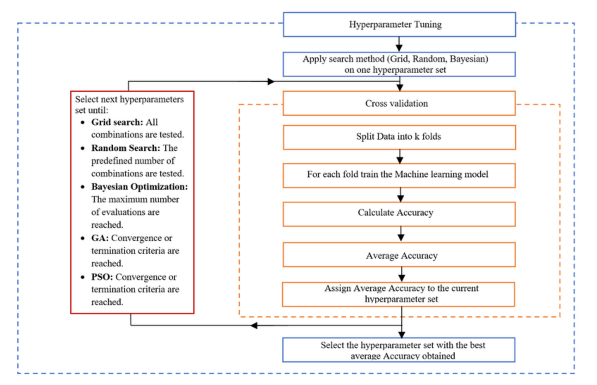

## Contents:<!-- omit in toc -->

- [Introduction to Model Tuning](#introduction-to-model-tuning)
- [Importance of Model Tuning](#importance-of-model-tuning)
- [Key Concepts in Model Tuning](#key-concepts-in-model-tuning)
  - [1. Hyperparameters vs. Parameters](#1-hyperparameters-vs-parameters)
  - [2. Cross-Validation](#2-cross-validation)
- [Techniques for Model Tuning](#techniques-for-model-tuning)
  - [1. Grid Search](#1-grid-search)
  - [2. Random Search](#2-random-search)
  - [3. Bayesian Optimization](#3-bayesian-optimization)
  - [4. Genetic Algorithms](#4-genetic-algorithms)
- [Best Practices in Model Tuning](#best-practices-in-model-tuning)
  - [1. Start Simple](#1-start-simple)
  - [2. Use Cross-Validation](#2-use-cross-validation)
  - [3. Monitor for Overfitting](#3-monitor-for-overfitting)
  - [4. Balance Performance and Complexity](#4-balance-performance-and-complexity)
- [Common Hyperparameters to Tune](#common-hyperparameters-to-tune)
  - [1. Decision Trees](#1-decision-trees)
  - [2. Support Vector Machines (SVM)](#2-support-vector-machines-svm)
  - [3. Neural Networks](#3-neural-networks)
- [Tools and Libraries for Model Tuning](#tools-and-libraries-for-model-tuning)
  - [1. Scikit-learn](#1-scikit-learn)
  - [2. Keras Tuner](#2-keras-tuner)
  - [3. Hyperopt](#3-hyperopt)
  - [4. Optuna](#4-optuna)
- [Videos: Hyperparameter Optimization with Scikit-learn and Optuna](#videos-hyperparameter-optimization-with-scikit-learn-and-optuna)
- [Conclusion](#conclusion)
- [Related Content](#related-content)
- [References](#references)



## Introduction to Model Tuning

In the world of machine learning, building a model is just the beginning. The true power of a model comes from its ability to generalize well to new, unseen data. This is where model tuning plays a critical role. Model tuning involves the process of optimizing a model's parameters to improve its performance and accuracy. This comprehensive article will delve into the key concepts, techniques, best practices, and tools involved in model tuning, providing a structured guide for practitioners at all levels.

> [!NOTE]  
> Reference and Details: [Feature Engineering Project](https://github.com/amitkumar-aimlp/projects/tree/content/feature-engineering-and-model-tuning-project)

## Importance of Model Tuning

Model tuning is essential for several reasons:

- **Enhances Model Accuracy**: Proper tuning can significantly improve the predictive accuracy of a model, making it more reliable. For example, fine-tuning the hyperparameters of a neural network can lead to better convergence and higher accuracy.
- **Reduces Overfitting and Underfitting**: By optimizing the model parameters, tuning helps in balancing the complexity of the model, thereby reducing the risk of overfitting (too complex) and underfitting (too simple). Overfitting occurs when the model learns the noise in the training data, while underfitting occurs when the model is too simplistic to capture the underlying pattern.
- **Improves Generalization**: Tuning helps ensure that the model performs well not just on the training data but also on unseen data, which is crucial for its practical applicability. This is particularly important in real-world applications where the model must handle new and diverse data.
- **Maximizes Performance**: Optimal parameter settings can lead to better performance in terms of speed, efficiency, and resource utilization. This is especially important for large-scale applications where computational resources and time are critical factors.

## Key Concepts in Model Tuning

### 1. Hyperparameters vs. Parameters

Understanding the difference between parameters and hyperparameters is fundamental:

- **Parameters**: These are the variables that the model learns during the training process. For example, in a neural network, the weights and biases are parameters. These are adjusted during training to minimize the loss function.
- **Hyperparameters**: These are the settings that you configure before training the model. They govern the training process and model architecture, such as the learning rate, number of layers in a neural network, or the maximum depth of a decision tree. Hyperparameters need to be set before training begins and can significantly impact the model's performance.

### 2. Cross-Validation

Cross-validation is a technique used to evaluate the performance of a model by partitioning the data into subsets:

- **Purpose**: It helps in assessing how the model will generalize to an independent dataset. Cross-validation provides a robust measure of model performance by ensuring that every data point gets a chance to be in the training and validation sets.
- **Types**:
  - **K-Fold Cross-Validation**: The dataset is divided into K subsets, and the model is trained and validated K times, each time using a different subset as the validation set and the remaining as the training set. This helps in mitigating the variability in the model evaluation and provides a more reliable estimate of model performance.
  - **Stratified K-Fold Cross-Validation**: Similar to K-Fold, but ensures that each fold is representative of the entire dataset in terms of class distribution. This is particularly useful for imbalanced datasets where certain classes might be underrepresented.
  - **Leave-One-Out Cross-Validation (LOOCV)**: A special case of K-Fold where K is equal to the number of data points, meaning each instance is used once as a validation set. LOOCV can be computationally expensive but provides an almost unbiased estimate of model performance.

## Techniques for Model Tuning

### 1. Grid Search

- **Definition**: Grid search is an exhaustive search method over a specified parameter grid.
- **Advantages**: It is comprehensive and explores all possible combinations of hyperparameters. This method ensures that the best possible parameter combination is found within the specified grid.
- **Disadvantages**: It is computationally expensive and time-consuming, especially with large parameter spaces. The search space grows exponentially with the number of hyperparameters, making it impractical for complex models.

### 2. Random Search

- **Definition**: Instead of searching all possible combinations, random search selects random combinations of hyperparameters to try.
- **Advantages**: It is more efficient than grid search and often finds good solutions with fewer evaluations. Random search is particularly effective when only a few hyperparameters significantly impact performance.
- **Disadvantages**: It is less comprehensive and might miss the optimal combination of hyperparameters. However, studies have shown that random search can be competitive with grid search in finding good hyperparameters.

### 3. Bayesian Optimization

- **Definition**: This method uses probabilistic models to predict the performance of different hyperparameter settings and choose the next set of hyperparameters to evaluate based on these predictions.
- **Advantages**: It is efficient and balances exploration and exploitation, often leading to good performance with fewer evaluations. Bayesian optimization can model the uncertainty in the search space and make more informed decisions.
- **Disadvantages**: It is more complex and requires a good understanding of probabilistic models. Implementing Bayesian optimization can be more challenging than grid or random search.

### 4. Genetic Algorithms

- **Definition**: Inspired by the process of natural selection, genetic algorithms iteratively improve a set of hyperparameters by combining and mutating them.
- **Advantages**: They are good for exploring large and complex search spaces and are adaptable to various types of problems. Genetic algorithms can efficiently search through highly nonlinear and multidimensional spaces.
- **Disadvantages**: They are computationally intensive and may have slower convergence compared to other methods. The performance of genetic algorithms heavily depends on the choice of genetic operators and their parameters.

## Best Practices in Model Tuning

### 1. Start Simple

- Begin with basic models and simpler tuning methods to get a baseline performance. This helps in understanding the initial performance of the model without much complexity.
- Gradually introduce complexity as you understand the model's behavior and requirements. Starting simple allows for quicker iterations and helps in identifying fundamental issues early.

### 2. Use Cross-Validation

- Always validate the model using cross-validation to ensure robustness. Cross-validation helps in providing a more reliable estimate of model performance by using multiple splits of the data.
- Helps in assessing the true performance of the model and prevents overfitting. Regular cross-validation can help in identifying the right level of model complexity and prevent overfitting to the training data.

### 3. Monitor for Overfitting

- Regularly check for signs of overfitting by comparing training and validation performance. If the model performs significantly better on the training data compared to the validation data, it might be overfitting.
- Use techniques like early stopping and regularization to mitigate overfitting. Early stopping involves halting the training process when the performance on the validation set starts to degrade, while regularization techniques add penalties to the loss function to prevent the model from becoming too complex.

### 4. Balance Performance and Complexity

- Aim for a model that is both performant and interpretable. Simpler models are easier to interpret and maintain but might not capture complex patterns as effectively as more complex models.
- Avoid overly complex models that are difficult to understand and maintain, unless necessary for the problem at hand. Striking a balance between performance and complexity ensures that the model remains useful and practical in real-world scenarios.

## Common Hyperparameters to Tune

### 1. Decision Trees

- **Max Depth**: Limits the maximum depth of the tree. A deeper tree can model more complex relationships but is also more prone to overfitting.
- **Min Samples Split**: The minimum number of samples required to split an internal node. Higher values prevent the model from learning overly specific patterns in the data.
- **Min Samples Leaf**: The minimum number of samples required to be at a leaf node. This helps in smoothing the model predictions and reducing overfitting.

### 2. Support Vector Machines (SVM)

- **C (Regularization Parameter)**: Controls the trade-off between achieving a low error on the training data and minimizing the complexity of the model. Higher values of C aim to fit the training data better, while lower values encourage simpler models.
- **Kernel Type**: Specifies the kernel type to be used in the algorithm (e.g., linear, polynomial, RBF). The choice of kernel can significantly impact the model's ability to capture complex relationships in the data.
- **Gamma**: Defines how far the influence of a single training example reaches. Higher values of gamma make the model focus more on individual data points, while lower values consider broader patterns.

### 3. Neural Networks

- **Learning Rate**: Determines the step size during the optimization process. A learning rate that is too high can cause the model to converge too quickly to a suboptimal solution, while a rate that is too low can slow down the training process.
- **Number of Layers**: Specifies the number of layers in the neural network. More layers allow the model to capture more complex patterns but also increase the risk of overfitting.
- **Number of Neurons per Layer**: Controls the complexity and capacity of the network. The right number of neurons can balance the model's ability to learn complex patterns without becoming too complex.
- **Batch Size**: The number of training examples utilized in one iteration. Larger batch sizes can make the training process more stable, while smaller batch sizes can introduce more variability and potentially better generalization.
- **Epochs**: The number of complete passes through the training dataset. More epochs can lead to better training performance, but too many epochs can result in overfitting.

## Tools and Libraries for Model Tuning

### 1. Scikit-learn

- **GridSearchCV**: Performs grid search with cross-validation. It automates the process
  of performing grid search over hyperparameter values and evaluates the performance using cross-validation.
- **RandomizedSearchCV**: Performs random search with cross-validation. This method is more efficient than grid search and can find good hyperparameter settings with fewer evaluations.

### 2. Keras Tuner

- **Random Search**: Randomly searches hyperparameters. It is easy to use and integrates well with Keras models.
- **Hyperband**: Efficiently searches through hyperparameters by adapting the number of resources allocated to each configuration. Hyperband can quickly identify promising hyperparameter settings and allocate more resources to them.

### 3. Hyperopt

- **Bayesian Optimization**: Provides an implementation for Bayesian optimization. Hyperopt uses probabilistic models to guide the search for optimal hyperparameters and can handle complex search spaces efficiently.

### 4. Optuna

- **Efficient Hyperparameter Optimization**: Allows for efficient and flexible hyperparameter optimization. Optuna uses a tree-structured Parzen estimator (TPE) approach for Bayesian optimization and supports advanced features like pruning unpromising trials.

## Videos: Hyperparameter Optimization with Scikit-learn and Optuna

In this video, explore the powerful techniques for hyperparameter optimization using Scikit-learn and Optuna. Learn how to implement grid search, random search, and advanced Bayesian optimization to fine-tune your machine learning models for improved performance. Whether you're new to hyperparameter tuning or looking to enhance your existing workflow, this tutorial provides practical insights and hands-on examples to help you get the most out of your model optimization efforts.

<iframe src=" https://www.youtube.com/embed/5nYqK-HaoKY?si=a00bV3tbBpb5N-Ux" frameborder="0" style="position: absolute; top: 0; left: 0; width: 100%; height: 100%;" allowfullscreen></iframe>

## Conclusion

Model tuning is an essential step in the machine learning pipeline. By carefully selecting and optimizing hyperparameters, one can significantly enhance the performance of a model. Utilizing appropriate techniques and tools, and adhering to best practices, ensures a robust and efficient tuning process. The journey of model tuning might be complex and time-consuming, but the rewards in terms of model performance and reliability are well worth the effort.
Model tuning involves a balance of art and science, requiring both technical knowledge and intuition about the specific problem at hand. By following the guidelines and leveraging the tools discussed in this article, practitioners can develop more accurate and robust models, ultimately leading to better outcomes in their machine learning projects.

## Related Content

- [Python Programming Language Syntax and Examples](https://amitkumar-aimlp.github.io/projects/python-programming-language-syntax-and-examples)
- [NumPy for Data Science: A Comprehensive Guide](https://amitkumar-aimlp.github.io/projects/numpy-for-data-science-a-comprehensive-guide)
- [Pandas for Data Science: A Comprehensive Guide](https://amitkumar-aimlp.github.io/projects/pandas-for-data-science-a-comprehensive-guide)
- [Pandas Vs. SQL: A Comprehensive Comparison](https://amitkumar-aimlp.github.io/projects/pandas-vs-sql-a-comprehensive-comparison)
- [PySpark Using Databricks: A Comprehensive Guide](https://amitkumar-aimlp.github.io/projects/pyspark-using-databricks-a-comprehensive-guide)
- [Pandas Vs. PySpark: A Comprehensive Comparison](https://amitkumar-aimlp.github.io/projects/pandas-vs-pyspark-a-comprehensive-comparison)
- [Matplotlib for Data Visualization](https://amitkumar-aimlp.github.io/projects/matplotlib-for-data-visualization)
- [Applied Statistics: An Overview](https://amitkumar-aimlp.github.io/projects/applied-statistics-an-overview)
- [Supervised Learning – A Simple Guide](https://amitkumar-aimlp.github.io/projects/supervised-learning-a-simple-guide)
- [Unsupervised Learning – A Simple Guide](https://amitkumar-aimlp.github.io/projects/unsupervised-learning-a-simple-guide)
- [Ensemble Learning – Methods](https://amitkumar-aimlp.github.io/projects/ensemble-learning-methods)
- [Feature Engineering - An Overview](https://amitkumar-aimlp.github.io/projects/feature-engineering-an-overview)

## References

1. Bergstra, J., & Bengio, Y. (2012). Random Search for Hyper-Parameter Optimization. _Journal of Machine Learning Research, 13_, 281-305. From [http://www.jmlr.org/papers/volume13/bergstra12a/bergstra12a.pdf](http://www.jmlr.org/papers/volume13/bergstra12a/bergstra12a.pdf)
2. Bergstra, J., Bardenet, R., Bengio, Y., & Kégl, B. (2011). Algorithms for Hyper-Parameter Optimization. In _Advances in Neural Information Processing Systems_ (pp. 2546-2554). From [https://papers.nips.cc/paper/4443-algorithms-for-hyper-parameter-optimization.pdf](https://papers.nips.cc/paper/4443-algorithms-for-hyper-parameter-optimization.pdf)
3. Hutter, F., Hoos, H. H., & Leyton-Brown, K. (2011). Sequential Model-Based Optimization for General Algorithm Configuration. In _Proceedings of the 5th International Conference on Learning and Intelligent Optimization_ (pp. 507-523). From [https://link.springer.com/chapter/10.1007/978-3-642-25566-3_40](https://link.springer.com/chapter/10.1007/978-3-642-25566-3_40)
4. Snoek, J., Larochelle, H., & Adams, R. P. (2012). Practical Bayesian Optimization of Machine Learning Algorithms. In _Advances in Neural Information Processing Systems_ (pp. 2951-2959). From [https://arxiv.org/abs/1206.2944](https://arxiv.org/abs/1206.2944)
5. Hastie, T., Tibshirani, R., & Friedman, J. (2009). _The Elements of Statistical Learning: Data Mining, Inference, and Prediction_ (2nd ed.). Springer. From [https://web.stanford.edu/~hastie/Papers/ESLII.pdf](https://web.stanford.edu/~hastie/Papers/ESLII.pdf)
6. Goodfellow, I., Bengio, Y., & Courville, A. (2016). _Deep Learning_. MIT Press. From [http://www.deeplearningbook.org/](http://www.deeplearningbook.org/)
7. Géron, A. (2019). _Hands-On Machine Learning with Scikit-Learn, Keras, and TensorFlow_ (2nd ed.). O'Reilly Media.
8. Brownlee, J. (2019). _Machine Learning Mastery With Python_. Machine Learning Mastery. From [https://machinelearningmastery.com/machine-learning-with-python/](https://machinelearningmastery.com/machine-learning-with-python/)
9. Pedregosa, F., Varoquaux, G., Gramfort, A., Michel, V., Thirion, B., Grisel, O., ... & Duchesnay, É. (2011). Scikit-learn: Machine Learning in Python. _Journal of Machine Learning Research, 12_, 2825-2830. From [http://www.jmlr.org/papers/volume12/pedregosa11a/pedregosa11a.pdf](http://www.jmlr.org/papers/volume12/pedregosa11a/pedregosa11a.pdf)
10. Zhang, Z., & O'Malley, A. J. (2012). Machine Learning in Predictive Analytics: An Introduction to Best Practices and Algorithms. _Harvard Data Science Review_. From [https://hdsr.mitpress.mit.edu/pub/6dqxy4g7](https://hdsr.mitpress.mit.edu/pub/6dqxy4g7)
11. Keras Tuner Documentation. From [https://keras-team.github.io/keras-tuner/](https://keras-team.github.io/keras-tuner/)
12. Optuna Documentation. From [https://optuna.org/](https://optuna.org/)
13. Hyperopt Documentation. From [http://hyperopt.github.io/hyperopt/](http://hyperopt.github.io/hyperopt/)
14. Scikit-learn Documentation. From [https://scikit-learn.org/stable/](https://scikit-learn.org/stable/)
15. Olson, R. S., & Moore, J. H. (2016). TPOT: A Tree-Based Pipeline Optimization Tool for Automating Machine Learning. In _Proceedings of the Workshop on Automatic Machine Learning_ (pp. 66-74). From [https://www.automl.org/papers/16AutoML_workshop_28.pdf](https://www.automl.org/papers/16AutoML_workshop_28.pdf)
16. Elgeldawi, Enas & Sayed, Awny & Galal, Ahmed & Zaki, Alaa. (2021). Hyperparameter Tuning for Machine Learning Algorithms Used for Arabic Sentiment Analysis. Informatics. 8. 10.3390/informatics8040079.
17. [Hyperparameter optimization](https://en.wikipedia.org/wiki/Hyperparameter_optimization)
18. [Hyperparameter Optimization Techniques to Improve Your Machine Learning Model's Performance](https://www.freecodecamp.org/news/hyperparameter-optimization-techniques-machine-learning/)
19. [Hyperparameter optimization: Foundations, algorithms, best practices, and open challenges](https://wires.onlinelibrary.wiley.com/doi/full/10.1002/widm.1484)
20. [Hyperparameter Optimization](https://d2l.ai/chapter_hyperparameter-optimization/)

> ### Be humble always and identify with the common man; even when success and achievements want to make you proud.
>
> -Bishop Leonard Umumna

---

_Published: 2020-01-15; Updated: 2024-05-01_

---

[TOP](#contents)
