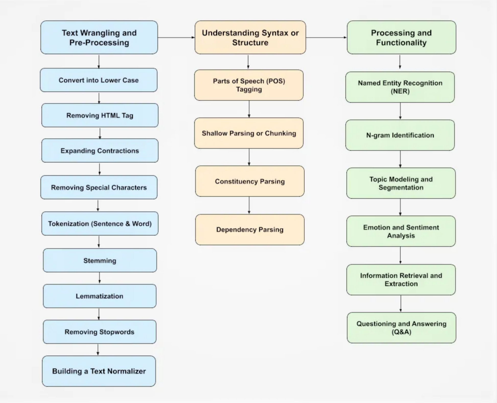

## Contents:<!-- omit in toc -->

- [1. Introduction to Natural Language Processing (NLP)](#1-introduction-to-natural-language-processing-nlp)
  - [1.1. Importance of NLP](#11-importance-of-nlp)
- [2. Key Components of NLP](#2-key-components-of-nlp)
  - [2.1. Tokenization](#21-tokenization)
  - [2.2. Part-of-Speech Tagging (POS Tagging)](#22-part-of-speech-tagging-pos-tagging)
  - [2.3. Named Entity Recognition (NER)](#23-named-entity-recognition-ner)
  - [2.4. Parsing](#24-parsing)
- [3. Advanced NLP Techniques](#3-advanced-nlp-techniques)
  - [3.1. Sentiment Analysis](#31-sentiment-analysis)
  - [3.2. Machine Translation](#32-machine-translation)
  - [3.3. Text Summarization](#33-text-summarization)
  - [3.4. Topic Modeling](#34-topic-modeling)
  - [3.5. Text Classification](#35-text-classification)
  - [3.6. Word Embeddings](#36-word-embeddings)
- [4. Applications of NLP](#4-applications-of-nlp)
  - [4.1. Search Engines](#41-search-engines)
  - [4.2. Chatbots and Virtual Assistants](#42-chatbots-and-virtual-assistants)
  - [4.3. Healthcare](#43-healthcare)
  - [4.4. Finance](#44-finance)
  - [4.5. Social Media Analysis](#45-social-media-analysis)
  - [4.6. E-commerce](#46-e-commerce)
- [5. Challenges in NLP](#5-challenges-in-nlp)
  - [5.1. Ambiguity](#51-ambiguity)
  - [5.2. Context Understanding](#52-context-understanding)
  - [5.3. Resource Limitations](#53-resource-limitations)
  - [5.4. Language Diversity](#54-language-diversity)
- [6. Future Trends in NLP](#6-future-trends-in-nlp)
  - [6.1. Improved Language Models](#61-improved-language-models)
  - [6.2. Multilingual NLP](#62-multilingual-nlp)
  - [6.3. Ethical Considerations](#63-ethical-considerations)
  - [6.4. Interactive and Real-Time NLP](#64-interactive-and-real-time-nlp)
- [7. NLP Tools and Libraries](#7-nlp-tools-and-libraries)
  - [7.1. NLTK (Natural Language Toolkit)](#71-nltk-natural-language-toolkit)
  - [7.2. spaCy](#72-spacy)
  - [7.3. Transformers by Hugging Face](#73-transformers-by-hugging-face)
  - [7.4. Gensim](#74-gensim)
- [8. Videos: Natural Language Processing Demystified](#8-videos-natural-language-processing-demystified)
- [9. Conclusion](#9-conclusion)
- [10. Related Content](#10-related-content)
- [11. References](#11-references)



## 1. Introduction to Natural Language Processing (NLP)

Natural Language Processing (NLP) is a subfield of Artificial Intelligence (AI) that focuses on the interaction between computers and humans through natural language. The goal of NLP is to enable computers to understand, interpret, and generate human language in a way that is both meaningful and useful. This involves a range of tasks from simple ones like tokenization to complex ones like machine translation and sentiment analysis.

> [!NOTE]  
> Reference and Details: [NLP Project-1](https://github.com/amitkumar-aimlp/projects/tree/content/nlp-project-1)
>
> Reference and Details: [NLP Project-2](https://github.com/amitkumar-aimlp/projects/tree/content/nlp-project-2)

### 1.1. Importance of NLP

NLP plays a crucial role in modern technology by facilitating human-computer interaction, enhancing data analysis, improving communication tools, and enabling sentiment analysis for business intelligence. Key areas where NLP has a significant impact include:

- **Human-Computer Interaction:** NLP enables more natural and intuitive ways for humans to interact with machines, such as voice-activated assistants and chatbots.
- **Data Analysis:** NLP helps in extracting meaningful information from large volumes of unstructured text data, making it easier to analyze and derive insights. For instance, it can automatically classify documents, detect topics, and identify key trends in large datasets.
- **Communication Tools:** NLP improves the functionality of various communication tools by enabling features like real-time translation, auto-correction, and context-aware responses. This enhances the efficiency and effectiveness of digital communication.
- **Sentiment Analysis:** Businesses use NLP to analyze customer feedback, reviews, and social media posts to understand public sentiment and make data-driven decisions. This can help in tailoring marketing strategies, improving customer service, and enhancing product development.

## 2. Key Components of NLP

### 2.1. Tokenization

Tokenization is the process of breaking down text into smaller units, such as words or sentences. It is a fundamental step in NLP as it prepares the text for further processing.

- **Word Tokenization:** Splits text into individual words. For example, the sentence "NLP is fascinating" would be tokenized into ["NLP", "is", "fascinating"].
- **Sentence Tokenization:** Splits text into individual sentences. For instance, the paragraph "NLP is fascinating. It has many applications." would be tokenized into ["NLP is fascinating.", "It has many applications."].

### 2.2. Part-of-Speech Tagging (POS Tagging)

POS tagging involves assigning parts of speech to each word in a text, such as nouns, verbs, adjectives, etc. This helps in understanding the grammatical structure of a sentence and provides context to the words.

- **Example:** In the sentence "The cat sat on the mat," POS tagging would label "The" as a determiner, "cat" as a noun, "sat" as a verb, "on" as a preposition, "the" as a determiner, and "mat" as a noun.

### 2.3. Named Entity Recognition (NER)

NER is the process of identifying and classifying named entities in text into predefined categories such as person names, organizations, locations, etc. It is widely used in information extraction and content categorization.

- **Example:** In the sentence "Barack Obama was the president of the United States," NER would identify "Barack Obama" as a person and "United States" as a location.

### 2.4. Parsing

Parsing involves analyzing the syntactic structure of a sentence to understand its grammatical organization. There are two main types of parsing:

- **Dependency Parsing:** Focuses on the dependencies between words in a sentence, showing how words relate to each other. For example, in "The dog chased the cat," dependency parsing reveals that "chased" is the root verb, with "dog" and "cat" as its subject and object, respectively.
- **Constituency Parsing:** Breaks down the sentence into sub-phrases or constituents, such as noun phrases and verb phrases. For example, "The quick brown fox jumps over the lazy dog" can be parsed into a noun phrase ("The quick brown fox") and a verb phrase ("jumps over the lazy dog").

## 3. Advanced NLP Techniques

### 3.1. Sentiment Analysis

Sentiment analysis determines the sentiment or emotion expressed in a piece of text. It is widely used in customer feedback analysis and social media monitoring to gauge public opinion.

- **Applications:** Analyzing customer reviews to determine satisfaction levels, monitoring social media to detect trends in public sentiment, and evaluating feedback to improve products and services.
- **Techniques:** Rule-based approaches, machine learning algorithms, and deep learning models are used to classify text as positive, negative, or neutral.

### 3.2. Machine Translation

Machine translation involves automatically translating text from one language to another. There are various techniques used in machine translation:

- **Rule-based Translation:** Uses linguistic rules to translate text. This approach requires extensive linguistic knowledge and rule creation for each language pair.
- **Statistical Machine Translation:** Uses statistical models based on bilingual text corpora to translate text. This approach relies on large amounts of parallel text data to learn translation patterns.
- **Neural Machine Translation:** Uses neural networks to achieve more accurate translations. This approach has gained popularity due to its ability to handle complex language patterns and produce more fluent translations.

### 3.3. Text Summarization

Text summarization creates a short, coherent version of a longer text. There are two main types:

- **Extractive Summarization:** Selects key sentences from the original text to create a summary. This method relies on identifying important sentences based on their relevance and position in the text.
- **Abstractive Summarization:** Generates new sentences that convey the main ideas of the original text. This method uses natural language generation techniques to produce more concise and coherent summaries.

### 3.4. Topic Modeling

Topic modeling identifies the underlying themes or topics in a large corpus of text. Common methods include:

- **Latent Dirichlet Allocation (LDA):** A generative probabilistic model that assumes documents are mixtures of topics, and topics are mixtures of words. LDA is widely used for discovering hidden topics in large text collections.
- **Non-Negative Matrix Factorization (NMF):** A matrix factorization technique that decomposes a document-term matrix into two lower-dimensional matrices, revealing the underlying topics and their associated terms.

### 3.5. Text Classification

Text classification assigns categories to text based on its content. It is used in applications such as spam detection and document categorization.

- **Applications:** Classifying emails as spam or non-spam, categorizing news articles into topics, and tagging customer support tickets for efficient handling.
- **Techniques:** Machine learning algorithms, such as Naive Bayes, Support Vector Machines (SVM), and deep learning models, are commonly used for text classification.

### 3.6. Word Embeddings

Word embeddings represent words in a continuous vector space where similar words are closer together. Popular techniques include:

- **Word2Vec:** A neural network-based model that learns word representations by predicting the context of words. Word2Vec can generate embeddings that capture semantic relationships between words.
- **GloVe:** A model that generates word embeddings by factorizing a word co-occurrence matrix. GloVe aims to capture global word-word co-occurrence statistics and produce meaningful word vectors.
- **FastText:** An extension of Word2Vec that represents words as bags of character n-grams. FastText can handle out-of-vocabulary words by breaking them down into smaller components.

## 4. Applications of NLP

### 4.1. Search Engines

NLP enhances the accuracy and relevance of search engines by improving query understanding and providing features like auto-suggestion and query correction.

- **Example:** Google uses NLP to understand user queries and provide relevant search results. It also offers features like spell correction and query suggestions to improve the user experience.

### 4.2. Chatbots and Virtual Assistants

NLP powers chatbots and virtual assistants, enabling them to understand and respond to user queries, automate customer service, and provide personalized assistance.

- **Example:** Virtual assistants like Siri, Alexa, and Google Assistant use NLP to interpret voice commands, answer questions, and perform tasks such as setting reminders and playing music.

### 4.3. Healthcare

In healthcare, NLP is used to analyze patient records, extract medical information from research papers, and assist in clinical decision-making.

- **Example:** NLP can help identify patterns in electronic health records (EHRs) to predict patient outcomes, extract relevant information from clinical notes, and support medical research by analyzing scientific literature.

### 4.4. Finance

NLP helps in analyzing financial reports, detecting fraud through textual data analysis, and monitoring market sentiment through news and social media.

- **Example:** Financial institutions use NLP to analyze earnings reports, news articles, and social media posts to assess market trends and make informed investment decisions. NLP is also used to detect fraudulent activities by analyzing transaction descriptions and customer communications.

### 4.5. Social Media Analysis

NLP monitors trends and public opinion on social media, analyzes user sentiment, and helps brands understand their audience better.

- **Example:** Companies use NLP to track brand mentions, analyze customer sentiment, and identify emerging trends on social media platforms like Twitter and Facebook. This information helps businesses tailor their marketing strategies and engage with their audience effectively.

### 4.6. E-commerce

NLP is used in e-commerce for personalized product recommendations, customer review analysis, and enhancing search functionality on online platforms.

- **Example:** E-commerce platforms like Amazon use NLP to analyze customer reviews, provide personalized product recommendations, and improve search results by understanding user queries and preferences.

## 5. Challenges in NLP

### 5.1. Ambiguity

Ambiguity is a major challenge in NLP as words and sentences can have multiple meanings. Types of ambiguity include:

- **Lexical Ambiguity:** When a word has multiple meanings. For example, the word "bank" can refer to a financial institution or the side of a river.
- **Syntactic Ambiguity:** When a sentence can be parsed in multiple ways. For example, the sentence "I saw the man with the telescope" can mean that either the speaker used a telescope to see the man or saw a man who had a telescope.
- **Semantic Ambiguity:** When a sentence has multiple interpretations. For example, the sentence "Visiting relatives can be boring" can mean either that visiting one's relatives is boring or that relatives who visit can be boring.

### 5.2. Context Understanding

Understanding context-specific meanings, handling sarcasm, idiomatic expressions, and resolving pronouns are complex tasks in NLP.

- **Example:** The phrase "I'm feeling blue" means "I'm sad," not "I'm turning blue." Understanding such idiomatic expressions requires contextual knowledge beyond literal word meanings.

### 5.3. Resource Limitations

NLP requires large annotated datasets for training models, which can be resource-intensive. Processing large text corpora also demands significant computational power.

- **Example:** Training state-of-the-art NLP models like BERT or GPT-3 requires access to vast amounts of text data and high-performance computing resources, which may not be readily available to all researchers and developers.

### 5.4. Language Diversity

Handling multiple languages and dialects, transliteration, and code-switching (mixing languages) are challenging aspects of NLP.

- **Example:** Developing NLP systems that can accurately process and understand text in multiple languages, including those with complex grammar and less digital presence, requires extensive linguistic knowledge and resources.

## 6. Future Trends in NLP

### 6.1. Improved Language Models

The development of more sophisticated models like GPT-4 and beyond promises better handling of context and coherence in text processing.

- **Example:** Future language models may achieve near-human understanding and generation of text, enabling more accurate and fluent interactions with AI systems.

### 6.2. Multilingual NLP

Enhanced translation and understanding across multiple languages, and cross-lingual information retrieval, will become more prominent.

- **Example:** Multilingual NLP models will enable seamless communication and information access across different languages, breaking down language barriers and fostering global collaboration.

### 6.3. Ethical Considerations

Addressing bias in NLP models, ensuring privacy and security in text processing, and promoting fairness are critical for the future of NLP.

- **Example:** Researchers and developers are working on techniques to reduce bias in NLP models, protect user data, and ensure that NLP applications are fair and inclusive.

### 6.4. Interactive and Real-Time NLP

Real-time language processing for interactive applications, improvements in speech recognition, and generation will enhance user experiences.

- **Example:** Advances in real-time NLP will enable more responsive virtual assistants, real-time translation services, and interactive educational tools that can adapt to users' needs on the fly.

## 7. NLP Tools and Libraries

### 7.1. NLTK (Natural Language Toolkit)

A comprehensive library for building NLP programs, providing easy-to-use interfaces for over 50 corpora and lexical resources.

- **Features:** NLTK offers tools for tokenization, POS tagging, parsing, stemming, and more. It also includes a wide range of datasets for training and evaluating NLP models.

### 7.2. spaCy

An industrial-strength NLP library that is efficient and easy to use with pre-trained models for various NLP tasks.

- **Features:** spaCy provides fast and accurate implementations of tokenization, POS tagging, NER, parsing, and more. It also supports deep learning integration and model training.

### 7.3. Transformers by Hugging Face

State-of-the-art models for NLP tasks, enabling easy implementation of transformer-based models like BERT, GPT, and others.

- **Features:** The Transformers library offers pre-trained models for a wide range of NLP tasks, including text classification, question answering, and text generation. It also provides tools for fine-tuning models on custom datasets.

### 7.4. Gensim

A library for topic modeling and document similarity, efficient for handling large text corpora.

- **Features:** Gensim supports algorithms like LDA, word2vec, and doc2vec for topic modeling and word embeddings. It is designed to process large-scale text data efficiently.

## 8. Videos: Natural Language Processing Demystified

Learn about the fundamentals of Natural Language Processing (NLP) in this insightful video! Discover key techniques, real-world applications, and the future of NLP technology. Perfect for beginners and experts alike, this guide will help you understand how NLP is transforming the way we interact with technology. Don't miss out on this comprehensive overview!

<iframe src="https://www.youtube.com/embed/rmVRLeJRkl4?si=q2yTgVnj6W2JY3ZK" frameborder="0" style="position: absolute; top: 0; left: 0; width: 100%; height: 100%;" allowfullscreen></iframe>

## 9. Conclusion

Natural Language Processing continues to evolve, offering powerful tools for understanding and generating human language. As technology advances, NLP will play an increasingly critical role in various industries, driving innovation and improving human-computer interaction. The future of NLP holds promise for more accurate, efficient, and ethical language processing technologies that will further enhance our ability to communicate and understand each other.
In summary, NLP is a dynamic and rapidly evolving field that bridges the gap between human language and computer understanding. By leveraging the key components, advanced techniques, and diverse applications of NLP, we can unlock new possibilities and drive progress across various domains. As we look to the future, ongoing advancements in NLP will continue to shape the way we interact with technology and each other, making communication more seamless, efficient, and inclusive.

## 10. Related Content

- [Python Programming Language Syntax and Examples](https://amitkumar-aimlp.github.io/projects/python-programming-language-syntax-and-examples)
- [NumPy for Data Science: A Comprehensive Guide](https://amitkumar-aimlp.github.io/projects/numpy-for-data-science-a-comprehensive-guide)
- [Pandas for Data Science: A Comprehensive Guide](https://amitkumar-aimlp.github.io/projects/pandas-for-data-science-a-comprehensive-guide)
- [Pandas Vs. SQL: A Comprehensive Comparison](https://amitkumar-aimlp.github.io/projects/pandas-vs-sql-a-comprehensive-comparison)
- [PySpark Using Databricks: A Comprehensive Guide](https://amitkumar-aimlp.github.io/projects/pyspark-using-databricks-a-comprehensive-guide)
- [Pandas Vs. PySpark: A Comprehensive Comparison](https://amitkumar-aimlp.github.io/projects/pandas-vs-pyspark-a-comprehensive-comparison)
- [Matplotlib for Data Visualization](https://amitkumar-aimlp.github.io/projects/matplotlib-for-data-visualization)
- [Applied Statistics: An Overview](https://amitkumar-aimlp.github.io/projects/applied-statistics-an-overview)
- [Supervised Learning – A Simple Guide](https://amitkumar-aimlp.github.io/projects/supervised-learning-a-simple-guide)
- [Unsupervised Learning – A Simple Guide](https://amitkumar-aimlp.github.io/projects/unsupervised-learning-a-simple-guide)
- [Ensemble Learning – Methods](https://amitkumar-aimlp.github.io/projects/ensemble-learning-methods)
- [Feature Engineering - An Overview](https://amitkumar-aimlp.github.io/projects/feature-engineering-an-overview)
- [Hyperparameter Optimization](https://amitkumar-aimlp.github.io/projects/hyperparameter-optimization)
- [Recommender Systems](https://amitkumar-aimlp.github.io/projects/recommender-systems)
- [Deep Learning Fundamentals](https://amitkumar-aimlp.github.io/projects/deep-learning-fundamentals)
- [Semi-supervised Learning](https://amitkumar-aimlp.github.io/projects/semi-supervised-learning)

## 11. References

1. **Jurafsky, D., & Martin, J. H. (2020).** _Speech and Language Processing (3rd ed.)._ Pearson.
   - A comprehensive textbook covering the theory and application of NLP techniques, including tokenization, POS tagging, NER, parsing, and more.
2. **Manning, C. D., Raghavan, P., & Schütze, H. (2008).** _Introduction to Information Retrieval._ Cambridge University Press.
   - An introduction to the methods and principles of information retrieval and text processing, providing foundational knowledge for understanding NLP.
3. **Bird, S., Klein, E., & Loper, E. (2009).** _Natural Language Processing with Python: Analyzing Text with the Natural Language Toolkit._ O'Reilly Media.
   - A practical guide to using the Natural Language Toolkit (NLTK) for building NLP applications, including examples and exercises.
4. **Mikolov, T., Chen, K., Corrado, G., & Dean, J. (2013).** "Efficient Estimation of Word Representations in Vector Space." _arXiv preprint arXiv:1301.3781._
   - The seminal paper introducing the Word2Vec model for learning word embeddings, which has become a foundational technique in NLP.
5. **Vaswani, A., Shazeer, N., Parmar, N., Uszkoreit, J., Jones, L., Gomez, A. N., ... & Polosukhin, I. (2017).** "Attention is All You Need." _Advances in Neural Information Processing Systems,_ 30, 5998-6008.
   - The groundbreaking paper introducing the Transformer model, which forms the basis of many state-of-the-art NLP models like BERT and GPT.
6. **Devlin, J., Chang, M. W., Lee, K., & Toutanova, K. (2019).** "BERT: Pre-training of Deep Bidirectional Transformers for Language Understanding." _Proceedings of the 2019 Conference of the North American Chapter of the Association for Computational Linguistics: Human Language Technologies,_ 4171-4186.
   - The paper that introduced BERT, a pre-trained model that has significantly advanced the state of the art in various NLP tasks.
7. **Brown, T. B., Mann, B., Ryder, N., Subbiah, M., Kaplan, J., Dhariwal, P., ... & Amodei, D. (2020).** "Language Models are Few-Shot Learners." _arXiv preprint arXiv:2005.14165._
   - The research paper presenting GPT-3, a large language model that has set new benchmarks in NLP for generating human-like text and understanding context.
8. **Sutskever, I., Vinyals, O., & Le, Q. V. (2014).** "Sequence to Sequence Learning with Neural Networks." _Advances in Neural Information Processing Systems,_ 27, 3104-3112.
   - The paper that introduced the seq2seq model for machine translation and other NLP tasks, which has become a fundamental approach in neural machine translation.
9. **Pennington, J., Socher, R., & Manning, C. D. (2014).** "GloVe: Global Vectors for Word Representation." _Proceedings of the 2014 Conference on Empirical Methods in Natural Language Processing (EMNLP),_ 1532-1543.
   - The paper introducing the GloVe model for word embeddings, which captures global statistical information about words from large text corpora.
10. **Radford, A., Narasimhan, K., Salimans, T., & Sutskever, I. (2018).** "Improving Language Understanding by Generative Pre-Training." _OpenAI Blog._
    - The original paper on the GPT model, which highlights the use of unsupervised pre-training for improving language understanding.
11. **Bengio, Y., Ducharme, R., Vincent, P., & Jauvin, C. (2003).** "A Neural Probabilistic Language Model." _Journal of Machine Learning Research,_ 3, 1137-1155.
    - A foundational paper on neural language models, presenting one of the earliest approaches to learning distributed word representations.
12. **Lample, G., Conneau, A., Ranzato, M., Denoyer, L., & Jégou, H. (2018).** "Word Translation Without Parallel Data." _arXiv preprint arXiv:1710.04087._
    - A significant contribution to multilingual NLP, presenting methods for word translation without the need for parallel corpora.
13. **Kumar, A., & Ahuja, N. (2020).** "A Comprehensive Survey of NLP Applications in Healthcare." _Journal of Biomedical Informatics,_ 110, 103543.
    - A survey paper discussing the various applications and advancements of NLP in the healthcare sector.
14. **Hirschberg, J., & Manning, C. D. (2015).** "Advances in Natural Language Processing." _Science,_ 349(6245), 261-266.
    - An overview of the progress in NLP research and applications, highlighting key milestones and future directions.
15. **Ruder, S. (2019).** "Neural Transfer Learning for Natural Language Processing." _PhD Thesis, National University of Ireland, Galway._
    - A comprehensive thesis on transfer learning techniques in NLP, discussing models like ULMFiT, ELMo, BERT, and GPT.
16. [Natural Language Processing](https://en.wikipedia.org/wiki/Natural_language_processing)
17. [Natural Language Processing](https://www.deeplearning.ai/resources/natural-language-processing)
18. [Natural Language Processing: A comprehensive overview](https://www.leewayhertz.com/natural-language-processing/)
19. [Natural Language Processing](https://deepai.org/machine-learning-glossary-and-terms/natural-language-processing)
20. [NLP Pipeline: Building an NLP Pipeline, Step-by-Step](https://suneelpatel18.medium.com/nlp-pipeline-building-an-nlp-pipeline-step-by-step-7f0576e11d08)

> ### Whether you think you can, or you think you can't—either way you're right.
>
> -Henry Ford

---

_Published: 2020-01-19; Updated: 2024-05-01_

---

[TOP](#contents)
