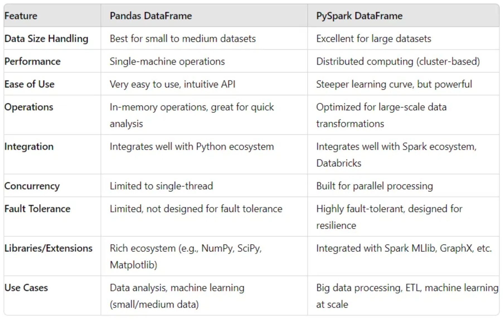

Contents:<!-- omit in toc -->

- [Introduction](#introduction)
- [Core Concepts](#core-concepts)
- [Performance and Scalability](#performance-and-scalability)
- [Data Structures](#data-structures)
- [Ease of Use and Learning Curve](#ease-of-use-and-learning-curve)
- [Data Handling and Manipulation](#data-handling-and-manipulation)
- [Integration and Ecosystem](#integration-and-ecosystem)
- [Performance Optimization](#performance-optimization)
- [Use Cases](#use-cases)
- [Community and Support](#community-and-support)
- [Pandas Vs. PySpark: Comparison Table](#pandas-vs-pyspark-comparison-table)
- [Conclusion](#conclusion)
- [Related Content](#related-content)
- [References](#references)



## Introduction

In the realm of data processing and analysis, two powerful tools have emerged as frontrunners: Pandas and PySpark. Each tool brings a unique set of features and capabilities tailored to different data needs. Understanding when and how to use Pandas versus PySpark can significantly impact the efficiency and scalability of your data workflows. This article delves into a comprehensive comparison of Pandas and PySpark, covering core concepts, performance, ease of use, data handling, integration, performance optimization, use cases, and community support.

## Core Concepts

- **Pandas**
  - **Developed for data manipulation and analysis in Python:** Pandas is an open-source data analysis and manipulation tool built on top of the Python programming language. It's designed to make working with structured data fast, easy, and expressive.
  - **DataFrame structure:** The primary data structure in Pandas is the DataFrame, a two-dimensional, size-mutable, and heterogeneous tabular data structure with labeled axes (rows and columns).
  - **Series structure:** A Series is a one-dimensional array with axis labels, capable of holding any data type.
- **PySpark**
  - **Python API for Apache Spark:** PySpark is the Python API for Apache Spark, an open-source distributed computing system that provides an interface for programming entire clusters with implicit data parallelism and fault tolerance.
  - **Distributed data processing:** PySpark allows for processing data across a distributed network of computers, making it suitable for handling large-scale data.
  - **Resilient Distributed Dataset (RDD):** An RDD is a fundamental data structure in PySpark, representing an immutable distributed collection of objects that can be processed in parallel.
  - **DataFrame and Spark SQL:** PySpark’s DataFrame is a distributed collection of data organized into named columns, similar to a table in a relational database. Spark SQL provides support for querying DataFrames via SQL.

## Performance and Scalability

- **Pandas**
  - **In-memory processing:** Pandas operates primarily in-memory, meaning that it loads data into the system's RAM. This makes it very fast for data manipulation and analysis but limits it to the size of available memory.
  - **Suitable for small to medium-sized datasets:** Pandas excels with small to moderately large datasets, typically up to a few gigabytes, where data fits comfortably within the memory of a single machine.
- **PySpark**
  - **Distributed computing across clusters:** PySpark is designed to work with large datasets by distributing data and computations across a cluster of machines.
  - **Handles large-scale data:** PySpark can handle terabytes to petabytes of data efficiently, making it suitable for big data applications.

## Data Structures

- **Pandas**
  - **DataFrame:** A Pandas DataFrame is a two-dimensional, size-mutable, heterogeneous tabular data structure with labeled axes (rows and columns). It supports many operations like arithmetic, filtering, and applying functions.
  - **Series:** A Series is a one-dimensional array with labels, capable of holding any data type. It is similar to a column in a DataFrame.
- **PySpark**
  - **DataFrame:** A PySpark DataFrame is a distributed collection of data organized into named columns. It supports a range of operations similar to Pandas DataFrame but is designed to operate on large datasets distributed across a cluster.
  - **RDD:** An RDD is an immutable distributed collection of objects that can be processed in parallel. RDDs support two types of operations: transformations (which create a new RDD) and actions (which return a value to the driver program).

## Ease of Use and Learning Curve

- **Pandas**
  - **Intuitive and easy to learn for Python developers:** Pandas’ syntax is straightforward and aligns closely with Python’s built-in data structures, making it easy for Python developers to learn and use.
  - **Rich set of built-in functions:** Pandas provides a wealth of functions for data manipulation, making it a powerful tool for data analysis.
- **PySpark**
  - **Steeper learning curve due to distributed computing concepts:** PySpark introduces the complexity of distributed computing, which can be challenging for newcomers to grasp.
  - **Requires understanding of Spark’s architecture:** Effective use of PySpark requires a good understanding of Spark’s architecture, including concepts like RDDs, DataFrames, and the Catalyst optimizer.

## Data Handling and Manipulation

- **Pandas**
  - **Powerful data manipulation with intuitive syntax:** Pandas allows for complex data manipulations with simple, readable code.
  - **Supports indexing, slicing, and subsetting of data:** You can easily access and manipulate subsets of data using labels, integer-location based indexing, and Boolean indexing.
  - **Data alignment and handling of missing data:** Pandas automatically aligns data when performing operations on multiple Series or DataFrames and provides robust handling of missing data with methods to detect, remove, and fill missing values.
- **PySpark**
  - **Distributed data processing:** PySpark excels in processing data distributed across multiple nodes, providing fault tolerance and scalability.
  - **Transformations and actions on RDDs and DataFrames:** PySpark supports a wide range of transformations (e.g., map, filter, join) and actions (e.g., count, collect) to manipulate data.
  - **Supports SQL queries through Spark SQL:** PySpark integrates with Spark SQL, enabling users to run SQL queries on DataFrames and RDDs, making it easier for those familiar with SQL to work with PySpark.

## Integration and Ecosystem

- **Pandas**
  - **Strong integration with other Python libraries:** Pandas integrates seamlessly with other Python libraries such as NumPy for numerical operations, Matplotlib for plotting, and SciPy for scientific computing.
  - **Extensive ecosystem for data analysis:** Pandas is part of the broader Python ecosystem, which includes a wide range of tools and libraries for data analysis and machine learning.
- **PySpark**
  - **Part of the Apache Spark ecosystem:** PySpark is a component of the larger Apache Spark ecosystem, which includes tools for batch processing, stream processing, machine learning, and graph processing.
  - **Integrates with Hadoop, HDFS, and other big data tools:** PySpark can work with Hadoop Distributed File System (HDFS) and other big data storage systems, making it suitable for large-scale data processing environments.

## Performance Optimization

- **Pandas**
  - **Limited by single-machine memory:** Pandas’ performance is limited by the amount of memory available on a single machine. For very large datasets, this can become a bottleneck.
  - **Optimizations through vectorized operations:** Pandas operations are often vectorized, meaning they are implemented to work with entire arrays at once, which can lead to significant performance gains.
- **PySpark**
  - **Optimized for distributed computing:** PySpark is designed for distributed computing, allowing it to scale out and handle large datasets efficiently.
  - **Catalyst optimizer for query optimization:** Spark SQL’s Catalyst optimizer automatically optimizes query plans, improving the performance of SQL queries on DataFrames.
  - **In-memory computation with Apache Arrow:** PySpark can use Apache Arrow for in-memory columnar data transfer, significantly speeding up the exchange of data between PySpark and Pandas DataFrames.

## Use Cases

- **Pandas**
  - **Exploratory data analysis (EDA):** Pandas is ideal for EDA, providing tools for quickly loading, cleaning, and exploring small to medium-sized datasets.
  - **Small to medium-scale data manipulation:** Pandas excels at handling datasets that fit into memory, making it suitable for many real-world data analysis tasks.
  - **Prototyping machine learning models:** Pandas is often used for prototyping machine learning models, thanks to its integration with libraries like scikit-learn.
- **PySpark**
  - **Large-scale data processing:** PySpark is designed for large-scale data processing, capable of handling datasets that span multiple machines.
  - **ETL (Extract, Transform, Load) operations:** PySpark is commonly used for ETL operations, processing large volumes of data efficiently.
  - **Real-time stream processing:** PySpark’s Spark Streaming module allows for real-time stream processing, making it suitable for applications that require real-time data analysis.
  - **Machine learning at scale:** PySpark integrates with MLlib, Spark’s machine learning library, enabling the development and deployment of scalable machine learning models.

## Community and Support

- **Pandas**
  - **Large and active community:** Pandas has a vibrant and active community of users and developers who contribute to its development and support.
  - **Extensive documentation and tutorials:** Pandas offers comprehensive documentation and a wealth of tutorials, making it accessible for users of all skill levels.
- **PySpark**
  - **Growing community:** PySpark’s community is rapidly growing, with increasing contributions from users and developers.
  - **Strong support from Apache Spark ecosystem:** PySpark benefits from the strong support and continuous development of the Apache Spark ecosystem, ensuring it remains a cutting-edge tool for distributed data processing.

## Pandas Vs. PySpark: Comparison Table

This table outlines the main features and differences between Pandas and PySpark, helping readers quickly grasp the key distinctions between the two tools.

| Feature / Aspect                      | Pandas                                        | PySpark                                          |
|---------------------------------------|-----------------------------------------------|--------------------------------------------------|
| **Core Concepts**                     | Developed for data manipulation and analysis in Python. | Python API for distributed computing with Apache Spark. |
| **Performance and Scalability**       | In-memory processing; suitable for small to medium-sized datasets. | Distributed computing across clusters; handles large-scale data. |
| **Data Structures**                   | DataFrame, Series                             | DataFrame, RDD                                    |
| **Ease of Use and Learning Curve**    | Intuitive syntax, rich built-in functions     | Steeper learning curve, requires understanding of distributed computing |
| **Data Handling and Manipulation**    | Powerful data manipulation, supports indexing, slicing, and alignment | Distributed data processing, transformations on RDDs and DataFrames |
| **Integration and Ecosystem**         | Strong integration with Python libraries      | Part of Apache Spark ecosystem, integrates with Hadoop |
| **Performance Optimization**          | Limited by single-machine memory; optimized vectorized operations | Optimized for distributed computing, Catalyst optimizer, Apache Arrow for in-memory computation |
| **Use Cases**                         | EDA, small to medium-scale data manipulation, prototyping ML models | Large-scale data processing, ETL operations, real-time stream processing, machine learning at scale |
| **Community and Support**             | Large and active community, extensive documentation | Growing community, strong support from Apache Spark ecosystem |

## Conclusion

Pandas and PySpark each offer unique advantages tailored to different data processing needs. Pandas excels in ease of use, powerful data manipulation, and integration with the Python ecosystem, making it ideal for small to medium-sized data analysis tasks. In contrast, PySpark is designed for distributed computing, offering scalability, performance optimization, and integration with big data tools, making it suitable for large-scale data processing and real-time analytics. By understanding the strengths and limitations of each tool, data professionals can make informed decisions about which to use based on their specific requirements.

## Related Content

- [Python Programming Language Syntax and Examples](https://amitkumar-aimlp.github.io/projects/python-programming-language-syntax-and-examples/)
- [NumPy for Data Science: A Comprehensive Guide](https://amitkumar-aimlp.github.io/projects/numpy-for-data-science-a-comprehensive-guide/)
- [Pandas for Data Science: A Comprehensive Guide](https://amitkumar-aimlp.github.io/projects/pandas-for-data-science-a-comprehensive-guide/)
- [Pandas Vs. SQL: A Comprehensive Comparison](https://amitkumar-aimlp.github.io/projects/pandas-vs-sql-a-comprehensive-comparison/)
- [PySpark Using Databricks: A Comprehensive Guide](https://amitkumar-aimlp.github.io/projects/pyspark-using-databricks-a-comprehensive-guide/)
- [Matplotlib for Data Visualization](https://amitkumar-aimlp.github.io/projects/matplotlib-for-data-visualization/)
- [Applied Statistics: An Overview](https://amitkumar-aimlp.github.io/projects/applied-statistics-an-overview/)
- [Supervised Learning – A Simple Guide](https://amitkumar-aimlp.github.io/projects/supervised-learning-a-simple-guide/)
- [Unsupervised Learning – A Simple Guide](https://amitkumar-aimlp.github.io/projects/unsupervised-learning-a-simple-guide/)
- [Ensemble Learning –  Methods](https://amitkumar-aimlp.github.io/projects/ensemble-learning-methods/)
- [Feature Engineering - An Overview](https://amitkumar-aimlp.github.io/projects/feature-engineering-an-overview/)
- [Hyperparameter Optimization](https://amitkumar-aimlp.github.io/projects/hyperparameter-optimization/)
- [Recommender Systems](https://amitkumar-aimlp.github.io/projects/recommender-systems/)
- [Deep Learning Fundamentals](https://amitkumar-aimlp.github.io/projects/deep-learning-fundamentals/)
- [Semi-supervised Learning](https://amitkumar-aimlp.github.io/projects/semi-supervised-learning/)
- [Natural Language Processing](https://amitkumar-aimlp.github.io/projects/natural-language-processing/)
- [Computer Vision Fundamentals](https://amitkumar-aimlp.github.io/projects/computer-vision-fundamentals/)
- [Time Series Analysis](https://amitkumar-aimlp.github.io/projects/time-series-analysis/)

## References

1. [Pandas Documentation](https://pandas.pydata.org/pandas-docs/stable)
2. [PySpark Documentation](https://spark.apache.org/docs/latest/api/python)
3. [Apache Arrow](https://arrow.apache.org)
4. [SQL and DataFrames](https://spark.apache.org/sql/)
5. [Pandas vs PySpark DataFrame With Examples](https://sparkbyexamples.com/pyspark/pandas-vs-pyspark-dataframe-with-example)

> ### Formal education will make you a living; self-education will make you a fortune.
>
> -Jim Rohn

---

_Published: 2020-01-08; Updated: 2024-05-01_

---

[TOP](#contents)
