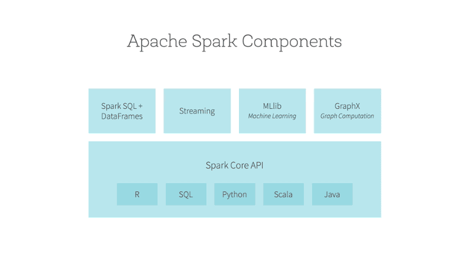
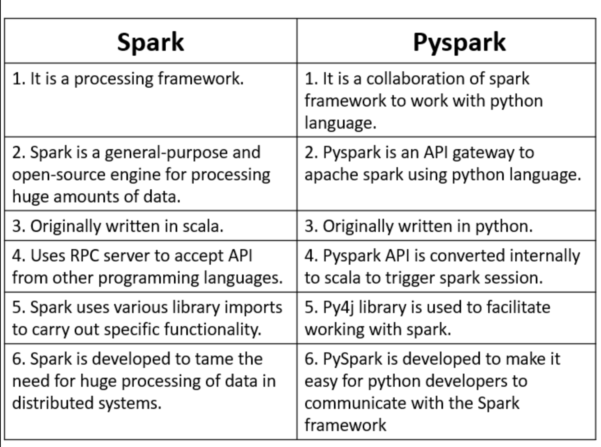
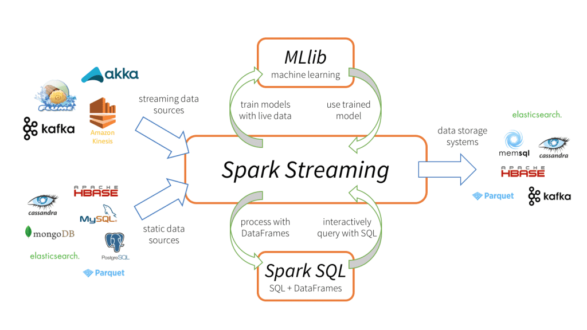

## Contents:<!-- omit in toc -->

- [Introduction](#introduction)
- [Setting Up PySpark in Databricks](#setting-up-pyspark-in-databricks)
  - [Creating a Databricks Account](#creating-a-databricks-account)
  - [Creating a Databricks Workspace](#creating-a-databricks-workspace)
  - [Launching a Cluster](#launching-a-cluster)
- [Data Ingestion and Preparation](#data-ingestion-and-preparation)
  - [Reading Data](#reading-data)
  - [Data Transformation](#data-transformation)
  - [Data Cleaning](#data-cleaning)
- [Data Analysis and Exploration](#data-analysis-and-exploration)
  - [Descriptive Statistics](#descriptive-statistics)
  - [Data Visualization](#data-visualization)
  - [Exploratory Data Analysis (EDA)](#exploratory-data-analysis-eda)
- [Machine Learning with PySpark](#machine-learning-with-pyspark)
  - [MLlib Overview](#mllib-overview)
  - [Feature Engineering](#feature-engineering)
  - [Building Models](#building-models)
  - [Model Evaluation](#model-evaluation)
- [Performance Tuning and Optimization](#performance-tuning-and-optimization)
  - [Understanding Spark Internals](#understanding-spark-internals)
  - [Optimizing PySpark Jobs](#optimizing-pyspark-jobs)
  - [Resource Management](#resource-management)
- [Collaboration and Version Control](#collaboration-and-version-control)
  - [Using Databricks Notebooks](#using-databricks-notebooks)
  - [Dashboards and Reports](#dashboards-and-reports)
- [Integrations and Extensions](#integrations-and-extensions)
  - [Integration with Other Tools](#integration-with-other-tools)
  - [Databricks Connect](#databricks-connect)
- [Videos: Simple PySpark Tutorial](#videos-simple-pyspark-tutorial)
- [Conclusion](#conclusion)
- [Related Content](#related-content)
- [References](#references)



## Introduction

In today's data-driven world, the ability to process and analyze large datasets efficiently is crucial. PySpark, the Python API for Apache Spark, offers a powerful framework for big data processing and analytics. When combined with Databricks, a cloud-based platform optimized for Apache Spark, the capabilities expand further, providing a seamless and scalable environment for data science and engineering tasks. This guide covers the essential features and functionalities of using PySpark within Databricks, offering insights into setup, data processing, machine learning, performance optimization, collaboration, and more.

> [!NOTE]  
> [PySpark: The Definitive Guide](https://github.com/amitkumar-aimlp/Spark-The-Definitive-Guide).

## Setting Up PySpark in Databricks

<iframe src="https://drive.google.com/file/d/1T0arvgBg-u7ToVHTKW9QgWY1mA17B107/preview" frameborder="0" style="position: absolute; top: 0; left: 0; width: 100%; height: 100%;" allowfullscreen></iframe>

### Creating a Databricks Account

- **Sign up for Databricks:** To get started with Databricks, visit the [Databricks website](https://databricks.com/) and sign up for an account. Databricks offers various pricing plans, including a free trial for new users.
- **Select a pricing plan or use the free trial:** Depending on your needs, choose a pricing plan that suits your budget and requirements. The free trial provides access to many features, allowing you to explore the platform before committing to a paid plan.

### Creating a Databricks Workspace

- **Setting up the workspace:** After signing up, create a new workspace. The workspace is your central hub for all activities within Databricks, including data storage, notebooks, and clusters.
- **Configuring the environment:** Customize your workspace settings, such as enabling Azure or AWS integrations, setting up secret scopes for secure storage of credentials, and configuring network security.

### Launching a Cluster

- **Cluster configuration options:** Databricks allows you to create clusters with various configurations. Choose the appropriate instance types, number of nodes, and Spark version based on your workload requirements.
- **Auto-scaling capabilities:** Enable auto-scaling to dynamically adjust the number of nodes in your cluster based on the workload. This feature helps optimize resource utilization and cost.
- **Starting and stopping clusters:** Start the cluster to begin processing data and stop it when not in use to save costs. Databricks provides an intuitive interface to manage cluster lifecycle.

## Data Ingestion and Preparation

### Reading Data

- **Supported file formats:** Databricks supports various file formats, including CSV, JSON, Parquet, Avro, and ORC. This flexibility allows you to work with diverse datasets.
- **Connecting to data sources:** Databricks can connect to multiple data sources such as Azure Blob Storage, AWS S3, and databases like MySQL, PostgreSQL, and SQL Server. Use the appropriate connectors and authentication methods to establish connections.
- **Using `spark.read` for data ingestion:** The `spark.read` function is the primary method for reading data into Spark DataFrames. It provides options to specify the file format, schema, delimiter, and other parameters.

### Data Transformation

- **Using PySpark DataFrame API:** PySpark DataFrame API offers a wide range of functions for data manipulation. Perform operations like filtering, selecting columns, grouping, joining, and aggregating data using intuitive methods.
- **Common transformations:** Some frequently used transformations include `filter`, `select`, `groupBy`, `join`, `withColumn`, and `agg`. These functions help you reshape and aggregate data efficiently.
- **User-Defined Functions (UDFs):** UDFs allow you to define custom functions for complex transformations. Register UDFs using the `spark.udf.register` method and apply them to DataFrames.

### Data Cleaning

- **Handling missing values:** Missing values are common in real-world datasets. Use functions like `dropna`, `fillna`, and `replace` to handle missing values appropriately.
- **Data type conversions:** Convert columns to the desired data types using functions like `cast` and `astype`. Ensure consistency and accuracy in your data by performing type conversions.
- **Data normalization and scaling:** Normalize and scale numerical features to standardize the range of values. PySpark provides functions like `StandardScaler` and `MinMaxScaler` for this purpose.

## Data Analysis and Exploration

### Descriptive Statistics

- **Summary statistics:** Use the `describe` method to obtain summary statistics such as count, mean, standard deviation, min, and max for numerical columns.
- **Correlation and covariance:** Analyze the relationships between variables using `corr` and `cov` functions. These metrics help identify patterns and dependencies in your data.

### Data Visualization

- **Built-in visualization tools in Databricks:** Databricks notebooks offer built-in visualization options for quick data exploration. Create charts and graphs directly within notebooks using the display function.
- **Integration with third-party libraries:** For advanced visualizations, integrate Databricks with popular Python libraries like Matplotlib, Seaborn, and Plotly. These libraries provide extensive customization options for creating interactive and publication-quality plots.

### Exploratory Data Analysis (EDA)

- **Identifying patterns and trends:** Perform EDA to gain insights into your data. Use functions like `groupBy`, `pivot`, and `agg` to summarize and explore data patterns.
- **Using SQL in Databricks notebooks:** Databricks supports SQL queries within notebooks. Use SQL syntax to query DataFrames and create temporary views for complex data analysis.

## Machine Learning with PySpark

### MLlib Overview

- **Introduction to Spark’s machine learning library:** MLlib is Spark’s scalable machine learning library. It provides tools for classification, regression, clustering, collaborative filtering, and more.
- **Pipeline API:** The Pipeline API helps streamline machine learning workflows by combining multiple stages (data preprocessing, feature engineering, model training) into a single pipeline.

### Feature Engineering

- **Vectorization:** Convert raw features into numerical vectors using transformers like `VectorAssembler`. This step is crucial for preparing data for machine learning algorithms.
- **Feature scaling and normalization:** Scale and normalize features to ensure they contribute equally to the model. Use `StandardScaler`, `MinMaxScaler`, and `Normalizer` for this purpose.

### Building Models

- **Classification algorithms:** MLlib supports various classification algorithms, including Logistic Regression, Decision Trees, Random Forest, and Gradient-Boosted Trees. These algorithms help classify data into distinct categories.
- **Regression algorithms:** For predicting continuous values, use regression algorithms like Linear Regression and Gradient-Boosted Trees Regressor. These models estimate the relationship between input features and the target variable.
- **Clustering algorithms:** Identify natural groupings in your data using clustering algorithms such as K-means and Gaussian Mixture. These techniques help discover hidden patterns and segment data.

### Model Evaluation

- **Evaluation metrics:** Evaluate the performance of your models using metrics like accuracy, precision, recall, F1 score for classification tasks, and RMSE (Root Mean Squared Error) for regression tasks.
- **Cross-validation and hyperparameter tuning:** Perform cross-validation to assess model performance on different subsets of data. Use hyperparameter tuning techniques like Grid Search and Random Search to optimize model parameters.

## Performance Tuning and Optimization

### Understanding Spark Internals

- **Spark architecture:** Spark’s architecture comprises a driver and executors. The driver coordinates the execution of tasks, while executors perform computations and store data.
- **DAG (Directed Acyclic Graph) and task execution:** Spark constructs a DAG of stages and tasks for each job. Understanding the DAG helps optimize job execution and resource utilization.

### Optimizing PySpark Jobs

- **Caching and persistence:** Cache intermediate DataFrames using `persist` and `cache` methods to reuse data across multiple stages. This reduces computation time and improves performance.
- **Optimizing joins and aggregations:** Use broadcast joins for small tables to avoid shuffling large datasets. Optimize aggregations using `reduceByKey` and `aggregateByKey` functions.
- **Broadcast variables:** Broadcast large read-only variables to all nodes in the cluster using `sc.broadcast`. This minimizes data transfer and improves performance.

### Resource Management

- **Configuring Spark parameters:** Tune Spark parameters like `executorMemory`, `executorCores`, and `driverMemory` to allocate resources efficiently. Experiment with different configurations to find the optimal settings.
- **Managing cluster resources:** Monitor cluster performance using the Databricks UI and adjust resource allocation as needed. Scale up or down based on workload requirements.

## Collaboration and Version Control

### Using Databricks Notebooks

- **Collaborative features:** Databricks notebooks support real-time collaboration, allowing multiple users to work together on the same notebook. Share notebooks with team members and collaborate effectively.
- **Notebook versioning and git integration:** Enable version control for notebooks using Databricks’ built-in versioning or integrate with Git for advanced version control. Track changes, revert to previous versions, and collaborate seamlessly.

### Dashboards and Reports

- **Creating interactive dashboards:** Create dashboards to visualize and share insights with stakeholders. Use Databricks’ dashboard features to combine multiple visualizations into a single interactive view.
- **Scheduling and sharing reports:** Automate report generation by scheduling notebooks to run at specific intervals. Share reports via email or export them to formats like HTML and PDF.

## Integrations and Extensions

### Integration with Other Tools

- **BI tools:** Connect Databricks with BI tools like Tableau and Power BI to create interactive reports and dashboards. Use the JDBC or ODBC connectors provided by Databricks for seamless integration.
- **Data integration tools:** Integrate Databricks with data integration platforms like Apache Nifi, Talend, and Informatica. These tools help streamline data ingestion, transformation, and loading processes.

### Databricks Connect

- **Running PySpark code from local IDE:** Databricks Connect allows you to run PySpark code from your local development environment, such as PyCharm or Jupyter Notebook. This enables a smooth development experience and efficient testing.
- **Connecting to remote Databricks clusters:** Use Databricks Connect to interact with remote Databricks clusters from your local machine. This setup allows you to leverage Databricks’ computational power while developing locally.

## Videos: Simple PySpark Tutorial

Discover the power of PySpark and Databricks in this insightful tutorial. Learn how to set up, process data, build machine learning models, and optimize performance using these powerful tools.

  <iframe src=" https://www.youtube.com/embed/_C8kWso4ne4?si=ADIWqFxU7Ak8waIK" frameborder="0" style="position: absolute; top: 0; left: 0; width: 100%; height: 100%;" allowfullscreen></iframe>

## Conclusion

PySpark, combined with Databricks, offers a robust and scalable solution for big data processing and analytics. This comprehensive guide covers the essential features and functionalities, from setting up your environment to advanced machine learning and performance optimization techniques. By leveraging Databricks’ collaborative features and seamless integrations, you can enhance your data workflows and drive meaningful insights from your data.

## Related Content

- [Python Programming Language Syntax and Examples](https://amitkumar-aimlp.github.io/projects/python-programming-language-syntax-and-examples/)
- [NumPy for Data Science: A Comprehensive Guide](https://amitkumar-aimlp.github.io/projects/numpy-for-data-science-a-comprehensive-guide/)
- [Pandas for Data Science: A Comprehensive Guide](https://amitkumar-aimlp.github.io/projects/pandas-for-data-science-a-comprehensive-guide/)
- [Pandas Vs. SQL: A Comprehensive Comparison](https://amitkumar-aimlp.github.io/projects/pandas-vs-sql-a-comprehensive-comparison/)
- [Pandas Vs. PySpark: A Comprehensive Comparison](https://amitkumar-aimlp.github.io/projects/pandas-vs-pyspark-a-comprehensive-comparison/)
- [Matplotlib for Data Visualization](https://amitkumar-aimlp.github.io/projects/matplotlib-for-data-visualization/)
- [Applied Statistics: An Overview](https://amitkumar-aimlp.github.io/projects/applied-statistics-an-overview/)
- [Supervised Learning – A Simple Guide](https://amitkumar-aimlp.github.io/projects/supervised-learning-a-simple-guide/)
- [Unsupervised Learning – A Simple Guide](https://amitkumar-aimlp.github.io/projects/unsupervised-learning-a-simple-guide/)
- [Ensemble Learning –  Methods](https://amitkumar-aimlp.github.io/projects/ensemble-learning-methods/)
- [Feature Engineering - An Overview](https://amitkumar-aimlp.github.io/projects/feature-engineering-an-overview/)
- [Hyperparameter Optimization](https://amitkumar-aimlp.github.io/projects/hyperparameter-optimization/)
- [Recommender Systems](https://amitkumar-aimlp.github.io/projects/recommender-systems/)
- [Deep Learning Fundamentals](https://amitkumar-aimlp.github.io/projects/deep-learning-fundamentals/)
- [Semi-supervised Learning](https://amitkumar-aimlp.github.io/projects/semi-supervised-learning/)
- [Natural Language Processing](https://amitkumar-aimlp.github.io/projects/natural-language-processing/)
- [Computer Vision Fundamentals](https://amitkumar-aimlp.github.io/projects/computer-vision-fundamentals/)
- [Time Series Analysis](https://amitkumar-aimlp.github.io/projects/time-series-analysis/)

## References

1. [Databricks Documentation - Comprehensive guide to using Databricks, including setup, cluster management, and advanced features. Available at: Databricks Documentation](https://docs.databricks.com/)
2. [Apache Spark Documentatio - Official documentation for Apache Spark, covering core concepts, APIs, and advanced topics. Available at: Apache Spark Documentation](https://spark.apache.org/documentation.html)
3. [PySpark API Reference - Detailed reference for PySpark APIs, including DataFrame operations, SQL, and machine learning. Available at: PySpark API Reference](https://spark.apache.org/docs/latest/api/python/)
4. [Databricks: The Platform for Apache Spark - Overview of Databricks features and capabilities, including collaborative notebooks and integrations. Available at: Databricks Overview](https://databricks.com/product/databricks)
5. [MLlib: Machine Learning in Apache Spark - In-depth guide to MLlib, Spark's machine learning library, covering algorithms and pipeline API. Available at: MLlib Guide](https://spark.apache.org/docs/latest/ml-guide.html)
6. [Best Practices for Using Apache Spark - Tips and techniques for optimizing Spark jobs, managing resources, and improving performance. Available at: Spark Best Practices](https://databricks.com/spark/best-practices)
7. [Data Visualization with Databricks - Guide to creating visualizations in Databricks, including built-in tools and third-party library integrations. Available at: Data Visualization in Databricks](https://databricks.com/solutions/data-visualization)
8. [Databricks Machine Learning - Documentation on using Databricks for machine learning workflows, from feature engineering to model deployment. Available at: Databricks Machine Learning](https://databricks.com/solutions/machine-learning)
9. [Using Databricks Notebooks - Detailed instructions on using Databricks notebooks for collaborative data analysis and reporting. Available at: Databricks Notebooks](https://docs.databricks.com/notebooks/index.html)
10. [Integrating Databricks with Other Tools - Guide to connecting Databricks with BI tools, data integration platforms, and external services. Available at: Databricks Integrations](https://docs.databricks.com/integrations/index.html)
11. [Databricks Connect - Documentation on using Databricks Connect to run PySpark code from local IDEs and interact with remote clusters. Available at: Databricks Connect](https://docs.databricks.com/dev-tools/databricks-connect.html)
12. [Best Resources to Learn Spark](https://www.mltut.com/best-resources-to-learn-spark/)
13. [Datacamp Cheat Sheets](https://www.datacamp.com/cheat-sheet)

> ### What lies behind us and what lies before us are tiny matters compared to what lies within us.
>
> -Ralph Waldo Emerson

---

_Published: 2020-01-07; Updated: 2024-05-01_

---

[TOP](#contents)
