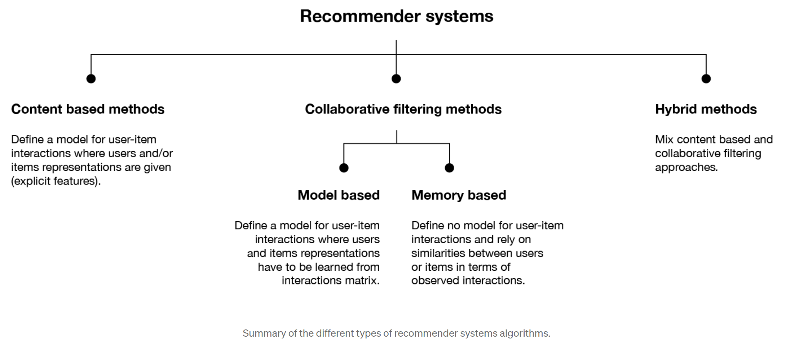
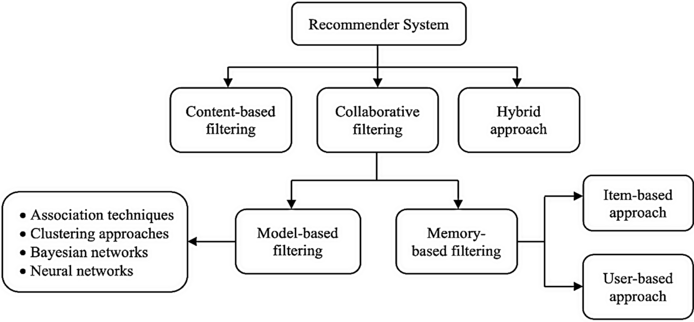

## Contents:<!-- omit in toc -->

- [1. Introduction to Recommender Systems](#1-introduction-to-recommender-systems)
- [2. Types of Recommender Systems](#2-types-of-recommender-systems)
  - [2.1 Content-Based Filtering](#21-content-based-filtering)
  - [2.2 Collaborative Filtering](#22-collaborative-filtering)
  - [2.3 Hybrid Methods](#23-hybrid-methods)
- [3. Components of Recommender Systems](#3-components-of-recommender-systems)
  - [3.1 Data Collection](#31-data-collection)
  - [3.2 Data Preprocessing](#32-data-preprocessing)
  - [3.3 Model Building](#33-model-building)
  - [3.4 Deployment](#34-deployment)
- [4. Evaluation Metrics](#4-evaluation-metrics)
  - [4.1 Accuracy Metrics](#41-accuracy-metrics)
  - [4.2 Classification Metrics](#42-classification-metrics)
  - [4.3 Ranking Metrics](#43-ranking-metrics)
  - [4.4 Diversity and Novelty](#44-diversity-and-novelty)
- [5. Challenges and Future Directions](#5-challenges-and-future-directions)
  - [5.1 Cold Start Problem](#51-cold-start-problem)
  - [5.2 Scalability](#52-scalability)
  - [5.3 Privacy and Ethical Issues](#53-privacy-and-ethical-issues)
  - [5.4 Explainability](#54-explainability)
- [6. Advanced Techniques in Recommender Systems](#6-advanced-techniques-in-recommender-systems)
  - [6.1 Deep Learning-Based Recommenders](#61-deep-learning-based-recommenders)
  - [6.2 Graph-Based Recommenders](#62-graph-based-recommenders)
  - [6.3 Context-Aware Recommender Systems](#63-context-aware-recommender-systems)
- [7. Applications of Recommender Systems](#7-applications-of-recommender-systems)
  - [7.1 E-commerce](#71-e-commerce)
  - [7.2 Streaming Services](#72-streaming-services)
  - [7.3 Social Networks](#73-social-networks)
  - [7.4 Healthcare](#74-healthcare)
- [Videos: Recommender Systems](#videos-recommender-systems)
- [8. Conclusion](#8-conclusion)
- [Related Content](#related-content)
- [References](#references)



## 1. Introduction to Recommender Systems

Recommender systems are algorithms designed to suggest items to users based on various data inputs. They are widely used in online platforms such as e-commerce sites, streaming services, and social networks to enhance user experience by providing personalized content. These systems analyze user behavior, preferences, and interactions to deliver relevant recommendations, which can significantly improve user satisfaction and engagement.
The primary goal of recommender systems is to help users find items that they will like, which in turn helps platforms increase user retention and sales. The effectiveness of these systems is often measured by how accurately they can predict user preferences and how well they can introduce users to new items that they might not have discovered on their own.

> [!NOTE]  
> Reference and Details: [Recommendation Systems Project](https://github.com/amitkumar-aimlp/projects/tree/content/recommendation-systems-project)

## 2. Types of Recommender Systems

### 2.1 Content-Based Filtering

**Definition:** Content-based filtering recommends items similar to those a user has liked in the past. This method relies on the features of the items and the user’s preferences, creating a profile for each user and item.

**Features:**

- **Uses Item Features and User Profiles:** Analyzes the characteristics of items (e.g., genre, author, description) and user preferences to make recommendations. For example, if a user likes science fiction books, the system will recommend other books in the same genre.
- **Employs Algorithms like TF-IDF and Word2Vec:** Uses text-based analysis techniques to understand item features and similarities. TF-IDF (Term Frequency-Inverse Document Frequency) helps in finding important words in item descriptions, while Word2Vec creates word embeddings to understand the context and relationships between words.
- **Easy to Understand and Implement:** Straightforward approach that is easy to explain and implement. Users can easily understand why certain items are being recommended based on their past preferences.

**Advantages:**

- **Does Not Require User Data:** Can provide recommendations based solely on item features, making it useful for new users (solving the cold start problem for items). This is particularly beneficial for platforms with many new users or infrequent visitors.
- **Good for New Items:** Effective for recommending newly added items that do not have interaction data yet. This ensures that new products, articles, or media get exposure even without historical user interaction.

**Disadvantages:**

- **Limited by Quality and Quantity of Item Features:** The effectiveness depends on the availability and quality of item features. Poorly described items or items with limited metadata may not be recommended accurately.
- **Can Lead to a Narrow Range of Recommendations:** May result in recommendations that are too similar, lacking diversity. Users might get bored with recommendations that don't introduce enough variety or new categories.

### 2.2 Collaborative Filtering

**Definition:** Collaborative filtering recommends items based on the preferences of similar users. This method uses user-item interaction data to find patterns and make recommendations.

**Features:**

- **User-Based and Item-Based Approaches:** User-based collaborative filtering finds similar users, while item-based collaborative filtering finds similar items. User-based methods identify users with similar tastes and recommend items that those users have liked. Item-based methods find items that are similar to items the user has liked before.
- **Utilizes User-Item Interaction Data:** Analyzes user behavior, such as ratings, clicks, and purchases. This data is used to create a matrix of users and items, where each entry represents the interaction between a user and an item.
- **Algorithms Include k-NN and Matrix Factorization (SVD):** Employs various algorithms to identify patterns in user-item interactions. k-NN (k-Nearest Neighbors) is used to find similar users or items, while matrix factorization techniques like SVD (Singular Value Decomposition) decompose the interaction matrix to discover latent factors.

**Advantages:**

- **Can Recommend Diverse Items:** Capable of suggesting items from different categories based on user behavior. This diversity can help users discover new interests and keep their experience fresh.
- **Does Not Require Item Features:** Works purely on interaction data, making it versatile. This is useful for platforms where item metadata is sparse or inconsistent.

**Disadvantages:**

- **Suffers from Cold Start Problem for New Users:** Requires sufficient interaction data to provide accurate recommendations. New users who have not interacted much with the platform may not receive accurate recommendations initially.
- **Scalability Issues with Large Datasets:** Can become computationally expensive with large user and item datasets. Efficient algorithms and infrastructure are needed to handle the scale of large platforms.

### 2.3 Hybrid Methods

**Definition:** Hybrid methods combine multiple recommendation techniques to improve accuracy and robustness. These methods leverage the strengths of different approaches to provide better recommendations.

**Features:**

- **Can Integrate Content-Based and Collaborative Filtering:** Combines various techniques to enhance recommendation quality. For example, Netflix uses a hybrid approach to combine user ratings (collaborative filtering) with movie metadata (content-based filtering) to recommend movies.
- **Uses Methods like Weighted Hybrid and Switching Hybrid:** Employs different strategies to merge recommendations from multiple methods. Weighted hybrid assigns different weights to the recommendations from different methods, while switching hybrid uses different methods based on the context or user type.

**Advantages:**

- **Overcomes Limitations of Individual Methods:** Addresses the weaknesses of content-based and collaborative filtering. For instance, hybrid methods can handle both new users and new items effectively.
- **Provides More Accurate and Diverse Recommendations:** Leverages multiple data sources and algorithms for better results. This results in a more comprehensive understanding of user preferences and item characteristics.

**Disadvantages:**

- **Increased Complexity in Implementation:** More challenging to design and implement. It requires integrating multiple algorithms and ensuring they work together seamlessly.
- **Requires More Computational Resources:** Demands higher computational power and data processing capabilities. The combination of different methods can increase the computational load.

## 3. Components of Recommender Systems

### 3.1 Data Collection

Data collection is the foundation of recommender systems. It involves gathering various types of data to understand user preferences and item characteristics.

- **User Data:** Includes user preferences, ratings, browsing history, and demographic information. This data helps create a user profile that the system can use to make personalized recommendations.
- **Item Data:** Consists of item features, descriptions, categories, and metadata. Detailed item data enables the system to understand item characteristics and similarities.
- **Interaction Data:** Captures user-item interactions, such as clicks, views, purchases, and ratings. This data is crucial for understanding user behavior and preferences.

### 3.2 Data Preprocessing

Data preprocessing is essential for cleaning and transforming raw data into a usable format for model building.

- **Cleaning:** Handling missing data, removing duplicates, and reducing noise. Clean data ensures the accuracy and reliability of the recommendations.
- **Normalization:** Scaling data to ensure consistency and comparability. Normalized data helps algorithms perform better by ensuring that all features are on a similar scale.
- **Feature Engineering:** Creating new features and representations to improve model performance. This step involves extracting useful information from raw data and transforming it into features that the model can use.

### 3.3 Model Building

Model building involves selecting appropriate algorithms, training models, and evaluating their performance.

- **Algorithms:** Choosing algorithms based on data characteristics and recommendation goals. The choice of algorithm depends on factors such as the type of data available, the complexity of the recommendation task, and the desired performance metrics.
- **Training:** Using historical data to train recommendation models. Training involves feeding the algorithm with data so it can learn patterns and make predictions.
- **Evaluation:** Measuring model performance using metrics like RMSE, MAE, precision, and recall. Evaluation helps determine how well the model is performing and whether it meets the desired accuracy and efficiency standards.

### 3.4 Deployment

Deployment is the process of integrating the recommender system into the application and ensuring it operates effectively.

- **Integration:** Embedding the recommender system within the existing platform or application. Integration involves connecting the model to the user interface and ensuring it can deliver recommendations in real-time.
- **Real-Time Recommendations:** Providing instant suggestions based on user interactions. Real-time recommendations require efficient algorithms and infrastructure to ensure quick response times.
- **Monitoring and Maintenance:** Continuously evaluating and updating models to maintain accuracy and relevance. Monitoring involves tracking model performance and making necessary adjustments to improve recommendation quality.

## 4. Evaluation Metrics

### 4.1 Accuracy Metrics

Accuracy metrics assess how well the recommender system predicts user preferences.

- **RMSE (Root Mean Squared Error):** Measures the square root of the average squared differences between predicted and actual ratings. Lower RMSE values indicate better accuracy.
- **MAE (Mean Absolute Error):** Calculates the average absolute differences between predicted and actual ratings. Lower MAE values indicate better performance.

### 4.2 Classification Metrics

Classification metrics evaluate the quality of the recommendations.

- **Precision:** The ratio of relevant items recommended to the total items recommended. Higher precision means more accurate recommendations.
- **Recall:** The ratio of relevant items retrieved to the total relevant items available. Higher recall indicates that the system is successfully retrieving relevant items.
- **F1 Score:** The harmonic mean of precision and recall, providing a balanced measure. A higher F1 score indicates a good balance between precision and recall.

### 4.3 Ranking Metrics

Ranking metrics assess the order and relevance of the recommended items.

- **MAP (Mean Average Precision):** Calculates the average precision across all users. Higher MAP values indicate better ranking quality.
- **NDCG (Normalized Discounted Cumulative Gain):** Measures the gain of the recommended items based on their positions in the recommendation list. Higher NDCG values indicate that relevant items are ranked higher.

### 4.4 Diversity and Novelty

Diversity and novelty metrics evaluate the variety and newness of the recommendations.

- **Diversity:** Assesses the range of different items recommended. Higher diversity means a wider range of items is being recommended, which can enhance user satisfaction by introducing them to new categories or genres.
- **Novelty:** Measures the proportion of previously unseen items recommended to users. Higher novelty indicates that the system is effectively introducing users to new and potentially interesting items.

## 5. Challenges and Future Directions

### 5.1 Cold Start Problem

The cold start problem refers to the difficulty in making accurate recommendations for new users and items.

- **New Users:** Lack of historical data for new users. Without sufficient interaction data, it is challenging to understand their preferences and make accurate recommendations.
- **New Items:** Lack of interaction data for new items. Newly added items do not have enough user interactions to be recommended confidently.
- **Solutions:** Hybrid methods, user onboarding strategies, and data augmentation techniques. Hybrid methods can combine content-based and collaborative filtering to handle new users and items effectively. Onboarding strategies can involve collecting initial preferences from new users, and data augmentation techniques can enhance item descriptions and metadata.

### 5.2 Scalability

Scalability challenges arise when handling large datasets and ensuring real-time processing.

- **Large Datasets:** Managing massive user and item data. Large datasets require efficient storage, retrieval, and processing capabilities.
- **Real-Time Processing:** Ensuring quick response times for recommendations. Real-time recommendations demand low-latency algorithms and infrastructure to provide instant suggestions.
- **Solutions:** Distributed computing, parallel processing, and efficient algorithm design. Techniques like distributed computing can spread the computational load across multiple machines, while parallel processing can enhance the speed of algorithm execution.

### 5.3 Privacy and Ethical Issues

Privacy and ethical issues involve protecting user data and ensuring fair and unbiased recommendations.

- **Data Privacy:** Implementing measures to protect user data and comply with regulations. Ensuring that user data is stored securely and used responsibly is crucial for maintaining user trust and complying with privacy laws.
- **Bias and Fairness:** Ensuring recommendations are unbiased and fair across different user groups. Addressing bias in recommendations is important to avoid reinforcing existing inequalities and ensuring that all users receive fair treatment.
- **Solutions:** Privacy-preserving algorithms, fairness-aware models, and transparency in data usage. Techniques like differential privacy can protect user data, while fairness-aware models can ensure that recommendations are equitable across different user demographics.

### 5.4 Explainability

Explainability is crucial for building user trust and making recommendations transparent.

- **Transparency:** Making recommendations understandable to users. Users are more likely to trust and accept recommendations if they understand the rationale behind them.
- **Trust:** Building user trust through explainable models. Transparent models help users feel confident that the system is working in their best interest.
- **Solutions:** Incorporating explainability techniques in model design, such as providing reasons for recommendations. Techniques like providing textual explanations or visual cues can help users understand why certain items are being recommended.

## 6. Advanced Techniques in Recommender Systems

### 6.1 Deep Learning-Based Recommenders

Deep learning techniques enhance the capabilities of recommender systems by handling complex interactions and large datasets.

- **Neural Collaborative Filtering:** Combines neural networks with collaborative filtering to capture non-linear user-item interactions. Neural networks can model complex relationships that traditional collaborative filtering methods might miss.
- **Autoencoders:** Used for dimensionality reduction and feature learning, improving recommendation accuracy. Autoencoders can compress high-dimensional data into lower dimensions, retaining important information while reducing computational complexity.
- **Recurrent Neural Networks (RNNs):** Effective for sequence-based recommendations, capturing temporal patterns in user behavior. RNNs are particularly useful for recommendations that depend on the order of user interactions, such as music playlists or content consumption sequences.
- **Advantages:** Handles complex and non-linear interactions, improving recommendation quality. Deep learning models can capture subtle patterns and relationships in the data.
- **Disadvantages:** Requires large datasets and high computational power, increasing complexity. Deep learning models can be computationally intensive and require substantial resources for training and inference.

### 6.2 Graph-Based Recommenders

Graph-based recommenders utilize graph structures to model relationships between users and items.

- **Graph Theory:** Uses graph structures to represent and analyze user-item relationships. In a graph-based recommender system, users and items are represented as nodes, and interactions between them are represented as edges.
- **Graph Neural Networks (GNNs):** Enhances traditional graph algorithms with neural networks for better performance. GNNs can learn complex patterns in graph-structured data, improving recommendation accuracy.
- **Advantages:** Captures complex relationships and dependencies, improving recommendation accuracy. Graph-based methods can model intricate relationships that other methods might miss.
- **Disadvantages:** High complexity and computational cost, requiring efficient algorithms and data structures. Graph-based methods can be computationally expensive and require specialized infrastructure for efficient execution.

### 6.3 Context-Aware Recommender Systems

Context-aware recommenders consider additional contextual information to provide highly personalized recommendations.

- **Contextual Information:** Includes time, location, device, and user mood. Contextual data helps tailor recommendations to the user's current situation, enhancing relevance and user satisfaction.
- **Approaches:** Contextual pre-filtering, post-filtering, and contextual modeling. Contextual pre-filtering involves filtering recommendations based on context before applying the recommendation algorithm. Post-filtering adjusts recommendations based on context after the algorithm has been applied. Contextual modeling incorporates context directly into the recommendation algorithm.
- **Advantages:** Provides highly personalized recommendations by considering context. Context-aware recommendations can adapt to changing user needs and preferences.
- **Disadvantages:** Requires extensive context data and complex modeling, increasing implementation challenges. Collecting and processing contextual data can be challenging and resource-intensive.

## 7. Applications of Recommender Systems

### 7.1 E-commerce

In e-commerce, recommender systems enhance the shopping experience by providing personalized product suggestions.

- **Product Recommendations:** Suggesting items based on user preferences and browsing history. This helps users discover products they are likely to buy, increasing sales and customer satisfaction.
- **Upselling and Cross-Selling:** Recommending complementary products to increase sales and revenue. For example, suggesting accessories that go with a purchased item can increase the average order value.
- **Customer Retention:** Enhancing user experience to build loyalty and retain customers. Personalized recommendations make users feel understood and valued, encouraging repeat visits and purchases.

### 7.2 Streaming Services

Streaming services use recommender systems to keep users engaged by suggesting relevant content.

- **Content Recommendations:** Suggesting movies, TV shows, music, and podcasts based on user preferences. Personalized content keeps users engaged and reduces churn.
- **Personalized Playlists:** Creating custom playlists tailored to individual tastes. Users appreciate playlists that match their preferences, increasing their usage of the service.
- **User Engagement:** Keeping users engaged with relevant and interesting content. Engaged users are more likely to remain subscribed and explore more content.

### 7.3 Social Networks

Recommender systems in social networks enhance user interaction and content discovery.

- **Friend Recommendations:** Suggesting potential friends or connections based on mutual interests and interactions. This helps users expand their social network and increases platform engagement.
- **Content Discovery:** Recommending posts, groups, and events that match user interests. Personalized content discovery keeps users engaged and active on the platform.
- **User Interaction:** Increasing interaction and engagement on the platform through personalized recommendations. Recommender systems help users find content and connections that are relevant to them, enhancing their overall experience.

### 7.4 Healthcare

In healthcare, recommender systems assist in providing personalized treatment plans and preventive care.

- **Personalized Treatment Plans:** Recommending treatments based on patient history and preferences. Personalized recommendations can improve patient outcomes by tailoring treatments to individual needs.
- **Preventive Care:** Suggesting preventive measures and lifestyle changes to improve health outcomes. Recommender systems can help patients adopt healthier habits and prevent illnesses.
- **Medical Research:** Assisting in the discovery of relevant medical literature and research articles. Researchers can use recommender systems to find studies and articles that are relevant to their work, speeding up the research process.

## Videos: Recommender Systems

Discover the fundamentals of recommender systems in this engaging video. Learn how these systems analyze user preferences and behavior to provide personalized recommendations, and understand their significance in enhancing user experience across various platforms. Perfect for anyone interested in AI and machine learning applications!

<iframe src=" https://www.youtube.com/embed/8CPI5_Ivmj4?si=CyhGNRXHqgHgxSk-" frameborder="0" style="position: absolute; top: 0; left: 0; width: 100%; height: 100%;" allowfullscreen></iframe>

## 8. Conclusion

<iframe src="https://drive.google.com/file/d/1hovnpm1SD3vLaH4iAVGP4oVD7h7-o6Vq/preview" frameborder="0" style="position: absolute; top: 0; left: 0; width: 100%; height: 100%;" allowfullscreen></iframe>

Recommender systems play a crucial role in enhancing user experience by providing personalized content. Despite the challenges, advancements in machine learning and AI continue to improve the accuracy, scalability, and fairness of these systems. Future research will focus on addressing existing limitations and exploring new techniques to further enhance recommendation quality. By leveraging advanced techniques such as deep learning, graph-based methods, and context-aware systems, the next generation of recommender systems will offer even more precise, diverse, and engaging recommendations.
These systems not only enhance user satisfaction and engagement but also drive business growth by increasing sales, user retention, and overall platform usage. As technology evolves, recommender systems will continue to be an integral part of personalized user experiences across various industries, making our interactions with digital platforms more intuitive and enjoyable.

## Related Content

- [Python Programming Language Syntax and Examples](https://amitkumar-aimlp.github.io/projects/python-programming-language-syntax-and-examples/)
- [NumPy for Data Science: A Comprehensive Guide](https://amitkumar-aimlp.github.io/projects/numpy-for-data-science-a-comprehensive-guide/)
- [Pandas for Data Science: A Comprehensive Guide](https://amitkumar-aimlp.github.io/projects/pandas-for-data-science-a-comprehensive-guide/)
- [Pandas Vs. SQL: A Comprehensive Comparison](https://amitkumar-aimlp.github.io/projects/pandas-vs-sql-a-comprehensive-comparison/)
- [PySpark Using Databricks: A Comprehensive Guide](https://amitkumar-aimlp.github.io/projects/pyspark-using-databricks-a-comprehensive-guide/)
- [Pandas Vs. PySpark: A Comprehensive Comparison](https://amitkumar-aimlp.github.io/projects/pandas-vs-pyspark-a-comprehensive-comparison/)
- [Matplotlib for Data Visualization](https://amitkumar-aimlp.github.io/projects/matplotlib-for-data-visualization/)
- [Applied Statistics: An Overview](https://amitkumar-aimlp.github.io/projects/applied-statistics-an-overview/)
- [Supervised Learning – A Simple Guide](https://amitkumar-aimlp.github.io/projects/supervised-learning-a-simple-guide/)
- [Unsupervised Learning – A Simple Guide](https://amitkumar-aimlp.github.io/projects/unsupervised-learning-a-simple-guide/)
- [Ensemble Learning –  Methods](https://amitkumar-aimlp.github.io/projects/ensemble-learning-methods/)
- [Feature Engineering - An Overview](https://amitkumar-aimlp.github.io/projects/feature-engineering-an-overview/)
- [Hyperparameter Optimization](https://amitkumar-aimlp.github.io/projects/hyperparameter-optimization/)
- [Deep Learning Fundamentals](https://amitkumar-aimlp.github.io/projects/deep-learning-fundamentals/)
- [Semi-supervised Learning](https://amitkumar-aimlp.github.io/projects/semi-supervised-learning/)
- [Natural Language Processing](https://amitkumar-aimlp.github.io/projects/natural-language-processing/)
- [Computer Vision Fundamentals](https://amitkumar-aimlp.github.io/projects/computer-vision-fundamentals/)
- [Time Series Analysis](https://amitkumar-aimlp.github.io/projects/time-series-analysis/)

## References

1. **Ricci, F., Rokach, L., & Shapira, B. (2015).** _Recommender Systems Handbook._ Springer.
   - This handbook provides a comprehensive overview of various recommender system techniques, algorithms, and applications.
2. **Aggarwal, C. C. (2016).** _Recommender Systems: The Textbook._ Springer.
   - A detailed textbook covering the fundamental concepts and advanced techniques in recommender systems.
3. **Adomavicius, G., & Tuzhilin, A. (2005).** _Toward the Next Generation of Recommender Systems: A Survey of the State-of-the-Art and Possible Extensions._ IEEE Transactions on Knowledge and Data Engineering, 17(6), 734-749.
   - A survey paper discussing the state-of-the-art in recommender systems and potential future directions.
4. **Koren, Y., Bell, R., & Volinsky, C. (2009).** _Matrix Factorization Techniques for Recommender Systems._ IEEE Computer, 42(8), 30-37.
   - This paper explains matrix factorization techniques used in collaborative filtering for recommender systems.
5. **Linden, G., Smith, B., & York, J. (2003).** _Amazon.com Recommendations: Item-to-Item Collaborative Filtering._ IEEE Internet Computing, 7(1), 76-80.
   - Discusses the item-to-item collaborative filtering algorithm used by Amazon.com for product recommendations.
6. **Salakhutdinov, R., & Mnih, A. (2008).** _Probabilistic Matrix Factorization._ In Proceedings of the 21st International Conference on Neural Information Processing Systems (NIPS 2008).
   - Introduces probabilistic matrix factorization, a method used in collaborative filtering.
7. **Schafer, J. B., Frankowski, D., Herlocker, J., & Sen, S. (2007).** _Collaborative Filtering Recommender Systems._ In The Adaptive Web: Methods and Strategies of Web Personalization, Springer, 291-324.
   - Provides an overview of collaborative filtering techniques and their applications in recommender systems.
8. **Ekstrand, M. D., Riedl, J. T., & Konstan, J. A. (2011).** _Collaborative Filtering Recommender Systems._ Foundations and Trends in Human-Computer Interaction, 4(2), 81-173.
   - A comprehensive review of collaborative filtering recommender systems, including algorithms and evaluation metrics.
9. **Herlocker, J. L., Konstan, J. A., Terveen, L. G., & Riedl, J. T. (2004).** _Evaluating Collaborative Filtering Recommender Systems._ ACM Transactions on Information Systems, 22(1), 5-53.
   - Discusses various evaluation metrics and methodologies for collaborative filtering systems.
10. **Burke, R. (2002).** _Hybrid Recommender Systems: Survey and Experiments._ User Modeling and User-Adapted Interaction, 12(4), 331-370.
    - A survey of hybrid recommender systems, discussing different hybridization methods and their effectiveness.
11. [Recommender Systems](https://en.wikipedia.org/wiki/Recommender_system)
12. [Introduction to recommender systems](https://towardsdatascience.com/introduction-to-recommender-systems-6c66cf15ada)
13. [Recommender Systems — A Complete Guide to Machine Learning Models](https://towardsdatascience.com/recommender-systems-a-complete-guide-to-machine-learning-models-96d3f94ea748)
14. [Recommendation systems: Principles, methods and evaluation](https://doi.org/10.1016/j.eij.2015.06.005)
15. [A systematic review and research perspective on recommender systems](https://rdcu.be/dPxdr)
    Remove Bottom

> ### Be who you are and say what you feel, because those who mind don’t matter and those who matter don’t mind.
>
> - Dr. Seuss

---

_Published: 2020-01-16; Updated: 2024-05-01_

---

[TOP](#contents)
