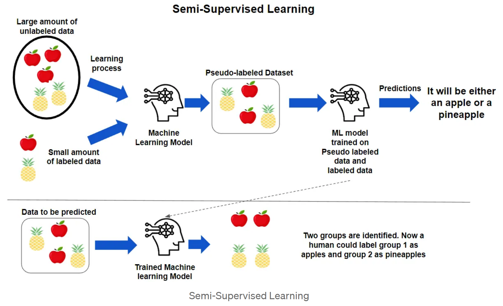

## Contents:<!-- omit in toc -->

- [1. Introduction to Semi-supervised Learning](#1-introduction-to-semi-supervised-learning)
  - [1.1. Definition](#11-definition)
  - [1.2. Importance](#12-importance)
- [2. Types of Semi-supervised Learning](#2-types-of-semi-supervised-learning)
  - [2.1. Self-training](#21-self-training)
  - [2.2. Co-training](#22-co-training)
  - [2.3. Multi-view Learning](#23-multi-view-learning)
  - [2.4. Graph-based Methods](#24-graph-based-methods)
  - [2.5. Consistency Regularization](#25-consistency-regularization)
- [3. Techniques and Algorithms](#3-techniques-and-algorithms)
  - [3.1. Pseudo-labelling](#31-pseudo-labelling)
  - [3.2. Generative Models](#32-generative-models)
  - [3.3. Graph Convolutional Networks (GCNs)](#33-graph-convolutional-networks-gcns)
  - [3.4. Label Propagation](#34-label-propagation)
  - [3.5. Dual Learning](#35-dual-learning)
  - [3.6. Teacher-Student Framework](#36-teacher-student-framework)
- [4. Advantages of Semi-supervised Learning](#4-advantages-of-semi-supervised-learning)
  - [4.1. Efficiency](#41-efficiency)
  - [4.2. Improved Performance](#42-improved-performance)
  - [4.3. Scalability](#43-scalability)
  - [4.4. Cost-Effectiveness](#44-cost-effectiveness)
- [5. Challenges in Semi-supervised Learning](#5-challenges-in-semi-supervised-learning)
  - [5.1. Quality of Unlabeled Data](#51-quality-of-unlabeled-data)
  - [5.2. Algorithm Complexity](#52-algorithm-complexity)
  - [5.3. Model Stability](#53-model-stability)
  - [5.4. Label Imbalance](#54-label-imbalance)
- [6. Applications](#6-applications)
  - [6.1. Text Classification](#61-text-classification)
  - [6.2. Image Recognition](#62-image-recognition)
  - [6.3. Natural Language Processing](#63-natural-language-processing)
  - [6.4. Medical Diagnosis](#64-medical-diagnosis)
  - [6.5. Speech Recognition](#65-speech-recognition)
  - [6.6. Anomaly Detection](#66-anomaly-detection)
- [7. Future Directions](#7-future-directions)
  - [7.1. Integration with Deep Learning](#71-integration-with-deep-learning)
  - [7.2. Improved Algorithms](#72-improved-algorithms)
  - [7.3. Real-world Applications](#73-real-world-applications)
  - [7.4. Ethical Considerations](#74-ethical-considerations)
  - [7.5. User Interaction and Feedback](#75-user-interaction-and-feedback)
- [Videos: Semi-Supervised Learning - Techniques and Applications](#videos-semi-supervised-learning---techniques-and-applications)
- [Related Content](#related-content)
- [References](#references)



## 1. Introduction to Semi-supervised Learning

### 1.1. Definition

Semi-supervised learning (SSL) is a hybrid machine learning technique that incorporates both labeled and unlabeled data to enhance model performance. In contrast to supervised learning, which relies solely on labeled data, SSL leverages the large quantities of unlabeled data that are often readily available. The goal is to make better use of the limited labeled data while improving model accuracy and generalization by utilizing the additional information from unlabeled data.

### 1.2. Importance

SSL is crucial in scenarios where labeled data is limited due to high annotation costs or the difficulty of obtaining accurate labels. By leveraging unlabeled data, SSL methods can:

- **Enhance Model Accuracy**: Improve prediction performance through additional learning from unlabeled examples.
- **Reduce Annotation Costs**: Decrease the financial and time investments required for data labeling.
- **Address Data Scarcity**: Provide solutions when labeled data is insufficient for traditional supervised learning approaches.

## 2. Types of Semi-supervised Learning

### 2.1. Self-training

Self-training is an iterative approach where a model initially trained on labeled data is used to generate pseudo-labels for unlabeled data. These pseudo-labels are then added to the training set, and the model is retrained on this augmented dataset.

- **Process**:
  1. Train the initial model on labeled data.
  2. Predict labels for unlabeled data.
  3. Incorporate high-confidence predictions as pseudo-labels.
  4. Retrain the model with both labeled and pseudo-labeled data.
- **Pros**: Straightforward and often effective when initial model performance is reasonably good.
- **Cons**: If the model makes incorrect predictions, errors can be propagated and amplified in subsequent iterations.

### 2.2. Co-training

Co-training involves training two or more classifiers on different, but complementary, feature sets of the same data. Each classifier labels the unlabeled data, and these labels are used to retrain the other classifiers.

- **Process**:
  1. Train multiple classifiers on different feature views.
  2. Each classifier labels the unlabeled data based on its feature view.
  3. Exchange labels between classifiers to update training data.
- **Pros**: Reduces the risk of error propagation by using diverse feature perspectives.
- **Cons**: Requires that feature sets are independent and informative; otherwise, the approach might be less effective.

### 2.3. Multi-view Learning

Multi-view learning extends the idea of co-training by incorporating multiple distinct views or representations of the data. Each view is expected to provide complementary information, leading to more robust learning.

- **Process**:
  1. Represent data in multiple views or feature spaces.
  2. Train models on each view separately or jointly.
  3. Combine predictions from all views to improve performance.
- **Pros**: Leverages a richer set of features and improves learning from diverse data perspectives.
- **Cons**: Complexity in model training and integration of different views; may require sophisticated algorithms.

### 2.4. Graph-based Methods

Graph-based methods model data as a graph where nodes represent data points and edges represent similarities or relationships between them. Label propagation through the graph is used to infer labels for unlabeled nodes based on the labels of connected nodes.

- **Process**:
  1. Construct a graph based on data similarities.
  2. Propagate labels through the graph using algorithms like label propagation or graph convolution.
  3. Assign labels to unlabeled nodes based on their connections.
- **Pros**: Effectively captures data structure and relational information.
- **Cons**: Computationally demanding and may require sophisticated graph processing techniques.

### 2.5. Consistency Regularization

Consistency regularization enforces the model to produce consistent predictions for perturbed versions of the same input. This approach helps in improving model robustness and generalization by regularizing the decision boundaries.

- **Techniques**:
  - **Virtual Adversarial Training (VAT)**: Adds adversarial perturbations to inputs and encourages the model to maintain stable predictions.
  - **Temporal Ensembling**: Combines predictions from multiple epochs or models to smooth out predictions.
- **Pros**: Enhances model stability and robustness to input variations.
- **Cons**: May increase training time and computational requirements.

## 3. Techniques and Algorithms

### 3.1. Pseudo-labelling

Pseudo-labelling involves using the model’s own predictions as labels for unlabeled data. This technique extends the training dataset with these pseudo-labels to improve model performance.

- **Process**:
  1. Train on labeled data to obtain initial model.
  2. Predict labels for unlabeled data.
  3. Select high-confidence predictions as pseudo-labels.
  4. Retrain the model with both original labeled data and pseudo-labeled data.
- **Applications**: Often used in scenarios where labeled data is scarce and unlabeled data is abundant.

### 3.2. Generative Models

Generative models learn the underlying distribution of data and can be used to generate synthetic examples or improve representations of unlabeled data. They help in modeling complex data distributions and enhancing learning.

- **Examples**:
  - **Variational Autoencoders (VAEs)**: Learn latent representations of the data and can generate new samples.
  - **Generative Adversarial Networks (GANs)**: Utilize adversarial training to generate realistic data samples.
- **Pros**: Can create high-quality synthetic data and improve model robustness.
- **Cons**: Requires careful tuning and may be computationally intensive.

### 3.3. Graph Convolutional Networks (GCNs)

GCNs extend convolutional networks to operate on graph-structured data. They aggregate information from neighboring nodes to update node representations and make predictions.

- **Applications**: Useful for tasks involving relational data like social networks, molecular graphs, and citation networks.
- **Pros**: Captures complex relationships and structures within data.
- **Cons**: Requires efficient graph processing capabilities and may have scalability issues.

### 3.4. Label Propagation

Label propagation spreads labels through a graph based on node similarities. It iteratively updates labels of unlabeled nodes based on the labels of their neighbors until convergence.

- **Process**:
  1. Initialize labels on a subset of nodes.
  2. Propagate labels to neighboring nodes.
  3. Update labels iteratively until they stabilize.
- **Pros**: Simple and effective for many graph-based tasks.
- **Cons**: May be sensitive to graph construction and initialization.

### 3.5. Dual Learning

Dual learning involves training two models in tandem, where one model focuses on labeled data and the other utilizes unlabeled data. The two models exchange information to improve each other’s performance.

- **Pros**: Balances the learning from both labeled and unlabeled data, potentially improving overall model performance.
- **Cons**: Requires synchronization between models and may be complex to implement.

### 3.6. Teacher-Student Framework

In this framework, a more complex, well-trained teacher model guides a simpler student model. The student learns from both labeled data and the teacher’s predictions on unlabeled data.

- **Pros**: Facilitates knowledge transfer from a more complex model to a simpler one, enhancing the student model's performance.
- **Cons**: Requires careful management of the teacher-student relationship and alignment.

## 4. Advantages of Semi-supervised Learning

### 4.1. Efficiency

SSL enhances the efficiency of learning processes by leveraging unlabeled data, which is often more abundant than labeled data. This approach reduces the need for extensive manual labeling, making it a cost-effective solution.

### 4.2. Improved Performance

Models trained with SSL can achieve higher accuracy and better generalization by learning from the additional information provided by unlabeled data. This improved performance is particularly noticeable in scenarios with limited labeled data.

### 4.3. Scalability

SSL techniques are well-suited for scaling with large datasets, as they can effectively use vast amounts of unlabeled data. This scalability makes SSL applicable to big data problems where traditional supervised learning may fall short.

### 4.4. Cost-Effectiveness

By reducing the dependence on labeled data, SSL lowers the overall cost of training machine learning models. This cost-effectiveness is achieved by minimizing the need for extensive data annotation efforts.

## 5. Challenges in Semi-supervised Learning

### 5.1. Quality of Unlabeled Data

The presence of noise or irrelevant information in unlabeled data can adversely affect model performance. Ensuring high-quality unlabeled data is essential for achieving reliable results with SSL.

### 5.2. Algorithm Complexity

Some SSL methods involve complex algorithms and computational requirements, which may pose challenges in terms of implementation and resource usage. Balancing complexity with performance is a key consideration.

### 5.3. Model Stability

Models trained with SSL may experience instability, especially if pseudo-labels or unlabeled data are noisy. Ensuring that models are robust and stable is crucial to avoid performance degradation.

### 5.4. Label Imbalance

An imbalance between labeled classes can lead to biased predictions. Addressing class imbalances through techniques like re-sampling or weighted loss functions is important for maintaining model fairness and accuracy.

## 6. Applications

### 6.1. Text Classification

SSL is extensively used in text classification tasks such as sentiment analysis, topic categorization, and spam detection. By leveraging unlabeled text data, models can better understand and classify various text categories.

### 6.2. Image Recognition

In image recognition, SSL helps improve object detection and classification performance by utilizing large collections of unlabeled images. This approach enhances the model’s ability to recognize and categorize objects in images.

### 6.3. Natural Language Processing

SSL techniques are applied in various NLP tasks, including named entity recognition, machine translation, and text summarization. By incorporating unlabeled text data, models can achieve better language understanding and generation.

### 6.4. Medical Diagnosis

In the medical field, SSL supports diagnostic models by leveraging unlabeled medical records. This approach enhances the model’s ability to identify diseases and anomalies, even with limited labeled examples.

### 6.5. Speech Recognition

SSL improves speech recognition systems by utilizing large amounts of unlabeled audio data. This enhancement leads to better language models and more accurate speech-to-text conversions.

### 6.6. Anomaly Detection

SSL is used for anomaly detection in various domains where labeled examples of rare events are scarce. By learning from both labeled and unlabeled data, SSL models can effectively identify outliers and anomalies.

## 7. Future Directions

### 7.1. Integration with Deep Learning

The integration of SSL with deep learning techniques promises to advance model capabilities further. Combining SSL with deep neural networks can enhance learning from complex and high-dimensional data.

### 7.2. Improved Algorithms

Research is focused on developing more efficient and accurate SSL algorithms. Innovations in algorithm design aim to address current limitations and expand the applicability of SSL in various domains.

### 7.3. Real-world Applications

Expanding SSL applications to diverse real-world scenarios is a promising direction. Continued exploration of SSL’s potential in new fields will drive innovation and practical impact, making it a valuable tool in various industries.

### 7.4. Ethical Considerations

Addressing ethical considerations, such as model bias and fairness, is crucial in SSL. Ensuring that SSL models are developed and deployed responsibly will contribute to ethical AI practices and equitable outcomes.

### 7.5. User Interaction and Feedback

Incorporating user feedback and interaction into SSL models can refine their performance and usability. Engaging users in the learning process helps tailor models to real-world needs and improves their effectiveness.

## Videos: Semi-Supervised Learning - Techniques and Applications

Dive into the world of semi-supervised learning with this insightful video. Learn about key techniques like self-training, co-training, and graph-based methods. Discover practical applications and understand the benefits and challenges of leveraging both labeled and unlabeled data to enhance machine learning models.

<iframe src="https://www.youtube.com/embed/AP0A8PgYfro?si=dIXsCXSrQZPX4qpJ" frameborder="0" style="position: absolute; top: 0; left: 0; width: 100%; height: 100%;" allowfullscreen></iframe>

## Related Content

- [Python Programming Language Syntax and Examples](https://amitkumar-aimlp.github.io/projects/python-programming-language-syntax-and-examples/)
- [NumPy for Data Science: A Comprehensive Guide](https://amitkumar-aimlp.github.io/projects/numpy-for-data-science-a-comprehensive-guide/)
- [Pandas for Data Science: A Comprehensive Guide](https://amitkumar-aimlp.github.io/projects/pandas-for-data-science-a-comprehensive-guide/)
- [Pandas Vs. SQL: A Comprehensive Comparison](https://amitkumar-aimlp.github.io/projects/pandas-vs-sql-a-comprehensive-comparison/)
- [PySpark Using Databricks: A Comprehensive Guide](https://amitkumar-aimlp.github.io/projects/pyspark-using-databricks-a-comprehensive-guide/)
- [Pandas Vs. PySpark: A Comprehensive Comparison](https://amitkumar-aimlp.github.io/projects/pandas-vs-pyspark-a-comprehensive-comparison/)
- [Matplotlib for Data Visualization](https://amitkumar-aimlp.github.io/projects/matplotlib-for-data-visualization/)
- [Applied Statistics: An Overview](https://amitkumar-aimlp.github.io/projects/applied-statistics-an-overview/)
- [Supervised Learning – A Simple Guide](https://amitkumar-aimlp.github.io/projects/supervised-learning-a-simple-guide/)
- [Unsupervised Learning – A Simple Guide](https://amitkumar-aimlp.github.io/projects/unsupervised-learning-a-simple-guide/)
- [Ensemble Learning –  Methods](https://amitkumar-aimlp.github.io/projects/ensemble-learning-methods/)
- [Feature Engineering - An Overview](https://amitkumar-aimlp.github.io/projects/feature-engineering-an-overview/)
- [Hyperparameter Optimization](https://amitkumar-aimlp.github.io/projects/hyperparameter-optimization/)
- [Recommender Systems](https://amitkumar-aimlp.github.io/projects/recommender-systems/)
- [Deep Learning Fundamentals](https://amitkumar-aimlp.github.io/projects/deep-learning-fundamentals/)
- [Natural Language Processing](https://amitkumar-aimlp.github.io/projects/natural-language-processing/)
- [Computer Vision Fundamentals](https://amitkumar-aimlp.github.io/projects/computer-vision-fundamentals/)
- [Time Series Analysis](https://amitkumar-aimlp.github.io/projects/time-series-analysis/)

## References

Here’s a list of references that would support the comprehensive article on semi-supervised learning. These references include seminal papers, textbooks, and authoritative sources in the field:

1. **Semi-Supervised Learning**
   - _Xiaojin Zhu and Andrew B. Goldberg_. (2009). _Introduction to Semi-Supervised Learning_. MIT Press.
   - [Introduction to Semi-Supervised Learning](https://mitpress.mit.edu/9780262033589/introduction-to-semi-supervised-learning/)
2. **Self-Training**
   - _Yarowsky, David_. (1995). _Unsupervised Word Sense Disambiguation Rivaling Supervised Methods_. Proceedings of the 33rd Annual Meeting of the Association for Computational Linguistics.
   - [Unsupervised Word Sense Disambiguation Rivaling Supervised Methods](https://www.aclweb.org/anthology/P95-1022)
3. **Co-Training**
   - _Blum, Avrim and Mitchell, Tom_. (1998). _Combining Labeled and Unlabeled Data with Co-Training_. Proceedings of the 11th Annual Conference on Computational Learning Theory (COLT).
   - [Combining Labeled and Unlabeled Data with Co-Training](https://dl.acm.org/doi/10.5555/645528.657548)
4. **Multi-view Learning**
   - _Raina, Raquel, et al._ (2007). _Large-scale Deep Unsupervised Learning Using Graphics Processors_. Proceedings of the 26th Annual International Conference on Machine Learning (ICML).
   - [Large-scale Deep Unsupervised Learning Using Graphics Processors](https://dl.acm.org/doi/10.1145/1273496.1273580)
5. **Graph-based Methods**
   - _Zhou, Dong and Schölkopf, Bernhard_. (2004). _Regularization on Discrete Structures_. Proceedings of the 21st International Conference on Machine Learning (ICML).
   - [Regularization on Discrete Structures](https://dl.acm.org/doi/10.5555/3044805.3044811)
6. **Consistency Regularization**
   - _Sajjadi, Mahsa S., et al._ (2016). _Regularization with Stochastic Transformations and Perturbations for Deep Semi-Supervised Learning_. Proceedings of the 34th International Conference on Machine Learning (ICML).
   - [Regularization with Stochastic Transformations and Perturbations for Deep Semi-Supervised Learning](https://proceedings.mlr.press/v48/sajjadi16.html)
7. **Pseudo-Labeling**
   - _Lee, Dong-Hyun_. (2013). _Pseudo-Label: The Simple and Efficient Semi-Supervised Learning Method for Deep Neural Networks_. ICML Workshop on Challenges in Representation Learning.
   - [Pseudo-Label: The Simple and Efficient Semi-Supervised Learning Method for Deep Neural Networks](https://arxiv.org/abs/1304.1590)
8. **Generative Models**
   - _Goodfellow, Ian, et al._ (2014). _Generative Adversarial Networks_. Proceedings of the 27th International Conference on Neural Information Processing Systems (NeurIPS).
   - [Generative Adversarial Networks](https://arxiv.org/abs/1406.2661)
9. **Graph Convolutional Networks**
   - _Kipf, Thomas N. and Welling, Max_. (2017). _Semi-Supervised Classification with Graph Convolutional Networks_. Proceedings of the 5th International Conference on Learning Representations (ICLR).
   - [Semi-Supervised Classification with Graph Convolutional Networks](https://arxiv.org/abs/1609.02907)
10. **Label Propagation**
    - _Zhu, Xiaojin, et al._ (2003). _Semi-Supervised Learning with Graphs_. Proceedings of the 22nd International Conference on Machine Learning (ICML).
    - [Semi-Supervised Learning with Graphs](https://dl.acm.org/doi/10.5555/3041850.3041938)
11. **Dual Learning**
    - _Xie, Qizhe, et al._ (2018). _Self-training with Noisy Student improves ImageNet classification_. Proceedings of the IEEE/CVF Conference on Computer Vision and Pattern Recognition (CVPR).
    - [Self-training with Noisy Student improves ImageNet classification](https://arxiv.org/abs/1905.00141)
12. **Teacher-Student Framework**
    - _Hinton, Geoffrey, et al._ (2015). _Distilling the Knowledge in a Neural Network_. Proceedings of the 3rd International Conference on Learning Representations (ICLR).
    - [Distilling the Knowledge in a Neural Network](https://arxiv.org/abs/1503.02531)
13. **Applications in Text Classification**
    - _Joulin, Armand, et al._ (2017). _Bag of Tricks for Efficient Text Classification_. Proceedings of the 15th Conference of the European Chapter of the Association for Computational Linguistics (EACL).
    - [Bag of Tricks for Efficient Text Classification](https://arxiv.org/abs/1607.01759)
14. **Applications in Image Recognition**
    - _Szegedy, Christian, et al._ (2016). _Rethinking the Inception Architecture for Computer Vision_. Proceedings of the IEEE Conference on Computer Vision and Pattern Recognition (CVPR).
    - [Rethinking the Inception Architecture for Computer Vision](https://arxiv.org/abs/1512.00567)
15. **Applications in Natural Language Processing**
    - _Devlin, Jacob, et al._ (2018). _BERT: Pre-training of Deep Bidirectional Transformers for Language Understanding_. Proceedings of the Conference of the North American Chapter of the Association for Computational Linguistics (NAACL).
    - [BERT: Pre-training of Deep Bidirectional Transformers for Language Understanding](https://arxiv.org/abs/1810.04805)
16. **Applications in Medical Diagnosis**
    - _Liu, Shiyu, et al._ (2019). _Semi-Supervised Learning for Medical Image Classification_. IEEE Transactions on Medical Imaging.
    - [Semi-Supervised Learning for Medical Image Classification](https://ieeexplore.ieee.org/document/8732860)
17. **Applications in Speech Recognition**
    - _Hannun, A. Y., et al._ (2014). _Deep Speech: Scaling up end-to-end speech recognition_. Proceedings of the 35th International Conference on Machine Learning (ICML).
    - [Deep Speech: Scaling up end-to-end speech recognition](https://arxiv.org/abs/1412.5567)
18. **Applications in Anomaly Detection**
    - _Chandola, V., et al._ (2009). _Anomaly Detection: A Survey_. ACM Computing Surveys (CSUR).
    - [Anomaly Detection: A Survey](https://dl.acm.org/doi/10.1145/1541880.1541882)
19. **Future Directions in SSL**
    - _Berthelot, David, et al._ (2019). _MixMatch: A Holistic Approach to Semi-Supervised Learning_. Proceedings of the 33rd International Conference on Neural Information Processing Systems (NeurIPS).
    - [MixMatch: A Holistic Approach to Semi-Supervised Learning](https://arxiv.org/abs/1905.02249)
20. **Ethical Considerations in AI**
    - _Barocas, Solon, et al._ (2019). _The Myth of Model Neutrality: A Comparative Analysis of Fairness Methods in Machine Learning_. Proceedings of the 2019 ACM Conference on Fairness, Accountability, and Transparency (FAT\*).
    - [The Myth of Model Neutrality: A Comparative Analysis of Fairness Methods in Machine Learning](https://arxiv.org/abs/1908.09635)
21. [Weak Supervision](https://en.wikipedia.org/wiki/Weak_supervision)
22. [Weak Supervision: A New Programming Paradigm for Machine Learning](https://ai.stanford.edu/blog/weak-supervision/)
23. [Weak Supervision Modeling, Explained](https://www.kdnuggets.com/2022/05/weak-supervision-modeling-explained.html)
24. [The Ultimate Beginner Guide of Semi-Supervised Learning](https://medium.datadriveninvestor.com/the-ultimate-beginner-guide-of-semi-supervised-learning-3bd11cb19835)

> ### It is your attitude, not your aptitude, that determines your altitude.
>
> -Zig Ziglar

---

_Published: 2020-01-18; Updated: 2024-05-01_

---

[TOP](#contents)
