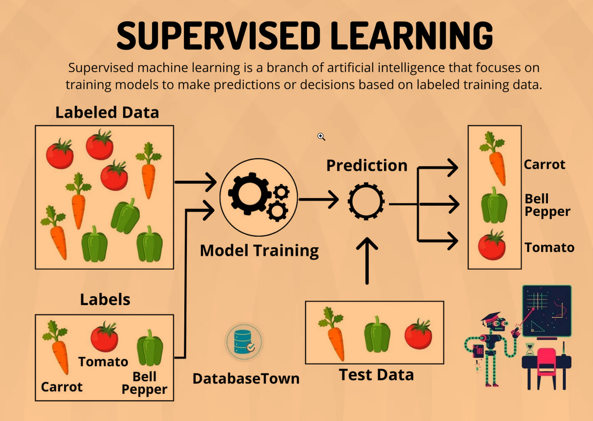

## Contents:<!-- omit in toc -->

- [Introduction](#introduction)
- [Key Features](#key-features)
  - [1. Labeled Data](#1-labeled-data)
    - [Definition](#definition)
    - [Examples](#examples)
  - [2. Training and Testing Phases](#2-training-and-testing-phases)
    - [Training Phase](#training-phase)
    - [Testing Phase](#testing-phase)
  - [3. Algorithms](#3-algorithms)
    - [Regression Algorithms](#regression-algorithms)
    - [Classification Algorithms](#classification-algorithms)
  - [4. Evaluation Metrics](#4-evaluation-metrics)
    - [Regression Metrics](#regression-metrics)
    - [Classification Metrics](#classification-metrics)
  - [5. Overfitting and Underfitting](#5-overfitting-and-underfitting)
    - [Overfitting](#overfitting)
    - [Underfitting](#underfitting)
  - [6. Hyperparameter Tuning](#6-hyperparameter-tuning)
    - [Definition](#definition-1)
    - [Techniques](#techniques)
  - [7. Feature Engineering](#7-feature-engineering)
    - [Definition](#definition-2)
    - [Techniques](#techniques-1)
  - [8. Data Preprocessing](#8-data-preprocessing)
    - [Definition](#definition-3)
    - [Techniques](#techniques-2)
  - [9. Applications](#9-applications)
- [Challenges](#challenges)
- [Videos: A Gentle Introduction to Machine Learning](#videos-a-gentle-introduction-to-machine-learning)
- [Conclusion](#conclusion)
- [Related Content](#related-content)
- [References](#references)



## Introduction

Supervised learning is a pivotal concept in machine learning that involves training algorithms on labeled data. In this method, the model learns from input-output pairs, where the output is known, allowing the algorithm to make predictions or decisions based on new, unseen data. This approach is crucial for tasks where historical data with known outcomes is available, such as predicting stock prices, diagnosing medical conditions, or classifying images.

> [!NOTE]  
> Reference and Details: [Supervised Learning Project](https://github.com/amitkumar-aimlp/projects/tree/content/supervised-learning-project)

## Key Features

### 1. Labeled Data

#### Definition

Labeled data consists of input examples paired with their correct outputs. This explicit pairing provides a clear signal for the model during training, helping it learn the mapping from inputs to outputs. Labeled data is essential for supervised learning because it directly informs the model about the correct results for each input scenario.

#### Examples

- **Image Classification**: In a dataset of dog and cat images, each image is labeled with the correct animal type. This enables the model to learn distinguishing features between cats and dogs.
- **Spam Detection**: Emails labeled as "spam" or "not spam" allow the model to learn patterns and characteristics of spam messages versus legitimate ones.
- **Medical Diagnosis**: Patient records with known outcomes (e.g., whether a patient has a particular disease) help in training models to predict disease presence based on various health metrics.

### 2. Training and Testing Phases

#### Training Phase

- **Objective**: The goal of the training phase is to teach the model how to map input features to the correct output. This involves optimizing the model's parameters so that it can accurately predict the output from new inputs.
- **Process**: During training, the model is exposed to a large number of labeled examples. It uses algorithms to minimize the error between its predictions and the actual labels. Techniques such as gradient descent are commonly used to iteratively update the model's parameters.

#### Testing Phase

- **Objective**: To evaluate how well the model performs on new, unseen data. This phase assesses whether the model has generalized well from the training data or if it has overfit.
- **Process**: The model is tested on a separate test set that was not used during training. Metrics such as accuracy, precision, and recall are used to measure performance. This evaluation helps in understanding how the model will perform in real-world scenarios.

### 3. Algorithms

#### Regression Algorithms

- **Linear Regression**: Models the relationship between a dependent variable and one or more independent variables using a linear equation. It is used for predicting continuous outcomes, such as predicting housing prices based on features like square footage and number of bedrooms.
- **Polynomial Regression**: Extends linear regression by fitting a polynomial equation to the data. This approach can capture non-linear relationships, making it suitable for more complex data patterns.

#### Classification Algorithms

- **Logistic Regression**: Despite its name, logistic regression is a classification algorithm used to predict categorical outcomes. It estimates probabilities using the logistic function, making it suitable for binary or multiclass classification problems.
- **Decision Trees**: Construct a model that splits the data into subsets based on feature values, resulting in a tree-like structure. Each leaf node represents a class label, and the branches represent decision rules. Decision trees are interpretable and can handle both numerical and categorical data.
- **Support Vector Machines (SVM)**: SVM aims to find the hyperplane that best separates different classes in the feature space. It is effective in high-dimensional spaces and is particularly useful for binary classification tasks.
- **k-Nearest Neighbors (k-NN)**: Classifies data points based on the majority class among their k-nearest neighbors. It is a simple, instance-based learning algorithm that does not require a training phase but can be computationally expensive at prediction time.
- **Naive Bayes**: Based on Bayes’ theorem, this algorithm assumes independence between features, simplifying the computation of probabilities. It is often used for text classification and works well with large datasets.
- **Random Forest**: An ensemble learning method that combines multiple decision trees to improve predictive performance. It aggregates the results of individual trees to make a final prediction, reducing the risk of overfitting and improving accuracy.

### 4. Evaluation Metrics

#### Regression Metrics

- **Mean Absolute Error (MAE)**: Calculates the average magnitude of errors between predicted and actual values. It is straightforward and provides a clear measure of prediction accuracy, but does not penalize large errors more than small ones.
- **Mean Squared Error (MSE)**: Computes the average of the squared differences between predicted and actual values. MSE gives more weight to larger errors, making it useful for situations where large deviations are particularly undesirable.
- **Root Mean Squared Error (RMSE)**: The square root of MSE, RMSE provides a measure of error in the same units as the target variable, making it easier to interpret. It is sensitive to large errors, which can be advantageous or disadvantageous depending on the application.
- **R-squared**: Represents the proportion of the variance in the dependent variable that is predictable from the independent variables. It is useful for assessing the goodness-of-fit of the model.

#### Classification Metrics

- **Accuracy**: Measures the ratio of correctly classified instances to the total number of instances. While useful, accuracy alone can be misleading in imbalanced datasets where some classes are underrepresented.
- **Precision**: Indicates the proportion of true positives among all predicted positives. Precision is critical in scenarios where the cost of false positives is high, such as medical diagnoses.
- **Recall (Sensitivity)**: Measures the proportion of true positives among all actual positives. Recall is important when the cost of missing positive instances is high, such as detecting fraud or disease.
- **F1 Score**: Combines precision and recall into a single metric, providing a balanced measure of performance. The F1 score is particularly useful when dealing with imbalanced datasets.
- **Confusion Matrix**: Provides a detailed breakdown of classification performance, including true positives, true negatives, false positives, and false negatives. This matrix helps in understanding the types of errors made by the model.
- **ROC Curve and AUC**: The ROC curve plots the true positive rate against the false positive rate, and the AUC (Area Under the Curve) quantifies the overall performance of the model. The ROC curve is useful for evaluating binary classifiers and comparing different models.

### 5. Overfitting and Underfitting

#### Overfitting

- **Definition**: Occurs when a model learns the training data too well, capturing noise and outliers, which results in poor performance on new data. Overfitting indicates that the model is too complex and has memorized the training data rather than generalizing from it.
- **Detection**: High accuracy on training data but significantly lower accuracy on validation or test data is a common sign of overfitting. Diagnostic tools like learning curves can help visualize this issue.
- **Prevention**: Techniques to prevent overfitting include:
  - **Regularization**: Methods such as L1 (Lasso) and L2 (Ridge) regularization add penalties to the loss function to discourage overly complex models.
  - **Pruning**: In decision trees, pruning involves removing branches that have little impact on the model’s performance.
  - **Cross-Validation**: Splitting data into multiple subsets for training and validation helps in assessing model performance more reliably and prevents overfitting.

#### Underfitting

- **Definition**: Occurs when a model is too simple to capture the underlying patterns in the data, resulting in poor performance on both training and test data. Underfitting indicates that the model is not complex enough to learn from the data.
- **Detection**: Low accuracy on both training and test data suggests underfitting. Inadequate performance metrics across various evaluation criteria can also indicate this issue.
- **Prevention**: Strategies to address underfitting include:
  - **Increasing Model Complexity**: Using more complex algorithms or adding more features can help the model better capture the underlying patterns.
  - **Feature Engineering**: Creating or selecting more relevant features can provide the model with better information.
  - **Hyperparameter Tuning**: Adjusting hyperparameters to improve model performance and complexity.

### 6. Hyperparameter Tuning

#### Definition

Hyperparameter tuning is the process of selecting the best hyperparameters for a model to optimize its performance. Unlike model parameters, which are learned during training, hyperparameters are set before training begins.

#### Techniques

- **Grid Search**: An exhaustive approach that tests all possible combinations of hyperparameters within a predefined range. It can be time-consuming but ensures that the best combination is found within the specified grid.
- **Random Search**: Samples hyperparameters randomly from a distribution. It is often faster than grid search and can be more effective in finding optimal hyperparameters, especially for large parameter spaces.
- **Bayesian Optimization**: Uses probabilistic models to explore the hyperparameter space based on past evaluation results. It is more efficient and can converge to the best hyperparameters faster than grid or random search.

### 7. Feature Engineering

#### Definition

Feature engineering involves creating new features or modifying existing features to improve the performance of a machine learning model. It leverages domain knowledge to enhance the model’s ability to learn from data.

#### Techniques

- **Normalization/Standardization**: Scaling features to a standard range (e.g., 0 to 1) or distribution (e.g., zero mean and unit variance) helps models perform better, especially when features have different units or ranges.
- **Encoding Categorical Variables**: Converting categorical data into numerical format allows models to process non-numeric data. Techniques include one-hot encoding, which creates binary columns for each category, and label encoding, which assigns numeric labels to categories.
- **Feature Selection**: Identifying and using only the most relevant features can reduce model complexity and improve performance. Techniques include statistical tests, recursive feature elimination, and feature importance scores from models like Random Forest.

### 8. Data Preprocessing

#### Definition

Data preprocessing involves preparing and cleaning data to ensure it is in a suitable format for model training. This step is crucial for building accurate and reliable models.

#### Techniques

- **Handling Missing Values**: Strategies for dealing with missing data include imputation (e.g., filling in missing values with the mean, median, or mode) or removing instances with missing values. Advanced techniques like KNN imputation or model-based imputation can also be used.
- **Outlier Detection**: Identifying and managing outliers helps prevent them from skewing the model’s performance. Techniques include statistical methods (e.g., Z-scores) and visualization methods (e.g., box plots).
- **Data Transformation**: Applying transformations such as log transformations or polynomial features can enhance the quality of data and improve model performance. Data transformation helps in stabilizing variance and making patterns more discernible.

### 9. Applications

- **Predictive Analytics**: Supervised learning models can forecast future trends by analyzing historical data. For example, sales forecasting models predict future sales based on past performance and external factors.
- **Image Classification**: Models classify images into predefined categories, such as identifying objects in photos or detecting anomalies in medical imaging. Image classification is widely used in applications like autonomous driving and facial recognition.
- **Spam Detection**: Algorithms identify and filter spam messages from legitimate ones. Spam filters use features like email content, sender information, and historical spam data to classify messages.
- **Medical Diagnosis**: Predictive models assist in diagnosing diseases by analyzing patient data, including symptoms, medical history, and test results. This application is vital for early detection and personalized treatment plans.
- **Fraud Detection**: Supervised learning models detect fraudulent activities in financial transactions by identifying patterns and anomalies. Fraud detection systems use historical transaction data to recognize suspicious behavior and prevent financial losses.

## Challenges

- **Data Quality**: High-quality labeled data is essential for building effective models. Issues such as incorrect labeling, incomplete data, or biased samples can negatively impact model performance. Ensuring data accuracy and representativeness is critical for reliable outcomes.
- **Feature Selection**: Choosing the right features while avoiding irrelevant ones is a challenging task. Irrelevant or redundant features can reduce model performance and increase computational complexity. Feature selection techniques and domain expertise are crucial for effective feature engineering.
- **Scalability**: Handling large datasets and complex models efficiently is a significant challenge. Techniques such as distributed computing, dimensionality reduction, and efficient algorithms help manage scalability issues and improve performance.
- **Bias and Fairness**: Ensuring that models are fair and do not perpetuate existing biases is a major concern. Bias in training data can lead to biased predictions, affecting marginalized groups disproportionately. Implementing fairness-aware algorithms and auditing models for bias are essential steps to address these challenges.

## Videos: A Gentle Introduction to Machine Learning

Machine Learning is often surrounded by hype and confusing terminology. In this StatQuest, we simplify and clarify the basic concepts that form the foundation of the field. These ideas are straightforward and easy to understand. After watching this StatQuest, you'll be prepared to explore a wide range of new and exciting topics in Machine Learning.

For more in-depth coverage refer the link: [Top 15 YouTube Channels to Level Up Your Machine Learning Skills](https://www.kdnuggets.com/2023/03/top-15-youtube-channels-level-machine-learning-skills.html)

<iframe src=" https://www.youtube.com/embed/Gv9_4yMHFhI?si=B0viDGYgUGPt8ocM" frameborder="0" style="position: absolute; top: 0; left: 0; width: 100%; height: 100%;" allowfullscreen></iframe>

## Conclusion

Supervised learning is a foundational technique in machine learning that relies on labeled data to build models capable of making accurate predictions. By understanding the key features, algorithms, evaluation metrics, and challenges associated with supervised learning, practitioners can develop effective models for various applications. As technology advances and data grows in complexity, mastering supervised learning techniques remains essential for driving innovation and solving real-world problems.

## Related Content

- [Python Programming Language Syntax and Examples](https://amitkumar-aimlp.github.io/projects/python-programming-language-syntax-and-examples)
- [NumPy for Data Science: A Comprehensive Guide](https://amitkumar-aimlp.github.io/projects/numpy-for-data-science-a-comprehensive-guide)
- [Pandas for Data Science: A Comprehensive Guide](https://amitkumar-aimlp.github.io/projects/pandas-for-data-science-a-comprehensive-guide)
- [Pandas Vs. SQL: A Comprehensive Comparison](https://amitkumar-aimlp.github.io/projects/pandas-vs-sql-a-comprehensive-comparison)
- [PySpark Using Databricks: A Comprehensive Guide](https://amitkumar-aimlp.github.io/projects/pyspark-using-databricks-a-comprehensive-guide)
- [Pandas Vs. PySpark: A Comprehensive Comparison](https://amitkumar-aimlp.github.io/projects/pandas-vs-pyspark-a-comprehensive-comparison)
- [Matplotlib for Data Visualization](https://amitkumar-aimlp.github.io/projects/matplotlib-for-data-visualization)
- [Applied Statistics: An Overview](https://amitkumar-aimlp.github.io/projects/applied-statistics-an-overview)

## References

**Foundational Textbooks**

- _Elements of Statistical Learning_ by Hastie, Tibshirani, and Friedman (for in-depth statistical and mathematical underpinnings)
- _Pattern Recognition and Machine Learning_ by Bishop (for a balance of theory and practical applications)
- _Machine Learning_ by Tom M. Mitchell (for a broader introduction to machine learning concepts)

**Comprehensive Overviews and Surveys**

- _A Review of Machine Learning Techniques_ by Kotsiantis, Zaharakis, and Pintelas (for a broad overview of various algorithms)
- _Supervised Learning_ by Shalev-Shwartz and Ben-David (for a theoretical foundation)

**Specific Algorithms and Techniques**

- _Support Vector Machines_ by Cortes and Vapnik (seminal paper)
- _Neural Networks and Deep Learning_ by Michael Nielsen (for a comprehensive introduction to deep learning)
- _Random Forests_ by Breiman (original paper)
- _Gradient Boosting_ by Friedman (foundational work)
- _Ensemble Methods_ by Polikar (overview of ensemble techniques)

**Applications and Case Studies**

- Papers from top-tier conferences (NIPS, ICML, ICLR) focusing on specific applications (e.g., healthcare, finance, computer vision)
- Industry reports and whitepapers showcasing real-world implementations

**Advanced Topics and Research Frontiers**

- Papers from recent top-tier conferences exploring cutting-edge research in supervised learning
- Overviews of emerging areas (e.g., transfer learning, meta-learning, explainable AI)

**Open-Source Libraries and Tools**

- Scikit-learn documentation (for practical implementation details)
- TensorFlow and Keras documentation (for deep learning frameworks)
- PyTorch documentation (for deep learning framework)

**Additional Considerations**

- Balance between theoretical and applied papers: Ensure a mix to provide a well-rounded perspective.
- Consider different subfields: Cover topics like regression, classification, and structured prediction.
- Incorporate diverse perspectives: Include papers from different research communities (e.g., statistics, computer science, engineering).
- Stay updated: Include recent publications to reflect the latest advancements.

**Websites and Credits**

- [Supervised Learning - Wikipedia](https://en.wikipedia.org/wiki/Supervised_learning)
- [A Simple Introduction to Supervised Learning](https://medium.com/@gerzson.boros/a-simple-introduction-into-supervised-learning-dcce83ee3ada)
- [STATQUEST: An epic journey through statistics and machine learning](https://statquest.org/)

> ### In the confrontation between the stream and the rock, the stream always wins, not through strength, but through persistence.
>
> –Buddha

---

_Published: 2020-01-11; Updated: 2024-05-01_

---

[TOP](#contents)
