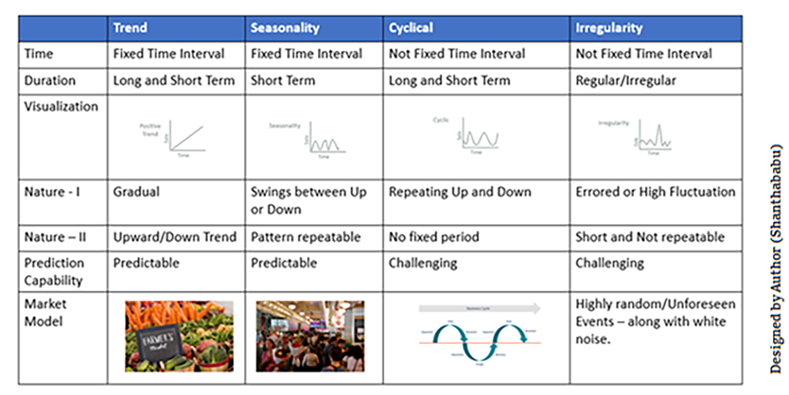
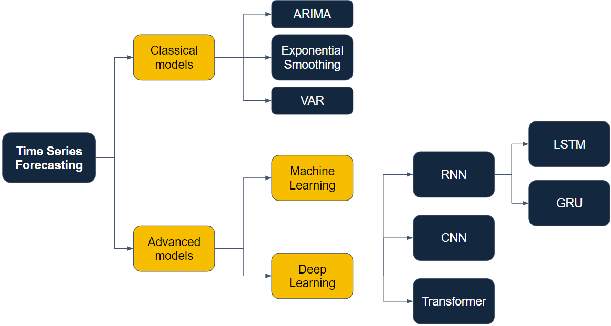

## Contents:<!-- omit in toc -->

- [1. Introduction to Time Series Analysis](#1-introduction-to-time-series-analysis)
- [2. Key Concepts in Time Series Analysis](#2-key-concepts-in-time-series-analysis)
  - [2.1 Time Series Data](#21-time-series-data)
  - [2.2 Stationarity](#22-stationarity)
  - [2.3 Trend and Seasonality](#23-trend-and-seasonality)
- [3. Components of a Time Series](#3-components-of-a-time-series)
  - [3.1 Trend Component](#31-trend-component)
  - [3.2 Seasonal Component](#32-seasonal-component)
  - [3.3 Cyclical Component](#33-cyclical-component)
  - [3.4 Irregular Component](#34-irregular-component)
- [4. Time Series Decomposition](#4-time-series-decomposition)
  - [4.1 Additive Model](#41-additive-model)
  - [4.2 Multiplicative Model](#42-multiplicative-model)
- [5. Time Series Models](#5-time-series-models)
  - [5.1 Autoregressive (AR) Model](#51-autoregressive-ar-model)
  - [5.2 Moving Average (MA) Model](#52-moving-average-ma-model)
  - [5.3 Autoregressive Integrated Moving Average (ARIMA) Model](#53-autoregressive-integrated-moving-average-arima-model)
- [6. Advanced Time Series Models](#6-advanced-time-series-models)
  - [6.1 Seasonal ARIMA (SARIMA) Model](#61-seasonal-arima-sarima-model)
  - [6.2 Exponential Smoothing (ETS)](#62-exponential-smoothing-ets)
  - [6.3 Vector Autoregression (VAR)](#63-vector-autoregression-var)
- [7. Machine Learning and Deep Learning in Time Series Analysis](#7-machine-learning-and-deep-learning-in-time-series-analysis)
  - [7.1 Machine Learning Models](#71-machine-learning-models)
  - [7.2 Deep Learning Models](#72-deep-learning-models)
- [8. Feature Engineering for Time Series](#8-feature-engineering-for-time-series)
  - [8.1 Lag Features](#81-lag-features)
  - [8.2 Rolling Statistics](#82-rolling-statistics)
  - [8.3 Date-Time Features](#83-date-time-features)
- [9. Time Series Cross-Validation](#9-time-series-cross-validation)
  - [9.1 Walk-Forward Validation](#91-walk-forward-validation)
  - [9.2 Time Series Split](#92-time-series-split)
- [10. Forecasting Techniques](#10-forecasting-techniques)
  - [10.1 Short-Term vs. Long-Term Forecasting](#101-short-term-vs-long-term-forecasting)
  - [10.2 Evaluation Metrics](#102-evaluation-metrics)
- [11. Applications of Time Series Analysis](#11-applications-of-time-series-analysis)
  - [11.1 Financial Market Analysis](#111-financial-market-analysis)
  - [11.2 Economic Forecasting](#112-economic-forecasting)
  - [11.3 Environmental Monitoring](#113-environmental-monitoring)
  - [11.4 Demand Forecasting](#114-demand-forecasting)
- [12. Tools and Libraries for Time Series Analysis](#12-tools-and-libraries-for-time-series-analysis)
  - [12.1 Python Libraries](#121-python-libraries)
  - [12.2 R Libraries](#122-r-libraries)
- [13. Challenges in Time Series Analysis](#13-challenges-in-time-series-analysis)
- [14. Future Directions in Time Series Analysis](#14-future-directions-in-time-series-analysis)
  - [14.1 Hybrid Models](#141-hybrid-models)
  - [14.2 Real-Time Time Series Analysis](#142-real-time-time-series-analysis)
  - [14.3 Automated Time Series Analysis](#143-automated-time-series-analysis)
- [15. Videos: Modern Time Series Analysis](#15-videos-modern-time-series-analysis)
- [16. Conclusion](#16-conclusion)
- [17. Related Content](#17-related-content)
- [18. References](#18-references)



## 1. Introduction to Time Series Analysis

Time series analysis involves statistical techniques for analyzing time-ordered data points to extract meaningful insights and patterns. It is crucial in various fields such as finance, economics, environmental science, and engineering. The primary goal is to understand the underlying structure of the data and forecast future values. Time series analysis can reveal trends, seasonal patterns, and cyclical movements, providing a comprehensive view of how data evolves over time. This approach is essential for making informed decisions, optimizing processes, and predicting future outcomes.

> [!NOTE]  
> Reference and Details: [Forecasting: Principles and Practice](https://otexts.com/fpp3/)

## 2. Key Concepts in Time Series Analysis

### 2.1 Time Series Data

- **Definition**: Time series data is a sequence of data points collected or recorded at specific time intervals. This type of data reflects how the value of an observation changes over time. Each observation in a time series is dependent on the previous observations, making it unique from other types of data.
- **Examples**: Examples of time series data include stock prices, daily temperature readings, monthly sales figures, and hourly electricity consumption. These data sets are used in various applications such as forecasting financial markets, monitoring climate change, and managing supply chains.

### 2.2 Stationarity

- **Definition**: A stationary time series has statistical properties, such as mean and variance, that do not change over time. Stationarity is a crucial assumption in many time series models because it simplifies the analysis and forecasting process.
- **Types**:
  - **Strict Stationarity**: The full statistical properties of the series remain constant over time. This includes higher moments like skewness and kurtosis.
  - **Weak Stationarity**: Only the mean, variance, and autocorrelation of the series remain constant over time. This is often sufficient for practical applications, especially in financial and economic data.

### 2.3 Trend and Seasonality

- **Trend**: The long-term upward or downward movement in the data. It reflects the overall direction in which the data is moving over a long period. Identifying the trend is crucial for understanding the general movement of the data and making long-term forecasts.
- **Seasonality**: Regular, periodic fluctuations in the data. These patterns repeat at specific intervals, such as daily, monthly, or yearly. Seasonality is essential for making accurate short-term predictions and understanding cyclic behaviors in the data.

## 3. Components of a Time Series

Understanding the components of a time series helps in better modeling and forecasting. Each component reveals different aspects of the data's behavior.

### 3.1 Trend Component

- Represents the long-term direction of the data, whether it is upward, downward, or stagnant. Trends are influenced by various factors such as economic growth, technological advancements, and social changes. Identifying trends helps in understanding the fundamental movements in the data.

### 3.2 Seasonal Component

- Represents regular and predictable patterns that repeat over specific intervals, such as seasons, quarters, or months. Seasonal components are often influenced by external factors such as weather, holidays, and cultural events. Recognizing seasonality is vital for making accurate short-term forecasts and planning.

### 3.3 Cyclical Component

- Represents fluctuations around the trend, often influenced by economic or business cycles. Unlike seasonality, cyclical patterns do not have a fixed period and can be irregular. Analyzing cyclical components helps in understanding the impact of economic cycles on the data.

### 3.4 Irregular Component

- Represents random noise or anomalies in the data that cannot be attributed to trend, seasonality, or cyclical components. These irregular components can be due to unforeseen events or measurement errors. Identifying and handling these components is crucial for improving the accuracy of models.

## 4. Time Series Decomposition

Decomposing a time series into its components helps in understanding and modeling the data. This process separates the series into trend, seasonal, and irregular components, allowing for more precise analysis and forecasting.

### 4.1 Additive Model

Yt = Tt + St + It

- Suitable when the seasonal fluctuations remain constant over time. In this model, the observed time series is the sum of its trend, seasonal, and irregular components. The additive model is straightforward and works well for time series with constant seasonal patterns.

### 4.2 Multiplicative Model

Yt = Tt × St × It

- Suitable when the seasonal fluctuations vary with the level of the time series. In this model, the observed time series is the product of its trend, seasonal, and irregular components. The multiplicative model is used for time series where the amplitude of seasonal variations changes over time.

## 5. Time Series Models

Various models are used to analyze and forecast time series data. Choosing the right model depends on the nature of the data and the specific forecasting requirements.

### 5.1 Autoregressive (AR) Model

- Uses the dependency between an observation and a number of lagged observations (previous time steps). The AR model assumes that the current value of the series is a linear combination of its past values. This model is useful for data with strong autocorrelation.

### 5.2 Moving Average (MA) Model

- Uses the dependency between an observation and a residual error from a moving average model applied to lagged observations. The MA model captures the short-term dependencies and is effective for time series with random shocks or noise.

### 5.3 Autoregressive Integrated Moving Average (ARIMA) Model

- Combines AR and MA models with differencing to make the data stationary. Differencing involves subtracting the previous observation from the current observation to remove trends and seasonality.
- **ARIMA(p, d, q)**: Where \( p \) is the order of the AR part, \( d \) is the number of differences needed to make the series stationary, and \( q \) is the order of the MA part. ARIMA models are versatile and widely used for various time series forecasting applications.

## 6. Advanced Time Series Models

Advanced models are developed to capture more complex patterns and relationships in time series data.

### 6.1 Seasonal ARIMA (SARIMA) Model

- Extends ARIMA to capture seasonality. It incorporates seasonal differencing and seasonal AR and MA terms to model seasonal patterns.
- **SARIMA(p, d, q)(P, D, Q)m**: Where \( P, D, Q \) are seasonal components and \( m \) is the number of periods per season. SARIMA models are particularly useful for data with strong seasonal patterns, such as sales data with monthly seasonality.

### 6.2 Exponential Smoothing (ETS)

- Models the data as an exponentially weighted moving average. This approach gives more weight to recent observations, making it responsive to changes in the data.
- **Types**: Simple Exponential Smoothing is suitable for data without trend or seasonality. Holt’s Linear Trend Model is used for data with a trend. Holt-Winters Seasonal Model is applied to data with both trend and seasonality. ETS models are flexible and effective for various types of time series data.

### 6.3 Vector Autoregression (VAR)

- Generalizes the AR model to capture the linear interdependencies among multiple time series. VAR models are used when there are multiple interrelated time series, and they can capture the influence of one series on another. This model is widely used in econometrics for analyzing and forecasting economic variables.

## 7. Machine Learning and Deep Learning in Time Series Analysis

Machine learning and deep learning models have gained popularity in time series analysis due to their ability to capture complex patterns.

### 7.1 Machine Learning Models

- **Random Forests**: An ensemble learning method that operates by constructing multiple decision trees. Random forests are robust to overfitting and can handle large datasets with high dimensionality.
- **Gradient Boosting Machines**: Builds models sequentially, each new model correcting errors made by the previous one. Gradient boosting is powerful for capturing non-linear relationships in the data.
- **Support Vector Machines**: Finds a hyperplane that best separates the data into different classes. SVMs are effective for classification and regression tasks with time series data.

### 7.2 Deep Learning Models

- **Recurrent Neural Networks (RNN)**: Suitable for sequential data, capturing temporal dependencies. RNNs can model complex, non-linear relationships in time series data.
- **Long Short-Term Memory (LSTM) Networks**: A type of RNN that can learn long-term dependencies. LSTMs are designed to overcome the vanishing gradient problem, making them effective for long-term forecasting.
- **Gated Recurrent Units (GRU)**: A variant of LSTM with a simpler structure. GRUs are computationally efficient and effective for capturing temporal patterns.
- **Convolutional Neural Networks (CNN)**: Typically used for spatial data but can be adapted for time series by treating time as a spatial dimension. CNNs are powerful for feature extraction and capturing local patterns in the data.

## 8. Feature Engineering for Time Series

Creating relevant features is essential for improving model performance. Feature engineering involves transforming raw data into features that better represent the underlying patterns.

### 8.1 Lag Features

- Creating features that represent previous time steps to capture temporal dependencies. Lag features are simple yet powerful for capturing autocorrelation in the data.

### 8.2 Rolling Statistics

- Calculating rolling means, variances, and other statistics over a window of time to smooth out short-term fluctuations. Rolling statistics provide a smoothed view of the data, highlighting trends and cycles.

### 8.3 Date-Time Features

- Extracting components like year, month, day, hour, etc., to capture seasonality and other temporal patterns. Date-time features are essential for modeling seasonality and other time-based variations in the data.

## 9. Time Series Cross-Validation

Cross-validation techniques help in evaluating the performance of time series models. These techniques ensure that the model's performance is robust and reliable.

### 9.1 Walk-Forward Validation

- Rolling forward through the time series to maintain temporal order while training and testing the model. Walk-forward validation mimics the real-world scenario where future data is not available during model training.

### 9.2 Time Series Split

- Splitting data into training and testing sets while preserving the temporal order to avoid data leakage. This method ensures that the model is evaluated on unseen data, providing a realistic assessment of its performance.

## 10. Forecasting Techniques

Forecasting involves predicting future values based on historical data. Different techniques are used depending on the forecasting horizon and data characteristics.

### 10.1 Short-Term vs. Long-Term Forecasting

- **Short-Term**: Focuses on near-future predictions, often using recent data. Short-term forecasting is useful for operational decisions, such as inventory management and staffing.
- **Long-Term**: Focuses on future trends and patterns over longer periods, requiring comprehensive data analysis. Long-term forecasting is used for strategic planning, such as budgeting and resource allocation.

### 10.2 Evaluation Metrics

- **Mean Absolute Error (MAE)**: Measures the average magnitude of errors in a set of predictions. MAE is easy to understand and interpret.
- **Mean Squared Error (MSE)**: Measures the average of the squares of the errors. MSE penalizes larger errors more than smaller ones, making it sensitive to outliers.
- **Root Mean Squared Error (RMSE)**: The square root of MSE, providing error magnitude in the same units as the data. RMSE is widely used for its interpretability and sensitivity to large errors.
- **Mean Absolute Percentage Error (MAPE)**: Measures the accuracy as a percentage of the error. MAPE is useful for comparing forecasting accuracy across different data sets.

## 11. Applications of Time Series Analysis

Time series analysis has a wide range of applications across various fields, each benefiting from the insights and forecasts derived from the data.

### 11.1 Financial Market Analysis

- Stock price prediction, risk management, and portfolio optimization are essential applications in finance. Time series analysis helps in identifying market trends, evaluating investment strategies, and managing financial risks.

### 11.2 Economic Forecasting

- GDP, unemployment rates, and inflation prediction help in macroeconomic planning and policy-making. Time series analysis provides valuable insights for government agencies, central banks, and economic researchers.

### 11.3 Environmental Monitoring

- Climate change analysis, weather forecasting, and pollution level monitoring are crucial for environmental protection and planning. Time series analysis helps in understanding long-term environmental trends and predicting future conditions.

### 11.4 Demand Forecasting

- Sales forecasting, inventory management, and supply chain optimization are vital for business operations and strategic planning. Time series analysis enables businesses to anticipate demand, reduce inventory costs, and improve customer satisfaction.

## 12. Tools and Libraries for Time Series Analysis

Various tools and libraries facilitate time series analysis, offering powerful functionalities for data manipulation, modeling, and visualization.

### 12.1 Python Libraries

- **Pandas**: Data manipulation and analysis. Pandas provide versatile data structures for handling time series data and include functions for resampling, shifting, and calculating rolling statistics.
- **Statsmodels**: Statistical modeling and testing. Statsmodels offer a range of models for time series analysis, including ARIMA, SARIMA, and state space models.
- **Prophet**: Forecasting tool developed by Facebook. Prophet is designed for easy implementation and tuning, making it accessible for users with varying levels of expertise.
- **ARIMA**: Modeling and forecasting using ARIMA models. The ARIMA library in Python provides tools for fitting and diagnosing ARIMA models, making it a popular choice for time series analysis.

### 12.2 R Libraries

- **Forecast**: Comprehensive tools for forecasting. The Forecast package in R includes functions for time series decomposition, modeling, and evaluation.
- **TSA**: Time Series Analysis package. The TSA package offers a range of tools for time series modeling and forecasting, including ARIMA and state space models.

## 13. Challenges in Time Series Analysis

Time series analysis comes with several challenges that need to be addressed to achieve accurate and reliable results.

- **Non-Stationarity**: Handling non-stationary data can be challenging and requires techniques like differencing and transformation. Non-stationary data can lead to misleading results if not properly addressed.
- **Noise and Outliers**: Dealing with anomalies that can distort analysis and forecasting. Identifying and mitigating the impact of noise and outliers is crucial for model accuracy.
- **High Dimensionality**: Managing and interpreting large datasets with many variables. High-dimensional data can be computationally intensive and may require dimensionality reduction techniques.
- **Model Selection**: Choosing the appropriate model for analysis and forecasting based on the data characteristics. Model selection involves balancing complexity, interpretability, and performance.

## 14. Future Directions in Time Series Analysis

The field of time series analysis is continuously evolving, with new methods and technologies emerging to enhance its capabilities.

### 14.1 Hybrid Models

- Combining traditional statistical models with machine learning approaches to improve accuracy and robustness. Hybrid models can capture linear and non-linear patterns, leveraging the strengths of both approaches.

### 14.2 Real-Time Time Series Analysis

- Developing methods for analyzing streaming data in real-time to provide immediate insights and forecasts. Real-time analysis is crucial for applications such as fraud detection, network monitoring, and autonomous systems.

### 14.3 Automated Time Series Analysis

- Leveraging automated machine learning (AutoML) for time series forecasting to simplify the modeling process and improve efficiency. AutoML tools can automate model selection, hyperparameter tuning, and performance evaluation, making time series analysis more accessible to non-experts.

## 15. Videos: Modern Time Series Analysis

Explore the fascinating world of Time Series Analysis with this in-depth tutorial. Learn the key concepts, models, and applications essential for data forecasting in fields like finance, economics, and environmental science. Perfect for data enthusiasts and professionals looking to enhance their analytical skills.

<iframe src="https://www.youtube.com/embed/v5ijNXvlC5A?si=rBUxPzIGAeYPsih_" frameborder="0" style="position: absolute; top: 0; left: 0; width: 100%; height: 100%;" allowfullscreen></iframe>

## 16. Conclusion

Time series analysis is a powerful tool for extracting insights and making predictions based on time-ordered data. Understanding its key concepts, models, and applications is essential for leveraging its full potential in various domains. From finance to environmental monitoring, time series analysis plays a critical role in informed decision-making and strategic planning. By embracing advanced models and techniques, the future of time series analysis holds great promise for more accurate and real-time insights. The continuous development of new methods and technologies will further enhance its capabilities, making it an indispensable tool for data analysis and forecasting.

## 17. Related Content

- [Python Programming Language Syntax and Examples](https://amitkumar-aimlp.github.io/projects/python-programming-language-syntax-and-examples/)
- [NumPy for Data Science: A Comprehensive Guide](https://amitkumar-aimlp.github.io/projects/numpy-for-data-science-a-comprehensive-guide/)
- [Pandas for Data Science: A Comprehensive Guide](https://amitkumar-aimlp.github.io/projects/pandas-for-data-science-a-comprehensive-guide/)
- [Pandas Vs. SQL: A Comprehensive Comparison](https://amitkumar-aimlp.github.io/projects/pandas-vs-sql-a-comprehensive-comparison/)
- [PySpark Using Databricks: A Comprehensive Guide](https://amitkumar-aimlp.github.io/projects/pyspark-using-databricks-a-comprehensive-guide/)
- [Pandas Vs. PySpark: A Comprehensive Comparison](https://amitkumar-aimlp.github.io/projects/pandas-vs-pyspark-a-comprehensive-comparison/)
- [Matplotlib for Data Visualization](https://amitkumar-aimlp.github.io/projects/matplotlib-for-data-visualization/)
- [Applied Statistics: An Overview](https://amitkumar-aimlp.github.io/projects/applied-statistics-an-overview/)
- [Supervised Learning – A Simple Guide](https://amitkumar-aimlp.github.io/projects/supervised-learning-a-simple-guide/)
- [Unsupervised Learning – A Simple Guide](https://amitkumar-aimlp.github.io/projects/unsupervised-learning-a-simple-guide/)
- [Ensemble Learning – Methods](https://amitkumar-aimlp.github.io/projects/ensemble-learning-methods/)
- [Feature Engineering - An Overview](https://amitkumar-aimlp.github.io/projects/feature-engineering-an-overview/)
- [Hyperparameter Optimization](https://amitkumar-aimlp.github.io/projects/hyperparameter-optimization/)
- [Recommender Systems](https://amitkumar-aimlp.github.io/projects/recommender-systems/)
- [Deep Learning Fundamentals](https://amitkumar-aimlp.github.io/projects/deep-learning-fundamentals/)
- [Semi-supervised Learning](https://amitkumar-aimlp.github.io/projects/semi-supervised-learning/)
- [Natural Language Processing](https://amitkumar-aimlp.github.io/projects/natural-language-processing/)
- [Computer Vision Fundamentals](https://amitkumar-aimlp.github.io/projects/computer-vision-fundamentals/)

## 18. References

These references provide a comprehensive foundation for understanding the principles, methods, and applications of time series analysis.

1. Box, G. E. P., Jenkins, G. M., & Reinsel, G. C. (2015). _Time Series Analysis: Forecasting and Control_. Wiley.
2. Hyndman, R. J., & Athanasopoulos, G. (2018). _Forecasting: Principles and Practice_. OTexts. Retrieved from https://otexts.com/fpp3/
3. Brockwell, P. J., & Davis, R. A. (2016). _Introduction to Time Series and Forecasting_. Springer.
4. Shumway, R. H., & Stoffer, D. S. (2017). _Time Series Analysis and Its Applications: With R Examples_. Springer.
5. Chatfield, C. (2003). _The Analysis of Time Series: An Introduction_. Chapman and Hall/CRC.
6. Hamilton, J. D. (1994). _Time Series Analysis_. Princeton University Press.
7. Makridakis, S., Wheelwright, S. C., & Hyndman, R. J. (1998). _Forecasting: Methods and Applications_. Wiley.
8. Montgomery, D. C., Jennings, C. L., & Kulahci, M. (2015). _Introduction to Time Series Analysis and Forecasting_. Wiley.
9. Wei, W. W. S. (2006). _Time Series Analysis: Univariate and Multivariate Methods_. Pearson.
10. Durbin, J., & Koopman, S. J. (2012). _Time Series Analysis by State Space Methods_. Oxford University Press.
11. Tsay, R. S. (2010). _Analysis of Financial Time Series_. Wiley.
12. Brownlee, J. (2017). _Introduction to Time Series Forecasting with Python: How to Prepare Data and Develop Models to Predict the Future_. Machine Learning Mastery.
13. Hyndman, R. J., & Khandakar, Y. (2008). Automatic Time Series Forecasting: The Forecast Package for R. _Journal of Statistical Software, 27_(3), 1-22.
14. Facebook Prophet Documentation. (n.d.). Retrieved from https://facebook.github.io/prophet/docs/quick_start.html
15. Pedregosa, F., Varoquaux, G., Gramfort, A., Michel, V., Thirion, B., Grisel, O., ... & Duchesnay, É. (2011). Scikit-learn: Machine Learning in Python. _Journal of Machine Learning Research, 12_, 2825-2830.
16. Hochreiter, S., & Schmidhuber, J. (1997). Long Short-Term Memory. _Neural Computation, 9_(8), 1735-1780.
17. Li, C., Xu, L., & Sun, J. (2019). Deep Learning for Time Series Forecasting: A Survey. _IEEE Transactions on Neural Networks and Learning Systems_.
18. Chen, T., & Guestrin, C. (2016). XGBoost: A Scalable Tree Boosting System. _Proceedings of the 22nd ACM SIGKDD International Conference on Knowledge Discovery and Data Mining_, 785-794.
19. [Forecasting: Principles and Practice](https://otexts.com/fpp3/)
20. [Awesome Time Series in Python](https://github.com/MaxBenChrist/awesome_time_series_in_python)
21. [Introduction to Time Series Analysis](https://www.itl.nist.gov/div898/handbook/pmc/section4/pmc4.htm)
22. [Time Series Analysis](https://en.wikipedia.org/wiki/Time_series)
23. [Time Series Analysis: Definition, Components, Methods, and Applications](https://www.analyticsvidhya.com/blog/2021/10/a-comprehensive-guide-to-time-series-analysis/)
24. [Advanced Time Series Forecasting Methods](https://mlpills.dev/time-series/advanced-time-series-forecasting-methods/)

> ### Optimists are right. So are pessimists. It’s up to you to choose which you will be.
>
> -Harvey Mackay

---

_Published: 2020-01-21; Updated: 2024-05-01_

---

[TOP](#contents)
