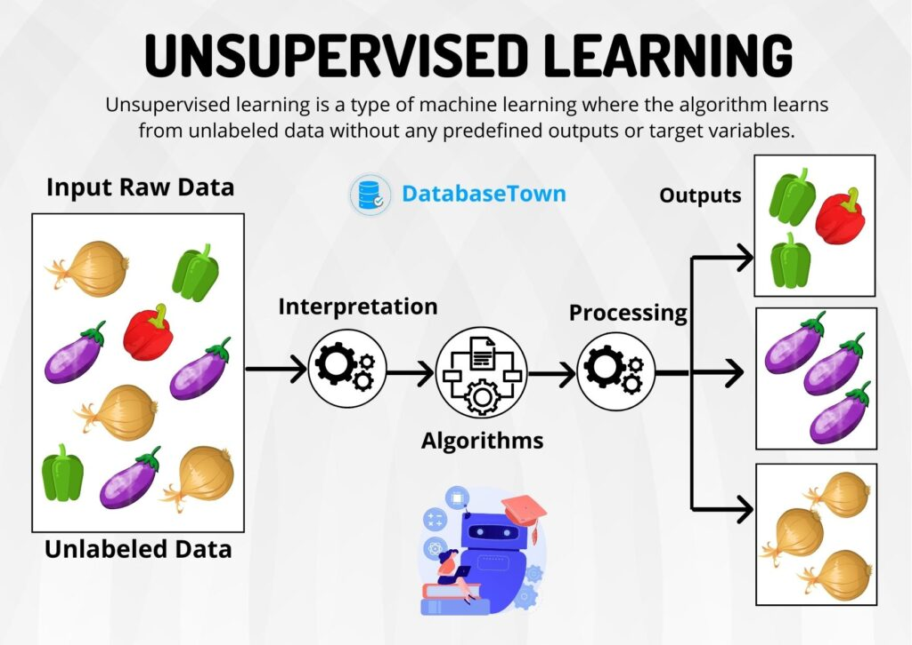

## Contents:<!-- omit in toc -->

- [Introduction](#introduction)
- [Key Concepts](#key-concepts)
  - [What is Unsupervised Learning?](#what-is-unsupervised-learning)
    - [Key Characteristics](#key-characteristics)
  - [Types of Unsupervised Learning](#types-of-unsupervised-learning)
- [Clustering](#clustering)
  - [K-Means Clustering](#k-means-clustering)
    - [Overview](#overview)
    - [Steps](#steps)
    - [Advantages and Disadvantages](#advantages-and-disadvantages)
  - [Hierarchical Clustering](#hierarchical-clustering)
    - [Overview](#overview-1)
    - [Types](#types)
    - [Advantages and Disadvantages](#advantages-and-disadvantages-1)
  - [DBSCAN (Density-Based Spatial Clustering of Applications with Noise)](#dbscan-density-based-spatial-clustering-of-applications-with-noise)
    - [Overview](#overview-2)
    - [Advantages](#advantages)
    - [Disadvantages](#disadvantages)
- [Dimensionality Reduction](#dimensionality-reduction)
  - [Principal Component Analysis (PCA)](#principal-component-analysis-pca)
    - [Overview](#overview-3)
    - [Steps](#steps-1)
    - [Applications](#applications)
  - [t-Distributed Stochastic Neighbor Embedding (t-SNE)](#t-distributed-stochastic-neighbor-embedding-t-sne)
    - [Overview](#overview-4)
    - [Advantages](#advantages-1)
    - [Disadvantages](#disadvantages-1)
- [Association](#association)
  - [Apriori Algorithm](#apriori-algorithm)
    - [Overview](#overview-5)
    - [Steps](#steps-2)
    - [Applications](#applications-1)
  - [Eclat Algorithm](#eclat-algorithm)
    - [Overview](#overview-6)
    - [Advantages](#advantages-2)
    - [Applications](#applications-2)
- [Algorithms for Anomaly Detection](#algorithms-for-anomaly-detection)
  - [Isolation Forest](#isolation-forest)
    - [Overview](#overview-7)
    - [Advantages](#advantages-3)
    - [Applications](#applications-3)
  - [One-Class SVM](#one-class-svm)
    - [Overview](#overview-8)
    - [Advantages](#advantages-4)
    - [Applications](#applications-4)
- [Applications of Unsupervised Learning](#applications-of-unsupervised-learning)
  - [Customer Segmentation](#customer-segmentation)
    - [Benefits](#benefits)
  - [Anomaly Detection](#anomaly-detection)
    - [Benefits](#benefits-1)
  - [Market Basket Analysis](#market-basket-analysis)
    - [Benefits](#benefits-2)
  - [Dimensionality Reduction for Data Visualization](#dimensionality-reduction-for-data-visualization)
    - [Benefits](#benefits-3)
  - [Recommendation Systems](#recommendation-systems)
    - [Benefits](#benefits-4)
- [Advantages and Disadvantages](#advantages-and-disadvantages-2)
  - [Advantages](#advantages-5)
    - [Additional Advantages](#additional-advantages)
  - [Disadvantages](#disadvantages-2)
    - [Additional Disadvantages](#additional-disadvantages)
- [Tools and Libraries for Unsupervised Learning](#tools-and-libraries-for-unsupervised-learning)
  - [Python Libraries](#python-libraries)
  - [R Libraries](#r-libraries)
  - [Additional Tools](#additional-tools)
- [Videos: Unsupervised Learning Key Concepts](#videos-unsupervised-learning-key-concepts)
- [Conclusion](#conclusion)
- [Related Content](#related-content)
- [References](#references)



## Introduction

Unsupervised learning is a cornerstone of machine learning that deals with data without labeled responses. Unlike supervised learning, where algorithms are trained on a predefined output, unsupervised learning seeks to understand the underlying structure of the data, identify patterns, and extract meaningful information. This guide will delve into the various aspects of unsupervised learning, including its key concepts, types, popular algorithms, applications, and the tools used to implement these methods.

> [!NOTE]  
> Reference and Details: [Unsupervised Learning Project](https://github.com/amitkumar-aimlp/projects/tree/content/supervised-learning-project)

## Key Concepts

### What is Unsupervised Learning?

Unsupervised learning is a type of machine learning where the model is trained using data that does not have labeled responses. The primary goal is to infer the natural structure present within a set of data points. It is used to draw inferences and patterns from datasets consisting of input data without labeled responses.

#### Key Characteristics

- **Exploratory Nature**: The exploratory nature of unsupervised learning makes it ideal for understanding the structure of complex data.
- **Data-Driven**: It relies heavily on the data itself to find patterns and relationships, making it versatile across different types of datasets.
- **No Need for Labels**: The absence of labeled data means that it can be applied to vast amounts of data where manual labeling is impractical or impossible.

### Types of Unsupervised Learning

Unsupervised learning encompasses several techniques, each serving a different purpose:

- **Clustering**: This technique involves grouping data points into clusters based on their similarities. It helps in identifying natural groupings within the data.
  - Examples: K-Means, Hierarchical Clustering, DBSCAN
- **Dimensionality Reduction**: This technique reduces the number of random variables under consideration, helping in simplifying models and visualizing high-dimensional data.
  - Examples: Principal Component Analysis (PCA), t-Distributed Stochastic Neighbor Embedding (t-SNE)
- **Association**: This technique finds interesting relations between variables in large databases, often used in market basket analysis.
  - Examples: Apriori Algorithm, Eclat Algorithm

## Clustering

### K-Means Clustering

#### Overview

K-Means Clustering is a popular method of vector quantization originally from signal processing, which aims to partition n observations into k clusters. Each observation belongs to the cluster with the nearest mean, serving as a prototype of the cluster.

#### Steps

1. **Initialize k centroids randomly**: Start with k random points as centroids.
2. **Assign each data point to the nearest centroid**: Calculate the distance of each data point to all centroids and assign it to the nearest one.
3. **Recalculate the centroids**: Compute the new centroid of each cluster by taking the mean of all data points assigned to it.
4. **Repeat the assignment and update steps until convergence**: Continue the process until the centroids no longer change significantly.

#### Advantages and Disadvantages

- **Advantages**: Simple to implement, efficient for large datasets, and works well with compact and well-separated clusters.
- **Disadvantages**: Requires specifying the number of clusters in advance, sensitive to initial centroid placement, and not suitable for clusters with non-convex shapes or varying densities.

### Hierarchical Clustering

#### Overview

Hierarchical Clustering is a method of cluster analysis that seeks to build a hierarchy of clusters. It creates a tree-like structure called a dendrogram that represents the nested grouping of data points and the order in which clusters are merged or split.

#### Types

- **Agglomerative**: This is a bottom-up approach where each data point starts in its own cluster, and pairs of clusters are merged as one moves up the hierarchy.
- **Divisive**: This is a top-down approach where all data points start in one cluster, and splits are performed recursively as one moves down the hierarchy.

#### Advantages and Disadvantages

- **Advantages**: Does not require specifying the number of clusters in advance, produces a hierarchy of clusters, and can capture nested clusters.
- **Disadvantages**: Computationally intensive for large datasets, sensitive to noise and outliers, and difficult to interpret dendrograms for large datasets.

### DBSCAN (Density-Based Spatial Clustering of Applications with Noise)

#### Overview

DBSCAN is a density-based clustering algorithm that identifies areas of high density and separates them from areas of low density. Unlike K-Means, it does not require specifying the number of clusters in advance and can find arbitrarily shaped clusters.

#### Advantages

- **Arbitrary shape**: Can find clusters of arbitrary shape.
- **Noise handling**: Can handle noise and outliers effectively.
- **No need for a predefined number of clusters**: Automatically determines the number of clusters based on the data.

#### Disadvantages

- **Parameter sensitivity**: Requires careful tuning of parameters like epsilon (maximum distance between points in a cluster) and MinPts (minimum number of points in a cluster).
- **Not suitable for datasets with varying densities**: Struggles with datasets containing clusters with different densities.

## Dimensionality Reduction

### Principal Component Analysis (PCA)

#### Overview

PCA is a statistical procedure that uses orthogonal transformation to convert possibly correlated variables into a set of values of linearly uncorrelated variables called principal components. It is widely used for reducing the dimensionality of data while preserving as much variability as possible.

#### Steps

1. **Standardize the data**: Ensure each variable contributes equally to the analysis.
2. **Compute the covariance matrix**: Measure the extent to which variables change together.
3. **Compute the eigenvalues and eigenvectors**: Identify the directions (principal components) along which the data varies the most.
4. **Form a feature vector**: Select the top k eigenvectors to form a new feature space.
5. **Derive the new dataset**: Transform the original dataset into the new feature space.

#### Applications

- **Data Visualization**: Simplifies high-dimensional data for visualization.
- **Noise Reduction**: Eliminates noise by focusing on the most significant components.
- **Feature Extraction**: Helps in extracting important features from the data.

### t-Distributed Stochastic Neighbor Embedding (t-SNE)

#### Overview

t-SNE is a machine learning algorithm for dimensionality reduction that is particularly well suited for the visualization of high-dimensional datasets. It reduces the dimensions of the data while preserving the relationships between data points as much as possible.

#### Advantages

- **Local structure**: Captures much of the local structure of the data.
- **Visualization**: Excellent for visualizing complex datasets.
- **Non-linear dimensionality reduction**: Handles non-linear relationships between variables effectively.

#### Disadvantages

- **Computationally intensive**: Requires significant computational resources for large datasets.
- **Parameter sensitivity**: Sensitive to parameter choices, such as perplexity and learning rate.

## Association

### Apriori Algorithm

#### Overview

The Apriori Algorithm is used for frequent item set mining and association rule learning over transactional databases. It identifies frequent individual items and extends them to larger item sets as long as they appear sufficiently often in the database.

#### Steps

1. **Identify frequent individual items**: Determine items that appear frequently in the dataset.
2. **Generate larger item sets**: Extend frequent items to larger item sets, checking their frequency.
3. **Extract association rules**: Identify the association rules that meet the minimum support and confidence criteria.

#### Applications

- **Market Basket Analysis**: Identifies product combinations that are frequently purchased together.
- **Recommendation Systems**: Suggests products to users based on frequently purchased combinations.
- **Inventory Management**: Helps in stocking related products together.

### Eclat Algorithm

#### Overview

The Eclat Algorithm is another method for mining frequent item sets using a depth-first search strategy. It typically outperforms the Apriori Algorithm, especially for large datasets.

#### Advantages

- **Efficiency**: Generally faster than the Apriori Algorithm.
- **Scalability**: Handles large datasets efficiently.
- **Simplicity**: Easier to implement with a simpler support-counting mechanism.

#### Applications

- **Frequent Itemset Mining**: Used extensively in data mining for discovering frequent patterns.
- **Text Mining**: Identifies frequent co-occurrences of terms in documents.
- **Biological Data Analysis**: Finds frequent patterns in biological sequences.

## Algorithms for Anomaly Detection

### Isolation Forest

#### Overview

Isolation Forest is an anomaly detection algorithm that isolates observations by randomly selecting a feature and then randomly selecting a split value between the maximum and minimum values of the selected feature. Anomalies are isolated closer to the root of the tree.

#### Advantages

- **High-dimensional data**: Effective for high-dimensional datasets.
- **Scalability**: Scales well to large datasets.
- **Fast training and prediction**: Efficient in both training and prediction phases.

#### Applications

- **Fraud Detection**: Identifies fraudulent transactions in financial data.
- **Network Security**: Detects unusual patterns in network traffic.
- **Industrial Systems**: Monitors machinery for early signs of failure.

### One-Class SVM

#### Overview

One-Class SVM is a version of the Support Vector Machine (SVM) used for anomaly detection. It tries to separate the normal data from outliers by finding a decision boundary that maximizes the margin between the normal data points.

#### Advantages

- **Complex relationships**: Captures complex, non-linear relationships.
- **Flexibility**: Applicable to various types of data.
- **Robustness**: Handles noisy data effectively.

#### Applications

- **Credit Scoring**: Detects anomalies in credit applications.
- **Healthcare**: Identifies abnormal patient health records.
- **Manufacturing**: Detects defective products in manufacturing processes.

## Applications of Unsupervised Learning

Unsupervised learning has a wide range of applications across different industries:

### Customer Segmentation

Grouping customers based on purchasing behavior helps businesses target their marketing efforts more effectively and develop personalized marketing strategies.

#### Benefits

- **Personalized Marketing**: Tailors marketing campaigns to specific customer segments.
- **Customer Retention**: Identifies and targets at-risk customers with retention strategies.
- **Product Development**: Guides the development of products that meet the needs of different customer segments.

### Anomaly Detection

Identifying unusual data points, such as fraud detection in financial transactions or fault detection in industrial systems, can be critical for maintaining security and operational efficiency.

#### Benefits

- **Fraud Prevention**: Detects fraudulent activities in real-time.
- **Operational Efficiency**: Prevents system failures by identifying anomalies early.
- **Security Enhancement**: Improves overall security by monitoring unusual patterns.

### Market Basket Analysis

Understanding the purchase behavior of customers through association rules can help in designing better cross-selling strategies and inventory management.

#### Benefits

- **Increased Sales**: Boosts sales through effective cross-selling and up-selling.
- **Inventory Optimization**: Improves inventory management by stocking frequently purchased items together.
- **Customer Insight**: Provides insights into customer buying patterns and preferences.

### Dimensionality Reduction for Data Visualization

Reducing the number of variables helps in visualizing complex datasets, making it easier to identify patterns and relationships.

#### Benefits

- **Simplified Analysis**: Makes it easier to analyze high-dimensional data.
- **Pattern Recognition**: Helps in identifying patterns that are not visible in high-dimensional space.
- **Data Interpretation**: Facilitates the interpretation of complex datasets.

### Recommendation Systems

Suggesting products to users based on clustering similar users or items improves user experience and engagement in e-commerce platforms.

#### Benefits

- **Enhanced User Experience**: Provides personalized recommendations to users.
- **Increased Engagement**: Encourages users to spend more time on the platform.
- **Revenue Growth**: Drives sales by recommending relevant products to users.

## Advantages and Disadvantages

### Advantages

- **No Need for Labeled Data**: Can work with large amounts of unlabeled data, reducing the cost and effort of data labeling.
- **Discovering Hidden Patterns**: Capable of uncovering hidden patterns and intrinsic structures in the data that may not be apparent.
- **Flexibility**: Applicable to a variety of problems and industries, providing versatile solutions.

#### Additional Advantages

- **Scalability**: Many unsupervised learning algorithms are scalable and can handle large datasets.
- **Automation**: Automates the process of data analysis, saving time and resources.
- **Improved Decision-Making**: Provides insights that inform data-driven decision-making.

### Disadvantages

- **Interpretability**: Results can sometimes be difficult to interpret, making it challenging to derive actionable insights.
- **Validation**: Hard to validate the output compared to supervised learning, as there are no ground truth labels.
- **Computational Complexity**: Some unsupervised learning algorithms can be computationally intensive, especially with large datasets.

#### Additional Disadvantages

- **Dependency on Data Quality**: Performance is heavily dependent on the quality of the input data.
- **Parameter Sensitivity**: Many algorithms require careful tuning of parameters.
- **Limited Control**: Lack of control over the learning process compared to supervised learning.

## Tools and Libraries for Unsupervised Learning

### Python Libraries

- **Scikit-learn**: Provides simple and efficient tools for data mining and data analysis, including implementations of clustering, dimensionality reduction, and association algorithms.
  - **Advantages**: Easy to use, comprehensive documentation, and wide range of algorithms.
  - **Disadvantages**: Limited support for deep learning and neural network-based methods.
- **TensorFlow**: An open-source machine learning framework that includes support for unsupervised learning techniques.
  - **Advantages**: Highly scalable, supports distributed computing, and integrates well with other Google services.
  - **Disadvantages**: Steeper learning curve and requires more coding effort.
- **Keras**: A high-level neural networks API that can be used to implement unsupervised learning models.
  - **Advantages**: User-friendly, easy to build and train deep learning models, and integrates with TensorFlow.
  - **Disadvantages**: Limited flexibility compared to lower-level frameworks.

### R Libraries

- **caret**: A set of functions that attempt to streamline the process for creating predictive models, including tools for unsupervised learning.
  - **Advantages**: Simplifies the modeling process, provides consistent interface for different algorithms, and excellent for prototyping.
  - **Disadvantages**: May not be suitable for very large datasets.
- **dplyr**: A fast, consistent tool for working with data frame-like objects, useful for data manipulation and preparation for unsupervised learning.
  - **Advantages**: Efficient data manipulation, supports large datasets, and integrates well with other R packages.
  - **Disadvantages**: Primarily focused on data manipulation rather than machine learning.

### Additional Tools

- **MATLAB**: A high-level language and interactive environment for numerical computation, visualization, and programming, with robust support for machine learning.
  - **Advantages**: Powerful visualization tools, extensive library of built-in functions, and strong support for matrix operations.
  - **Disadvantages**: Expensive licensing and less commonly used outside academia and engineering.
- **Weka**: A collection of machine learning algorithms for data mining tasks, written in Java and includes tools for data pre-processing, classification, regression, clustering, and visualization.
  - **Advantages**: User-friendly interface, comprehensive set of algorithms, and excellent for educational purposes.
  - **Disadvantages**: Limited scalability and performance compared to other modern tools.

## Videos: Unsupervised Learning Key Concepts

Dive into the world of unsupervised learning with this clear and concise video. Learn about key concepts, popular algorithms like K-Means and PCA, and practical applications. Perfect for beginners and anyone looking to deepen their understanding of machine learning!

<iframe src=" https://www.youtube.com/embed/WIMgMBYqhKE?si=DY_RZn3JXaArFGQR" frameborder="0" style="position: absolute; top: 0; left: 0; width: 100%; height: 100%;" allowfullscreen></iframe>

## Conclusion

Unsupervised learning is a powerful tool in the field of machine learning. It helps in understanding the underlying structure of data, identifying patterns, and extracting meaningful information without the need for labeled responses. Despite its challenges, such as interpretability and validation, it has a wide range of applications and is essential for exploratory data analysis. Whether it's clustering, dimensionality reduction, or association, unsupervised learning techniques provide valuable insights that drive data-driven decision-making across various domains. As the field of machine learning continues to evolve, the importance of unsupervised learning will only grow, making it an essential skill for data scientists and machine learning practitioners.

## Related Content

- [Python Programming Language Syntax and Examples](https://amitkumar-aimlp.github.io/projects/python-programming-language-syntax-and-examples/)
- [NumPy for Data Science: A Comprehensive Guide](https://amitkumar-aimlp.github.io/projects/numpy-for-data-science-a-comprehensive-guide/)
- [Pandas for Data Science: A Comprehensive Guide](https://amitkumar-aimlp.github.io/projects/pandas-for-data-science-a-comprehensive-guide/)
- [Pandas Vs. SQL: A Comprehensive Comparison](https://amitkumar-aimlp.github.io/projects/pandas-vs-sql-a-comprehensive-comparison/)
- [PySpark Using Databricks: A Comprehensive Guide](https://amitkumar-aimlp.github.io/projects/pyspark-using-databricks-a-comprehensive-guide/)
- [Pandas Vs. PySpark: A Comprehensive Comparison](https://amitkumar-aimlp.github.io/projects/pandas-vs-pyspark-a-comprehensive-comparison/)
- [Matplotlib for Data Visualization](https://amitkumar-aimlp.github.io/projects/matplotlib-for-data-visualization/)
- [Applied Statistics: An Overview](https://amitkumar-aimlp.github.io/projects/applied-statistics-an-overview/)
- [Supervised Learning – A Simple Guide](https://amitkumar-aimlp.github.io/projects/supervised-learning-a-simple-guide/)
- [Ensemble Learning –  Methods](https://amitkumar-aimlp.github.io/projects/ensemble-learning-methods/)
- [Feature Engineering - An Overview](https://amitkumar-aimlp.github.io/projects/feature-engineering-an-overview/)
- [Hyperparameter Optimization](https://amitkumar-aimlp.github.io/projects/hyperparameter-optimization/)
- [Recommender Systems](https://amitkumar-aimlp.github.io/projects/recommender-systems/)
- [Deep Learning Fundamentals](https://amitkumar-aimlp.github.io/projects/deep-learning-fundamentals/)
- [Semi-supervised Learning](https://amitkumar-aimlp.github.io/projects/semi-supervised-learning/)
- [Natural Language Processing](https://amitkumar-aimlp.github.io/projects/natural-language-processing/)
- [Computer Vision Fundamentals](https://amitkumar-aimlp.github.io/projects/computer-vision-fundamentals/)
- [Time Series Analysis](https://amitkumar-aimlp.github.io/projects/time-series-analysis/)

## References

1. [Scikit-learn Documentation](https://scikit-learn.org/stable/)
2. [TensorFlow Documentation](https://www.tensorflow.org/)
3. [Keras Documentation](https://keras.io/)
4. [R Documentation - caret](https://topepo.github.io/caret/)
5. [R Documentation - dplyr](https://dplyr.tidyverse.org/)
6. [MATLAB Documentation](https://www.mathworks.com/products/matlab.html)
7. [Weka Documentation](https://www.cs.waikato.ac.nz/ml/weka/)
8. [A Survey of Clustering Algorithms](https://en.wikipedia.org/wiki/Cluster_analysis#Types_of_clustering)
9. [Principal Component Analysis (PCA)](https://en.wikipedia.org/wiki/Principal_component_analysis)
10. [t-Distributed Stochastic Neighbor Embedding (t-SNE)](https://en.wikipedia.org/wiki/T-distributed_stochastic_neighbor_embedding)
11. [Apriori Algorithm](https://en.wikipedia.org/wiki/Apriori_algorithm)
12. [Eclat Algorithm](https://en.wikipedia.org/wiki/Eclat_algorithm)
13. [Isolation Forest](https://scikit-learn.org/stable/modules/generated/sklearn.ensemble.IsolationForest.html)
14. [One-Class SVM](https://scikit-learn.org/stable/modules/generated/sklearn.svm.OneClassSVM.html)
15. [Hierarchical Clustering](https://en.wikipedia.org/wiki/Hierarchical_clustering)
16. [DBSCAN (Density-Based Spatial Clustering of Applications with Noise)](https://en.wikipedia.org/wiki/DBSCAN)
17. [Unsupervised Learning - Wikipedia](https://en.wikipedia.org/wiki/Unsupervised_learning)
18. Hastie, T., Tibshirani, R., Friedman, J. (2009). Unsupervised Learning. In: The Elements of Statistical Learning. Springer Series in Statistics. Springer, New York, NY. https://doi.org/10.1007/978-0-387-84858-7_14
19. [Unsupervised Machine Learning Cheat Sheet](https://www.datacamp.com/cheat-sheet/unsupervised-machine-learning-cheat-sheet)
20. [Unsupervised Learning: Types, Applications & Advantages](https://databasetown.com/unsupervised-learning-types-applications/)

> ### Whatever we think about and thank about, we bring about.
>
> -Wayne Dyer

---

_Published: 2020-01-12; Updated: 2024-05-01_

---

[TOP](#contents)
